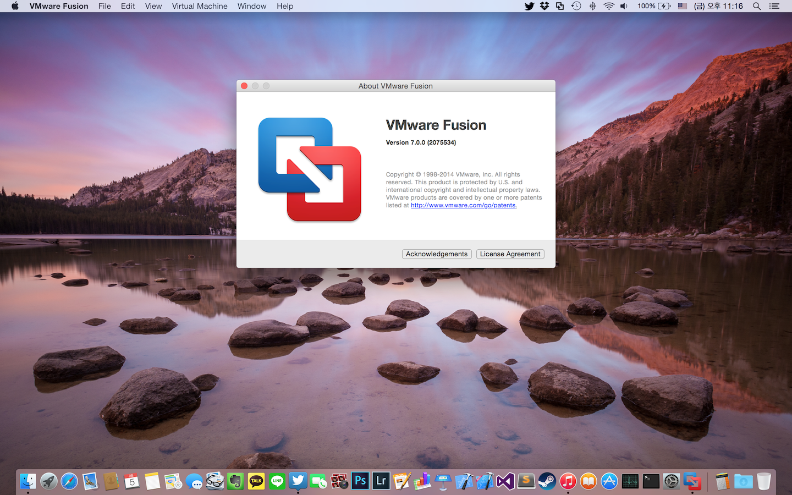
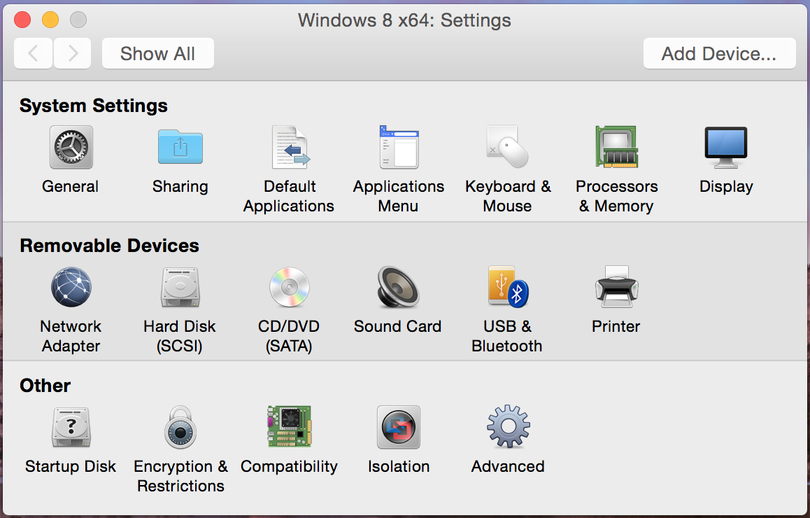

얼마 전까진 VirtualBox를 사용했습니다만, 이래저래 아쉬운 점이 참 많았습니다.

그래서 Parallels Desktop과 VMWare Fusion중 어느 프로그램을 살지 고민하다, 더 저렴한 VMWare Fusion 6 을 샀습니다.

물론 VMware가 가상화에 대해 더 나은 기술력을 갖고있다고 생각했기 때문이기도 하지만요.

그러다 7을 발표하면서 저는 무료 업그레이드 범위에 들게 되었고, 그리하여 VMWare 7으로 업그레이드 하게 되었습니다.

속도등등이 조금 향상되었다고 하는데 체감될 만한 수준은 아닌 것 같고, 개인적인 소감으로는 안정성이(화면깨짐) 많이 좋아진 것 같네요.

물론 아이콘등은 요세미티 스타일에 따라 변화하긴 했습니다만, 워낙 둔감한지라 속도 향상은 잘 모르겠네요.

(쓸 지는 모르겠지만) 자세한 사용기는 나중에...
