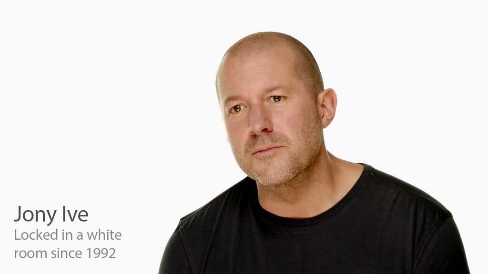

**※ 이 포스트는 전혀 사실이 아닙니다.**

<blockquote class="twitter-tweet" lang="ko">
  

    근데 이번 애플 키노트에서 가장 실망했던것은 조니 아이브가 이제 카메라도 못 들어가는 하얀 방에 갇혔다는 것이다.
  

  
  

    — 김승호 (@niceb5y) <a href="http://twitter.com/niceb5y/status/510068716118085633">2014년 9월 11일</a>
  

</blockquote>

<blockquote class="twitter-tweet" lang="ko" data-conversation="none">
  

    <a href="http://twitter.com/niceb5y">@niceb5y</a> 자세히 보면 하얀 페인트를 뒤집어쓴채 말하고 있는게 보입니다. — 떠돌이 (@bugbear5) <a href="http://twitter.com/bugbear5/status/510068909739753473">2014년 9월 11일</a>
  

</blockquote>

영국인인 조니 아이브는, 고향과 멀리 떨어진 미국 땅에 가서 일하고 있는 ~~디자인산업~~기사입니다.

스티브 잡스라는 못된 고용주를 두어 외국인 노동자라는 이유만으로 하얀 방에 1992년 부터 갇혀 있었습니다.

고용주가 팀 쿡이라는 인물로 바뀌게 되면서 상황이 나아지는 줄 알았으나, 더 나빠지게 되었다고 합니다.

조니 아이브에게 자유를!

~~글 쓰기 전에는 재밌을 줄 알았는데...~~
