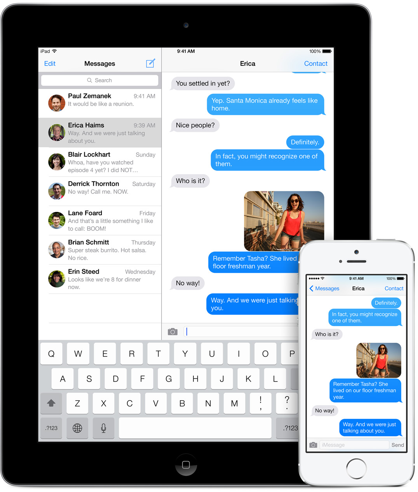
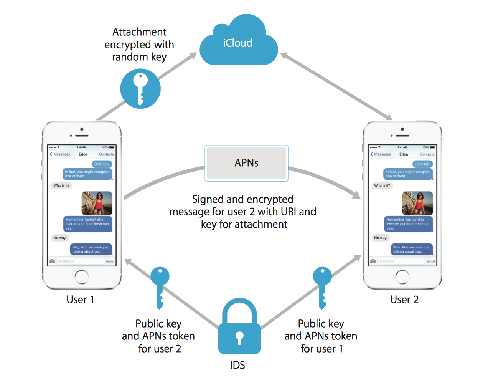

&nbsp;

요즘 카카오톡 감시로 말이 워낙 많아서... [텔레그램](http://telegram.org)과 같은 암호화가 가능한 + 서버가 외국에 있는 메신저를 쓰는 분들이 많아지는 것 같습니다.

그런데 텔레그램도 뭔가 말이 많아서(...) 쓸까 말까 고민을 하던 와중에 그냥 어렴풋이 좋다고 알던 애플의 아이메시지(iMessage) 알고리즘이 문득 궁금해져서 찾아보게 되었습니다.

애플의 [보안 관련 문서](http://images.apple.com/iphone/business/docs/iOS_Security_Feb14.pdf)에 설명되어 있습니다.

# iMessage의 암호화 방법

1 - 기기가 아이메시지 대화를 시작하는 순간, 아이메시지는 두 종류의 공개키 + 개인키를 생성합니다.

1280bit [RSA](http://ko.wikipedia.org/wiki/RSA_암호) (암호화) + 256bit [ECDSA](http://en.wikipedia.org/wiki/Elliptic_Curve_Digital_Signature_Algorithm) (전자서명)

2 - 개인키들은 기기의 키체인에, 공개키들은 APNs(애플 푸시 네트워크 서버) 토큰등과 함께 애플의 디렉토리 서비스(IDS) 서버에 저장이 됩니다.

3 - 사람 A가 사람 B의 기기로 메시지를 보내기 위해 B의 연락처를 입력하면, A의 기기가 애플의 서버에 접속해서 B의 공개키와 APNs 토큰등을 가져옵니다.

4 - 메시지의 내용은 보내는 사람의 개인키로 전자서명됩니다.

5 - 메시지가 전송될때 타임스탬프와 APNs 라우팅 정보등은 따로 암호화는 하지 않지만, APNs와는 TLS 암호화를 이용하여 통신합니다.

6 - 만약 한 사람이 기기가 2대 이상이 있다면, 기기들사이에서는 개인키를 어떻게 공유할까요? 공유하지 않습니다. 기기별로 각각 다른 공개/개인키를 가지고 있고, 메시지를 보낼 때에는 각각의 기기에 맞게 암호화해서 따로 저장합니다.

7 - 메시지가 너무 길거나 첨부파일이 포함되어 있으면 iCloud에 업로드되며 랜덤 생성된 키로 암호화 됩니다. 이 키와 URI또한 서명 / 암호화를 거칩니다.

8 - 모든 메시지는 기기에 도착하자마자 APNs에서 삭제되며, 기기가 꺼져있다던가 등등의 이유로 기기에 전송이 되지 않으면 7일간 더 보관됩니다.

뭐... 보안이 더 뛰어난 메신저들도 많겠지만, 이 정도로도 충분히 안전한 방식이라고 생각됩니다.
