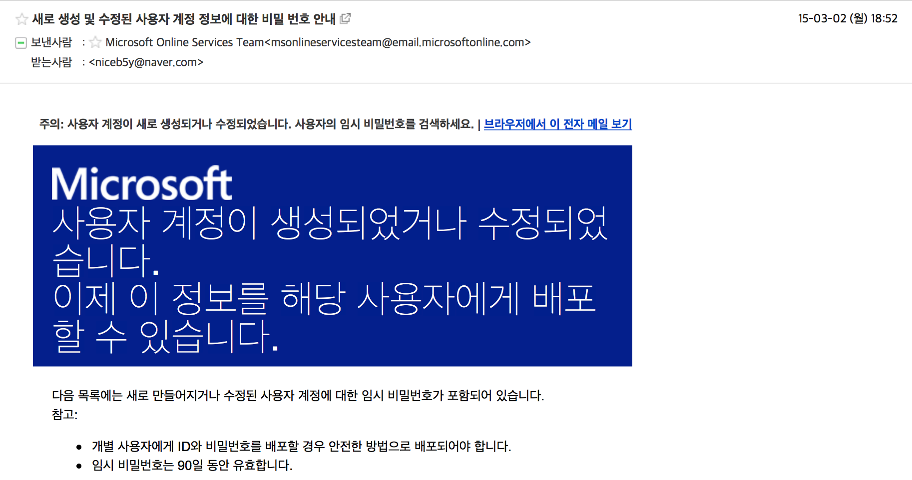
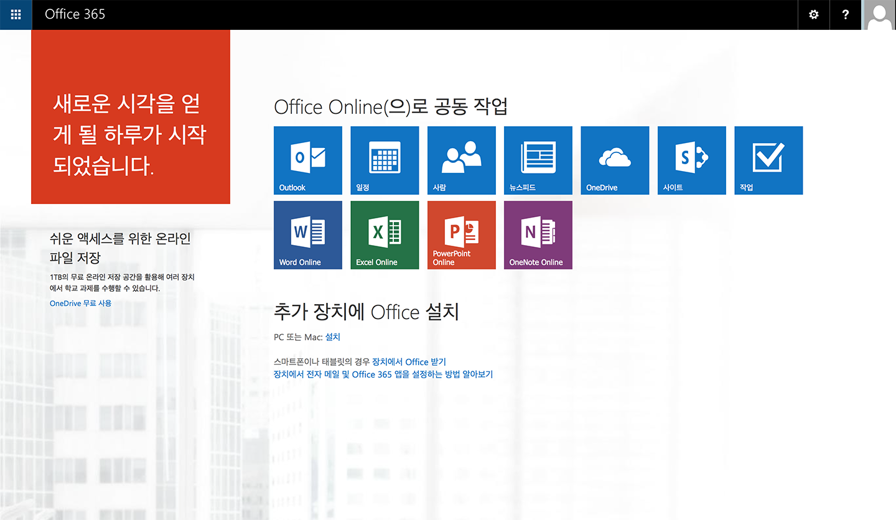

## **[중요] 가입 방법이 변경되었습니다. [[여기]](http://cloud.soongsil.ac.kr/)를 대신 이용하세요.**

~~얼마 전에 MS에서 다음과 같은 뉴스를 발표 하였습니다.~~

~~> 전체 교직원 대상 마이크로소프트 오피스 프로페셔널 플러스(Office Professional Plus)가 계약되어 있는 학교의 학생 및 교직원은 추가 비용 없이 오피스 365 프로플러스 사용 가능~~

~~그런데, 우리학교는 Office 365를 통한 @soongsil.ac.kr 메일 서비스를 하고 있었더랬죠.~~

~~그래서 soongsil.ac.kr로 혹시 사용 가능한지 시도해봤더니 잘 되더랍니다.~~

~~방법은 다음과 같습니다.~~

~~1. [다음 사이트](http://www.ssu.ac.kr/web/kor/plaza_c_02_02)의 안내를 따라 [다음의 주소](mailto:ssuimt@ssu.ac.kr)로 메일을 전송하여, soongsil.ac.kr 계정을 발급받습니다.~~
~~직번/학번, 이름, 신규 ID, 도메인, 부서/학과, 신청일을 넣도록 되어 있는데, 도메인에는 soongsil.ac.kr을 넣습니다. 나머지는 설명이 필요없을듯 하고요. (몇몇 외국메일은 안보내지는듯. 보내고 며칠을 기다리다 네이버 메일로 다시 신청하니 금방 오더군요.)~~
~~2. 다음처럼 메일이 옵니다. 로그인해서 들어가시고, 임시 비밀번호를 변경합니다.~~

~~3. [다음 페이지](http://portal.office.com/)에서 다운로드 받으시면 됩니다.~~

~~엄밀히 말하면 무료...라기보다 학교에서 계약한 덕분에 쓰는 거긴 한데... 그래도 추가비용 없이 쓸 수 있다는게 엄청난 장점인듯.~~

~~게다가 사용 대수도 5PC... + 원드라이브 1TB까지. 확실히 MS가 큰 힘 쓰는 듯 싶습니다.~~

~~조금만 더 일찍 하지... Office 365 university 이미 샀는데...~~

~~Thanks Bill!~~
