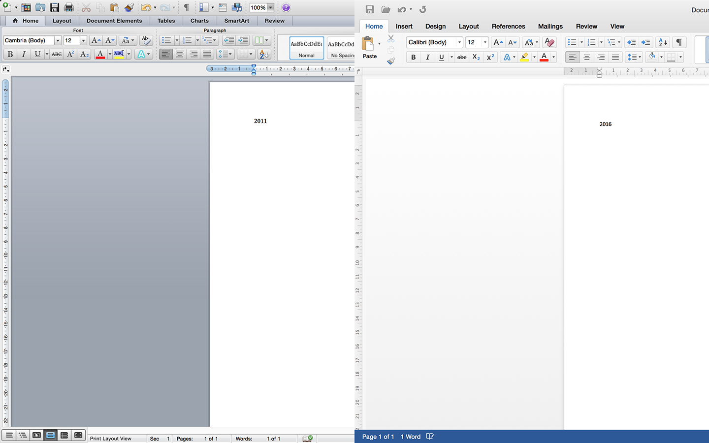
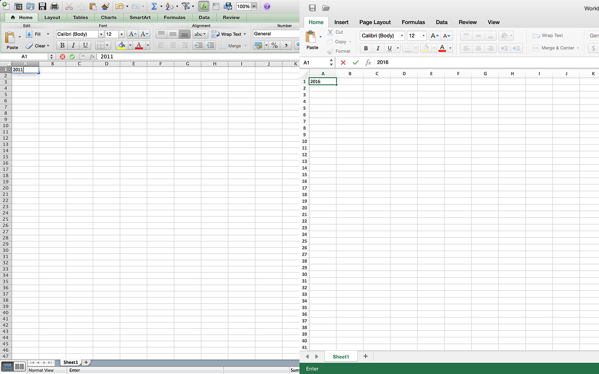
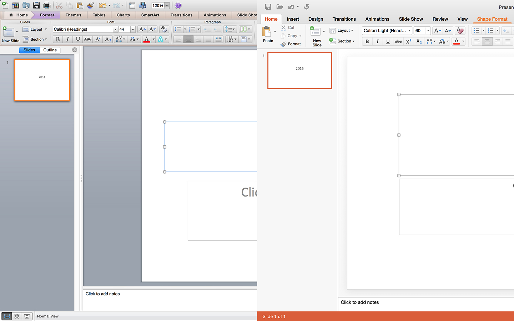

Word

Excel

PowerPoint

아직 제대로 사용해 보지 못했기 때문에 간략한 소감만.

프리뷰 버전이라 그런지, 초기 구동 속도는 이전 버전보다는 살짝 굼뜬 느낌입니다.

다만, 그 이외의 전반적인 속도는 만족스럽습니다.

인터페이스는 Windows용 Office 2013의 수준이라는 느낌입니다. Office 2013의 부드러운 커서 이동 같은 효과를 그대로 지니고 있습니다.

또, 기존의 2011버전과는 다르게 리본 UI를 OSX에 맞게 잘 녹여낸 느낌입니다. 위 스크린샷에서 보실 수 있듯, 상당히 깔끔한 인터페이스를 가지고 있습니다.

몇몇 부분에서 레티나 디스플레이를 지원하지 않던 저번 버전과 달리, 모든 부분에서 레티나 디스플레이를 잘 지원하는 것으로 보입니다.

정식 버전에서는 조금 더 다듬어졌으면 하는 부분도 살짝 보이긴 하는데, 이 정도면 장족의 발전을 이루었기에 충분히 만족스럽습니다.

정식 버전에서는 기왕 한국어 지원도 추가해줬으면 싶습니다. iOS 버전은 한국어를 지원하는데 말이죠.
