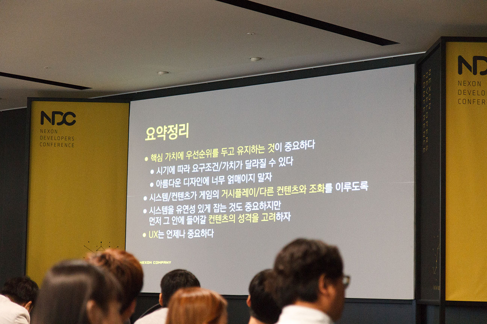

드디어 NDC 2015 포스팅 마지막 날이네요.

원래 하루에 몰아 쓰려 했는데, 어쩌다 보니 하루에 하나씩 쓰게 되는군요.

2일차에 대충 찍었던 사진들을 다시 찍어봤습니다.

피파 온라인

메이플스토리

요새 모바일 게임을 안해서 무슨 게임이 나오는지도 잘 모르는데, 꽤 괜찮아 보이던 게임이 있었어요.

다만 역시 터치 조작은 너무 손가락이 아파요.

메이플스토리2..로 알고 있습니다. 이건 게임을 안해봐서 어디 나오는지 잘 모르겠네요.

도타2라는데, 도타도 몇판 밖에 안해봐서 사실 하나도 모릅니다.

그림 말고도 다른 작품들이 전시되어 있었습니다.

마지막날이라서 여기저기 찍어봤어요. 여기서는 오큘러스 리프트 크레센트 베이, 기어VR을 시연해 볼 수 있었습니다.

둘째날에 오큘러스 리프트 크레센트 베이를 시연해 봤는데... 매우 좋았습니다. 기어VR보다 아무래도 데모 컨텐츠가 좋아서 그런지... (물론 사양 차이도 감안해야겠지만요) 사고싶더군요.

물론 돈이라던지, 저걸 돌릴 PC라던지가 없는 관계로 어찌 될지는 모릅니다.

여기가 그 어떤 사고가 있었던(...) 문입니다. 사고때문인지 3일내내 회전문은 막아놨더라고요.

두번째로 들은 강연은 야생의 땅 : 듀랑고의 제작 시스템에 관한 세션이였습니다.

왜 사진이 두번째 강연부터 시작하냐면... 첫번째 강연은 사진촬영이 불가능해서 없습니다. 뭐... 좋은 강연이었어요.

저는 사진촬영 안된다길래 하지도 않았지만, 정말 철저하게 막으시더군요. 감시에 빈틈이 없어서(...) 대단하다고 느꼈습니다.

뭐랄까... 기획에 대해서 생각해 볼 수 있는 세션이였는데, 그래서 가죽장화는 무슨 맛일까요.

게임이 꽤 재밌어 보이길래, 나중에 한번 해봐야겠다는 생각을 했습니다.

꼬치구이로 몬스터를 사냥한다던가(...)하는 모습이 인상 깊어서...

~~그런데 가죽장화는 무슨 맛이죠?~~

다음 세션은 야생의 땅 듀랑고 속의 복잡계에 대한 세션이었는데요, 복잡계 이론에 대해 알 수 있는 좋은 세션이긴 했는데...

듀랑고 속의 복잡계에 대해서는 알 수 없었던 듯. ~~(속았다.)~~

그리고 NDC2015에서 마지막으로 들은 세션입니다. 메모리 프로파일링 시스템 개발에 대한 세션이었는데, 제가 이걸 이해 할만한 레벨은 아니지만(...) 재밌었습니다.

저런거 간단하게 해서 제가 만든 프로그램에 붙여보고 싶긴 한데... 뭐 gprof정도로 해결되는게 제가 짜는 프로그램이라(...)

이렇게 3일동안의  NDC2015 참관이 끝났습니다.

포스팅이 영 부실하긴 한데... (특히 이 포스팅은...)

조만간 세션 동영상들이 올라올테니 직접 보시는게 좋을 것 같아요.

끝으로 NDC를 참관한 소감은... 여러 좋은 세션들을 들을 수 있어서 좋았습니다.

뭐 보고 계시진 않겠지만, 덕분에 ~~학교도 빼먹고~~ 유익한 시간이었어요. ~~올해도 모에론 같은게 있었으면 더 좋았을 텐데요~~

\- 끝 \-
