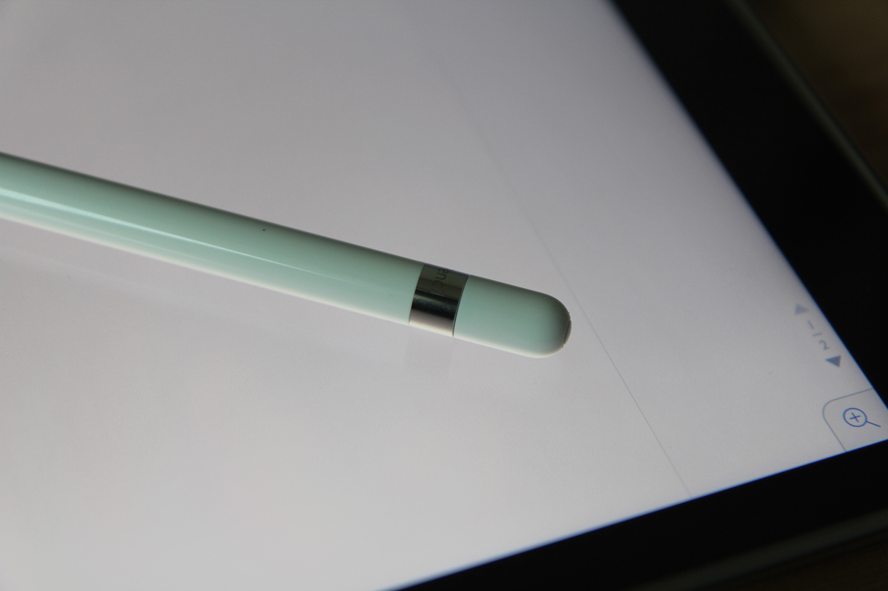
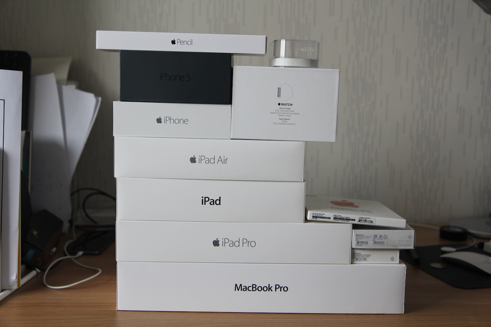
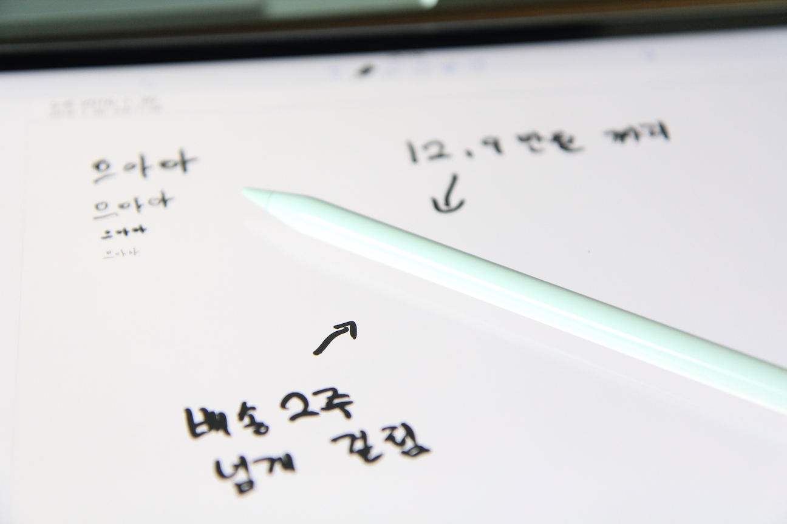
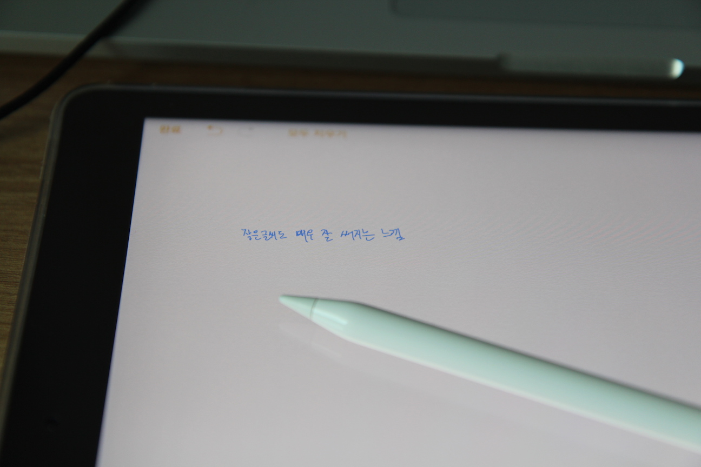
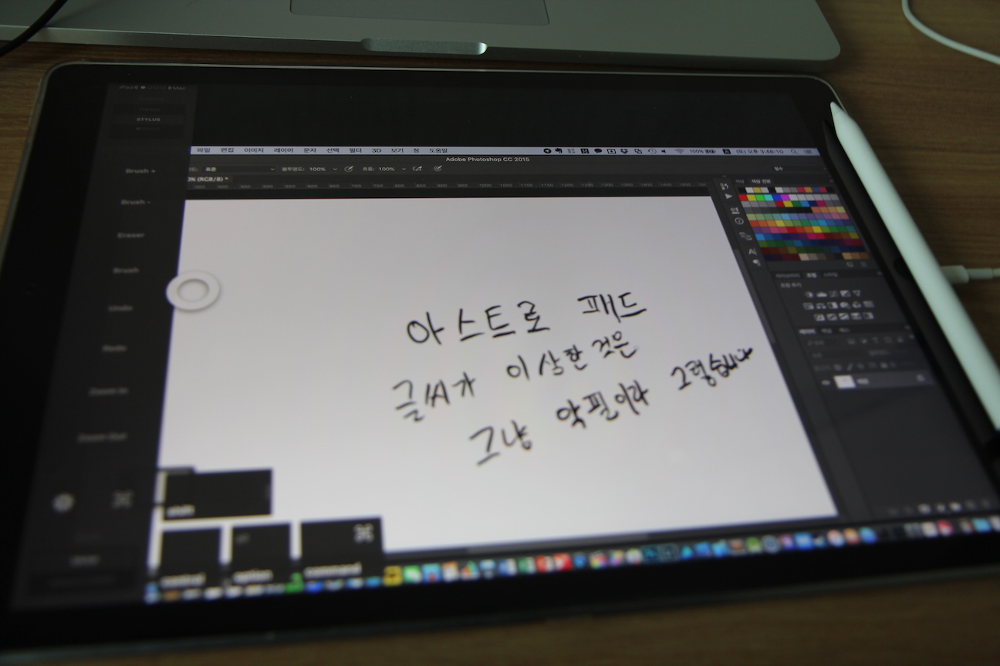
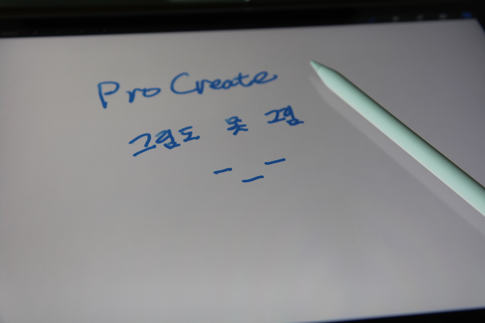

거창하게 말은 리뷰랬지만, 사실은 별거 없습니다.

늦게 사기도 했고, 늦게 오기도 해서 이제서야 도착했는데, 그 사이에 이런 저런 리뷰 많이 나오기도 했고...

그냥 자기만족으로 끄적이는 글이기 때문에...

~~사과 상자 쌓인거 보면 대충 리뷰 어떻게 걸러들어야 할지 감이 오실듯.~~

일단 필기하는 느낌은 정말 좋습니다. 딜레이도 정말 적고요.

작은 글씨도 쓰기 좋습니다.

필압, 기울기 등을 잘 지원합니다. [Astropad](http://astropad.com)로 맥에 연결해서 사용할 수도 있고요.

[Procreate](http://procreate.si)같은 앱에서 바로 그림을 그릴 수 있습니다.

그림 그리기 좋은 것 같은데, 전문가도 아니고, 그림을 잘 그리지 못하다 보니 확신은 못하겠지만요...

뭐, 장점을 뽑으라면... 아이패드 프로에서 사용할 수 있는 최고의 터치펜이라고 할 수 있겠죠. 아이패드의 OS & HW 차원에서 지원하는 유일한 터치펜이다 보니 말이죠.

단점은... 가격, 충전해야 하는 번거로움, 분실 위험성 등이 있겠네요,

필기하려고 샀는데... 개인적으로는 꽤 만족스러운 느낌입니다. 아직 별로 써보진 못했으니, 좀 더 써봐야겠지만요.

<iframe width="560" height="315" src="https://www.youtube.com/embed/qtmN4k1QvRk" frameborder="0" allow="accelerometer; autoplay; encrypted-media; gyroscope; picture-in-picture" allowfullscreen></iframe>

~~덧. 리듬게임 하기도 좋습니다.~~
