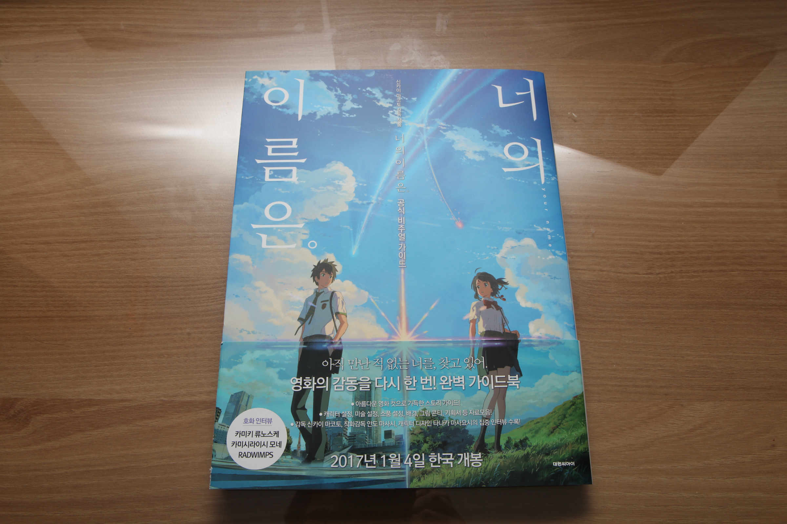
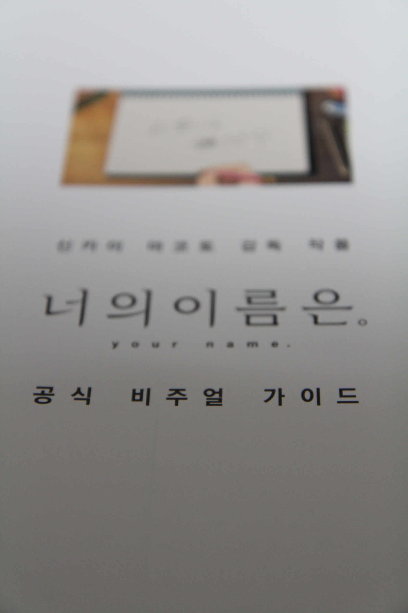
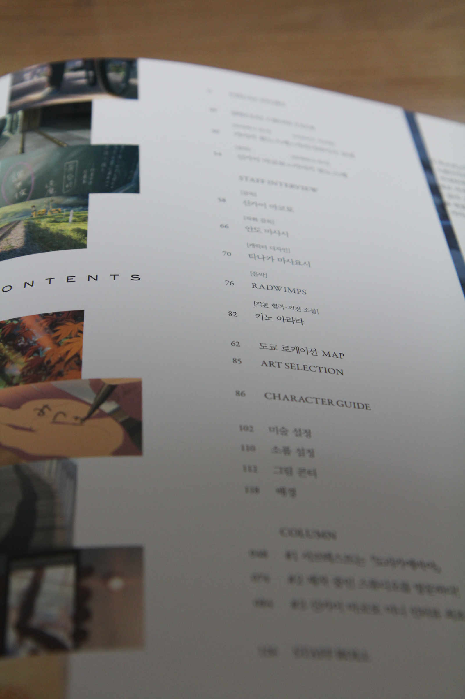
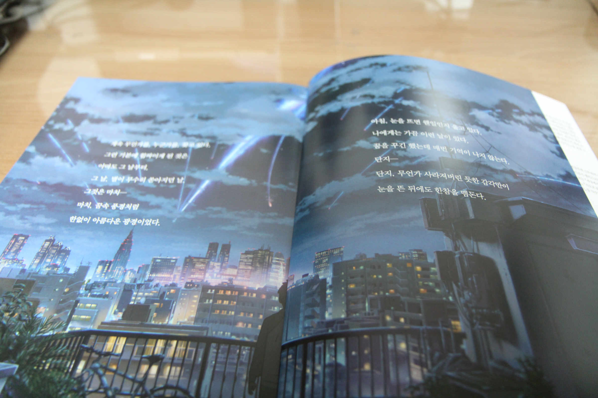
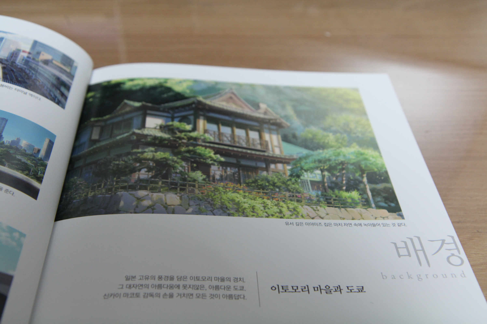
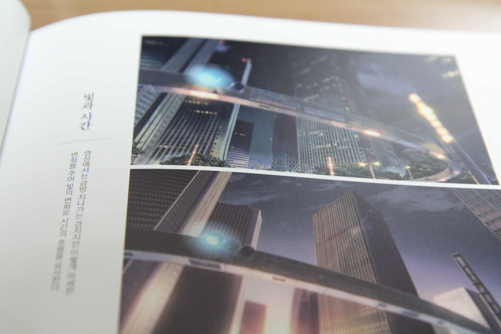
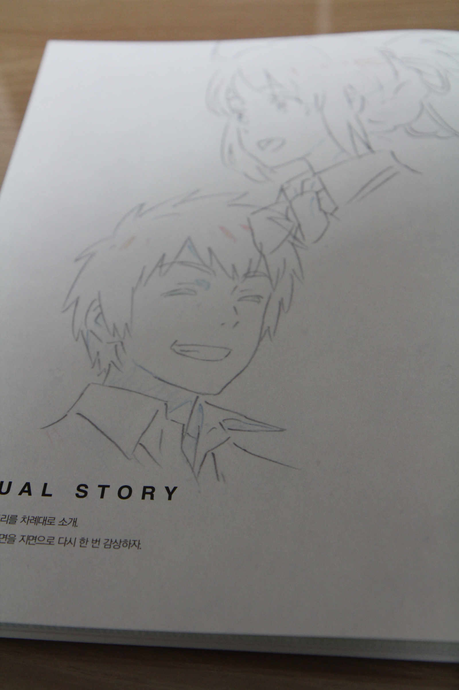
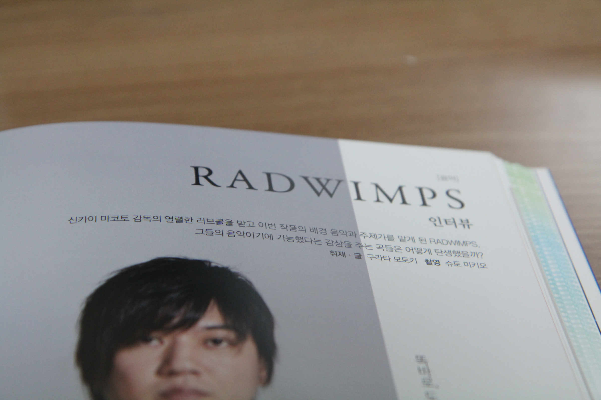

이상하게 신카이 마코토 감독 작품 포스팅이 많아진 것 같은데 그렇습니다.

제 통장 잔고를 털어 가고 있어요.

이게 아니라면 어디 다른곳에서 털어가긴 했겠지만(아마 BNEI?).... 뭐 그건 그렇다 치고.

일단 이렇게 생겼습니다.

생각해보니까 초회 구입 특전이 있었는데, 지금 다시 카메라 꺼내서 찍긴 귀찮으니 넘어갑시다. 미츠하랑 타키가 각도에 따라 달라 보이는 렌티큘러 엽서입니다. 물론 딱히 쓸 데가 없으니 어디 집어넣어놓고 까먹겠지만(...).

사진에서는 안나오지만 첫 페이지부터 뭐가 묻어있더군요. 소설도 그렇고 뽑기운이 영.... 귀찮아서 교환은 안할듯 싶습니다. 가끔 꺼내보고 다시 기억나서 가슴아파하겠지만...

차례입니다. 조리개도 안 조이고 찍고.... 이런거 보면 사진도 참 날림으로 찍는듯.

> "그것은 마치.... 마치, 꿈속 풍경처럼 한없이 아름다운 광경이었다."

> "이런 마을 싫어요!"

미츠하가 그토록 싫어하던 그 마을.

얼마나 많은 사람들이 갈려나갔는지 모를 타임랩스 장면.

캐릭터 설정화도 포함되어 있습니다. 안 보여드릴 거지만(...).

영화 제작에 참여한 사람들의 인터뷰도 포함되어 있습니다. 이것 또한 안 보여드릴 거지만.

간단히 평가하자면.... 영화를 재밌게 본 사람들은 살 만한 물건인 것 같습니다.

더 크고 아름다운 그림이 많았으면 좋겠지만, 그건 브로마이드를 사야 해결 될 문제 같고요.

그나저나 블루레이는 언제 나오려는지.... 올해 안에는 나오려나...?
