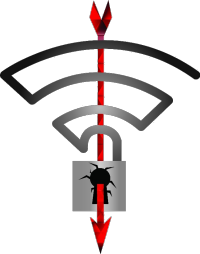

무선 네트워크의 보안을 담당하는 WPA2 프로토콜에서 취약점이 발견되었다는 소식입니다.

&nbsp;

## KRACK

[원문](https://www.krackattacks.com/#intro)

&nbsp;

## 요약

발견된 취약점을 통해 신용카드나 비밀번호, 채팅 메시지, 이메일 등의 민감한 정보들이 도청될 수 있습니다.

이 취약점은 대부분의 WPA2를 사용하는 무선네트워크에 대하여 유효합니다. 이 공격은 암호화된 패킷을 복호화하는데 그치지 않고, 위조하거나 새로운 패킷을 삽입할 수 있습니다.

다행히도, 해당 취약점은 **하위호환 가능한 방식**으로 수정될 수 있습니다. 또한 이 공격은 공유기가 아니라 공유기에 연결된 기기의 취약점을 이용하기 때문에, 공유기의 업데이트는 필요하지 않을 수 있다고 합니다.

&nbsp;

## 잡설

드디어 WPA2가 뚫리는 날이 오는군요. 언젠간 오겠지 싶었지만.

공유기 업데이트가 필요한 취약점이 아닌가 걱정했는데 아니라서 다행입니다. 워낙 업데이트 안해주는 라우터가 많다보니 말이죠.
