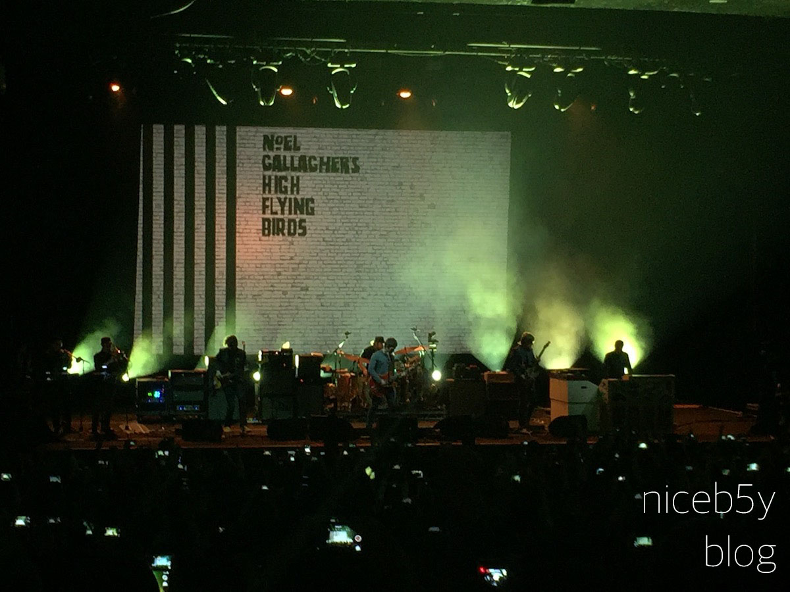
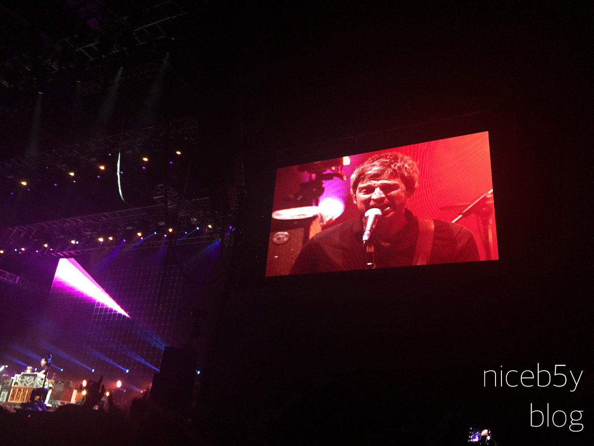
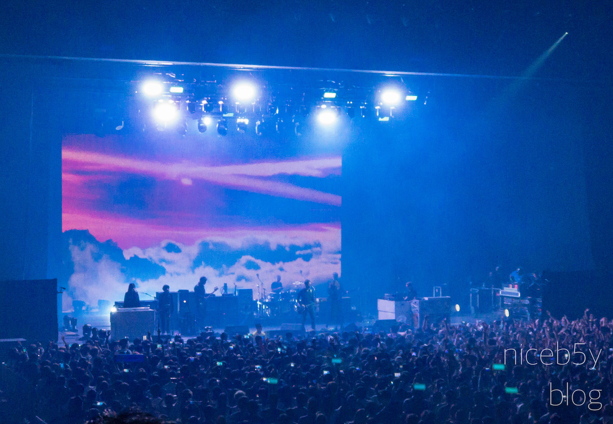
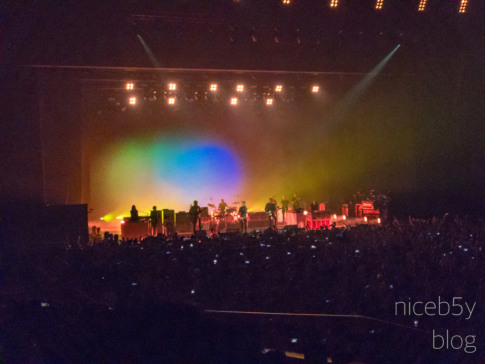
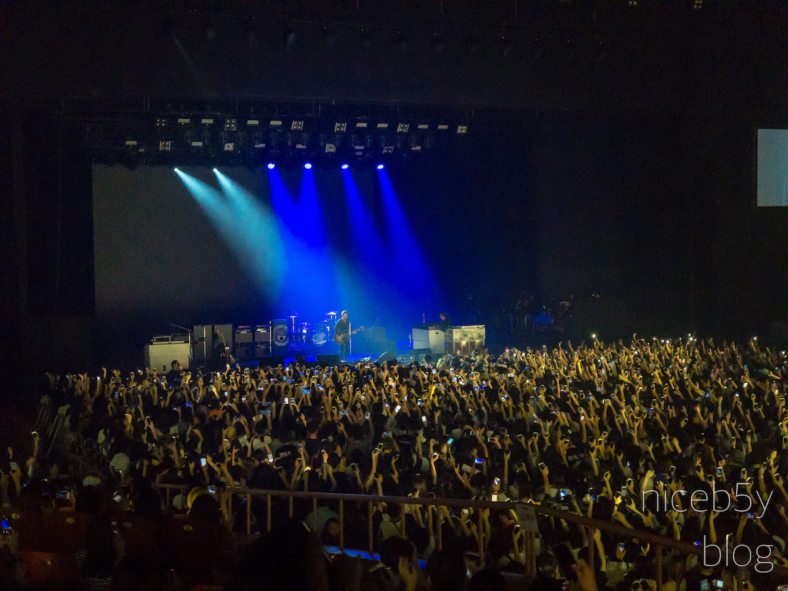

지난 16일(2018년 8월) Noel Gallagher's High Flying Birds(노엘 갤러거즈 하이 플라잉 버즈, a.k.a. 하플버, 높나새)의 공연을 보고 왔습니다.

마지막으로 한국을 찾았던 해가 2015년인데, 2번의 내한 공연 모두 관람을 했었습니다(자랑).

4월에 열렸던 단독 공연도 관람을 했었고,

7월에 열렸던 락 페스티벌에서도 보러 갔었죠.

Oasis를 한 단어로 정의하면 바로 '본인'이라고 말하던 분답게 공연은 매우 훌륭했습니다.

한가지 흠을 잡자면 티셔츠의 품질이 별로였다는 점인데, Oasis 시절부터 'X같은'의 수식어가 붙는게 티셔츠였으니 예상하지 못했던 바는 아닙니다.

어찌됐든 간에, 다음 공연을 (그리고 새 앨범을) 꽤 오랜 기간 기다렸습니다.

도중에 콜드플레이도 내한하고 별일이 다 있더군요. 그럴 줄 몰랐는데 말이죠.

그리고 마침내 3집이 발매됐습니다. 또 오랜 시간이 흐르고, 투어 발표, 예매 전쟁 같은 몇몇 과정을 겪고 나서,

마침내 공연을 볼 수 있었습니다.

스케쥴 때문인지 공연은 하루만 이뤄졌고, 지난 단독콘서트보다는 규모가 큰 올림픽공원 올림픽홀에서 진행되었습니다.

이번엔 편하게 보려고 스탠딩이 아닌 지정석으로 예매했습니다. 올림픽공원에서 공연을 관람하는건 처음인데, 나쁘지 않았습니다.

2015년의 공연들과는 다르게 기타가 자주 변경되거나, 세션 구성이 좀 더 풍성해진 느낌이었습니다. 퍼커션으로 가위가 사용되는 모습을 보는 새로운 경험을 할 수도 있었고요.

이번 앨범인 "Who Built the Moon?"의 곡들이 취향이 많이 탈만한 실험적인 느낌의 곡들이 많았는데, 라이브로 들으니 더 좋게 느껴졌습니다. "Holy mountain" 같은 곡은 분위기도 다르게 느껴졌고요.

라이브로 처음 듣게 된 Oasis 시절의 곡으로는 "Little By Little"이 있었는데, 원래 무척 좋아하는 곡이다 보니, 라이브로 듣게 되니 더 이상 감동적일 수 없었습니다.

어쿠스틱 버전으로 연주되는 "Supersonic"도 들을 수 있었는데, 기타와 키보드만으로 연주되는 이 곡은 그야말로 최고였습니다. 음원으로 내면 당장 구매할 정도로 말이죠.

3년쯤 후에 다시 만나자며 공연은 끝났지만, 벌써 다음 앨범과 공연을 기다리게 하는 공연이었습니다.

<iframe allow="autoplay *; encrypted-media *;" frameborder="0" height="450" sandbox="allow-forms allow-popups allow-same-origin allow-scripts allow-top-navigation-by-user-activation" src="https://embed.music.apple.com/kr/playlist/%EB%85%B8%EC%97%98-%EA%B0%A4%EB%9F%AC%EA%B1%B0%EC%A6%88-%ED%95%98%EC%9D%B4-%ED%94%8C%EB%9D%BC%EC%9E%89-%EB%B2%84%EC%A6%88-2018/pl.u-06oxvLguo0dLEX?app=music" width="100%"></iframe>
