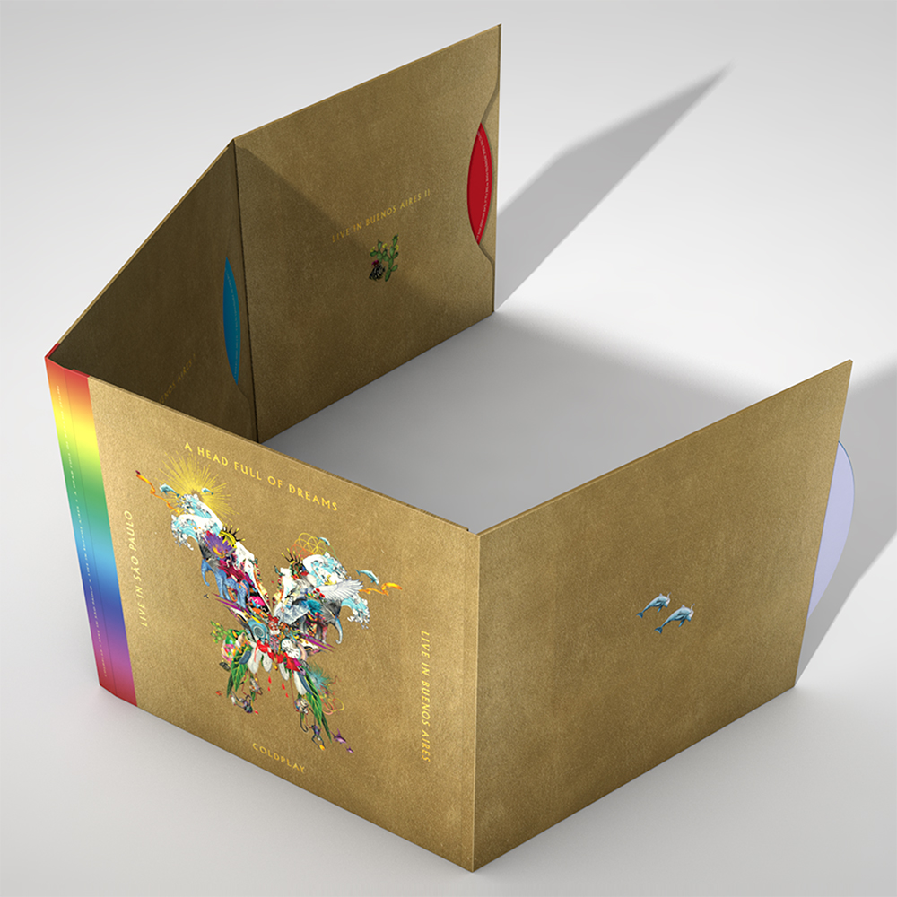
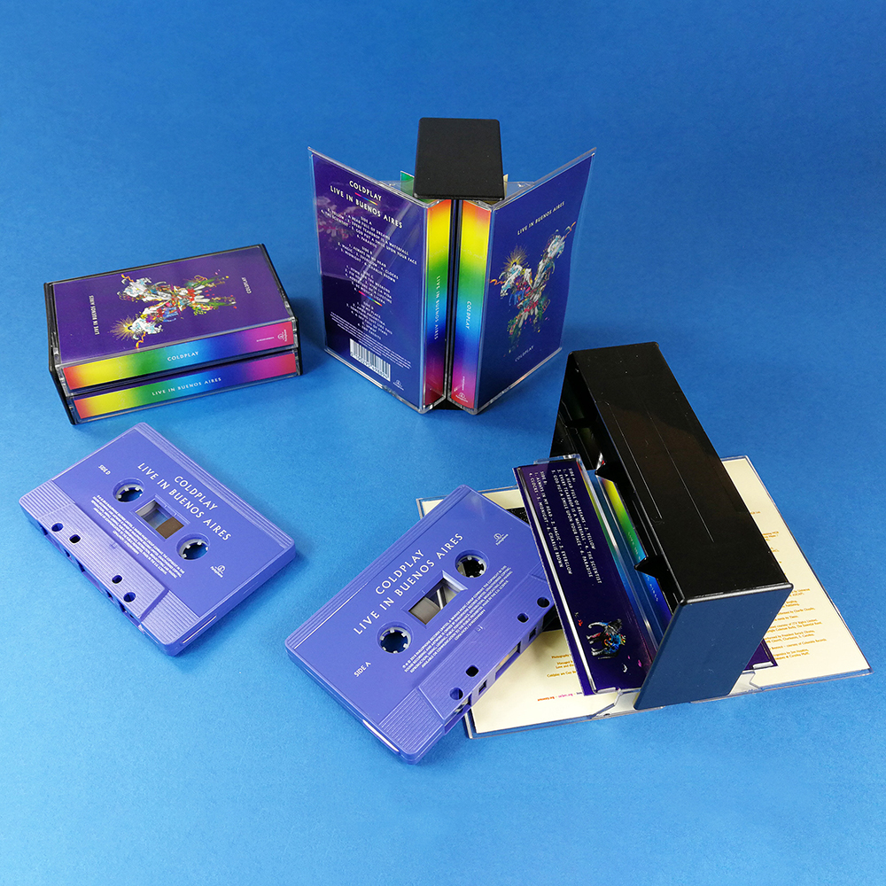

아실 분들은 아시겠지만, 저는 콜드플레이의 팬입니다. 지난해(2017)에 이뤄진 콜드플레이 공연을 관람하고 이 블로그에 [글을 남긴 적](https://blog.niceb5y.net/coldplay-ahfod-tour-in-seoul-2017/)도 있었죠. 공연을 관람하고 나면 긴 여운이 생기곤 합니다. 그리고는 금세 다시 보고 싶어 지곤 하죠. 그럴 때 가장 좋은 것이 라이브의 실황을 담은 영상이 되겠습니다.

콜드플레이는 공식적으로 3번의 라이브 실황을 DVD나 블루레이 디스크로 담았었죠. 'Live 2003'은 오래 전이다 보니 DVD밖에 없습니다만, 'Live 2012'나 'Ghost Stories Live 2014'는 DVD와 블루레이 디스크로 모두 출시되었습니다. 제가 가지고 있는 것들은 'Live 2012'와 'Ghost Stories Live 2014'의 블루레이 디스크입니다. 안타깝게도 첫 라이브 실황인 'Live 2003'은 **DVD밖에 존재하지 않았기 때문에** 구매를 망설였었고, 어느 순간 국내에서 찾아보기 어렵게 되어 사지 못했습니다. 게다가 DVD는 지역 코드 때문에 미국 아마존에서 주문하기도 여의치 않더군요.

어쨌든 작년에 공연을 관람한 뒤로, 콜드플레이가 새 라이브 실황을 발표하는 순간만을 기다렸습니다. 잘하면 서울 공연의 영상이 담기지 않을까 하는 기대를 품고서 말이죠. 시간이 흘러 투어가 끝나고, 또 시간이 흘러 발표가 됐습니다. 기대와는 다르게, 제목을 보고 약간 안타까움을 느낄 수밖에 없었죠. 앨범 이름이 'Live in Buenos Aires'였으니까요. 조금 더 여러 도시의 모습을 담고, 거기에 서울 공연의 모습이 담겼더라면 하는 아쉬움이 있었습니다만 그래도 거기까진 괜찮았습니다.

이번 실황, **블루레이가 없네요?**

레트로 열풍에 힘입어 이렇게 LP까지 만들어 파는데 말입니다.

공식 트위터 계정으로 질의도 해봤지만, 답변을 받을 수는 없었습니다. 그래도 시간이 흐른 뒤에 답변이 올라오더군요.

<blockquote class="twitter-tweet">
No plans for a Blu-ray version of the Butterfly Package. But the A Head Full Of Dreams documentary is on Amazon&#39;s Prime Video in HD, at <a href="https://t.co/JbdmgamhkK">https://t.co/JbdmgamhkK</a>. And you can get the São Paulo concert film in HD from iTunes at <a href="https://t.co/kCKPBZM1BT">https://t.co/kCKPBZM1BT</a>. A <a href="https://t.co/2a9Cm1n3f6">https://t.co/2a9Cm1n3f6</a>
&mdash; Coldplay (@coldplay) <a href="https://twitter.com/coldplay/status/1071854196171915274?ref_src=twsrc%5Etfw">December 9, 2018</a></blockquote>

블루레이 디스크로 출시할 계획이 **없다**고 말이죠. 덧붙여, HD 영상을 보고 싶으면 스트리밍이나, VOD로 보라고 말해주는군요. 친절도 하셔라.

사실 요즘 같은 시대에 디스크를 사서 보는 게 상당히 귀찮은 행위입니다. 여러 개 모으다 보면 공간도 많이 차지하며, 다른 영상 보려면 디스크 교체해 가면서 봐야 하고, 모바일로 보기도 어렵고, 예전처럼 PC에 광 드라이브가 많이 탑재되지도 않는데 전용 플레이어를 사야 하는 불편함이 있습니다. 넷플릭스나 아이튠즈 스토어에선 신용카드와 인터넷, 그리고 몇 번의 클릭이면 간단하게 볼 수 있는데 말이죠. 그럼에도 불구하고 팬들이 광디스크를 구매하는 것은 그 나름의 이유가 있기 마련입니다. 디지털 매체를 구매했을 때 아티스트에게 돌아가는 수익의 비율이 낮아서일 수 있고, 실물을 더 선호해서일 수 있고, 좋은 인테리어 소품이 되기 때문(...)일 수도 있죠.

'블루레이 그거 몇 장 팔리지 않는데 뭐하러 만드나?'라고 생각하실 수 있겠지만, 그렇게 생각하면 또 하나 웃긴 점은....

이 앨범, **카세트테이프**로도 만들어 팝니다.

이런저런 아쉬움이 참 큰 실황입니다.

<iframe allow="autoplay *; encrypted-media *;" frameborder="0" height="450" style="width:100%;max-width:660px;overflow:hidden;background:transparent;" sandbox="allow-forms allow-popups allow-same-origin allow-scripts allow-storage-access-by-user-activation allow-top-navigation-by-user-activation" src="https://embed.music.apple.com/kr/album/live-in-buenos-aires/1438770205"></iframe>

_4번 트랙 'The Scientist'를 무한반복으로 들으며 씀._
