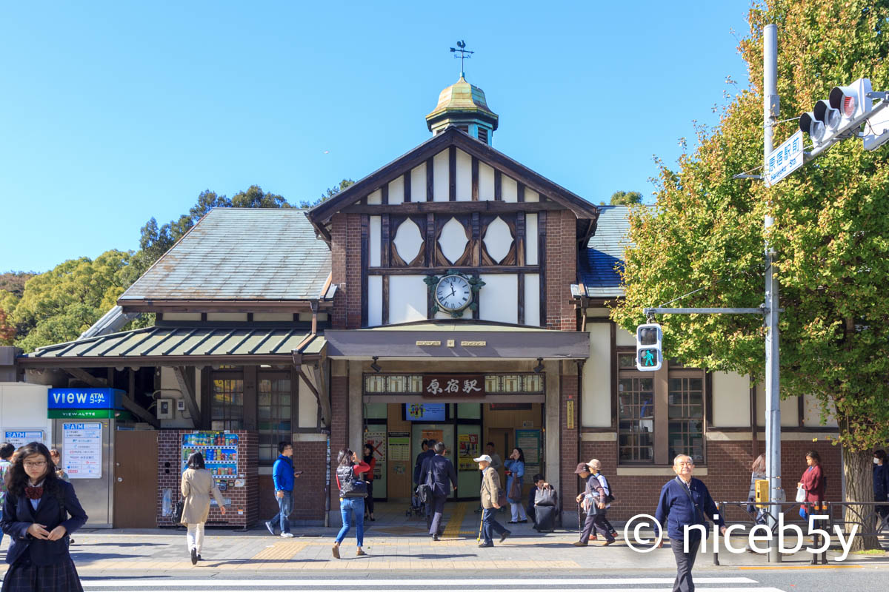

2년간의 유쾌하지 않았던 경험이었던 국방부 퀘스트를 마치고, 복학하기에 앞서 친구들과 도쿄를 다녀왔습니다. 2018년 10월 30일 ~ 2018년 11월 5일간의 여행으로, 총 7일 동안 도쿄를 여행하고 왔습니다. 이미 시간이 꽤 지나기도 해서 쓸지 말지 꽤 고민했는데 그래도 기록으로 남기는 게 좋겠다 싶어 가볍게 적어볼까 합니다.

여행은 7일이지만, 1일 차랑 7일 차는 짐 들고 다니느라 별로 찍은 게 없어서 사진은 5일치가 주가 되겠습니다.

## 1일 차 - 인천 -> 나리타

인천공항에서 OZ106 항공편을 타고 나리타 공항에서 내렸습니다.

말로만 듣던 인천공항을 돌아다니는 로봇을 봤었는데, 충전 중이라 사용은 못 해봤기 때문에 안타까웠습니다.

인천공항이 자랑하는 면세점을 구경했지만, 정작 땡기는건 없어서 딱히 뭘 사진 않았습니다.

비행기에서 2시간가량을 보내고 일본에 도착했는데, 생각보다 시간도 늦고, 처음 일본 열차를 타고 숙소까지 찾아가는 등, 어버버하다 하루가 끝났습니다. 원래 다른 곳 가서 저녁을 먹을 계획을 하고 있었는데, 시간 계산에 실패한 관계로 그냥 가까운 곳에서 먹었습니다. 주문을 어떻게 할지 몰라서 버벅거리는 와중에 아르바이트 하시는 분이 한국분이어서 도움을 받았습니다. 딱히 별거 없이 첫날은 이렇게 끝났습니다.

## 2일 차 - 키치죠지 / 롯폰기

1일차까지는 실감이 잘 안 났는데, 날이 밝고 전철역까지 걸어 다니다 보니 일본에 왔다는 실감이 좀 났습니다.

첫 번째 목적지는 키치죠지였습니다. 일본 지명을 잘 모르는지라 처음 들어봤던 동네였죠. 보통 지브리 박물관 때문에 많이 오는 여행지라고 들었습니다만, 예약을 못 해서(...) 생략. 연인들이 많이 갈 것 같은 이노카시라 공원에 갔습니다.

연인이랑 갔냐고요? 남자 3명이 갔는데요(...).

날이 따뜻한 도쿄라 10월의 마지막 날인데도 불구하고 이제 막 단풍이 들기 시작했습니다.

동물원도 있었는데 구경하진 않았습니다. 공원만 둘러봐도 좋더군요.

공원을 둘러보고 이것저것 먹기 위해 이동했습니다.

공원 근처의 유명하다는 꼬칫집. 맛있었습니다.

다시 이동해서 멘치카츠를 먹었습니다. 줄 서서 먹을 정도로 인기 많은 가게더군요. 맛은 있었는데, 하필 일본여행 내내 감기를 앓았기 때문에 고기의 맛이나 향을 100% 느낄 수 없었습니다.

어째 중간 과정이 생략돼서 먹기만 하러 다니는 것 같지만(...) 카페에 왔습니다.

시킨 메뉴는 치즈케이크.

... 그리고 커피. 감기가 후각을 다 죽여놨지만, 어쨌든 잘 먹었습니다.

다시 이동합니다.

롯폰기 힐스 모리 타워에 왔습니다. 전망대를 위해서요.

타워 입구. 나중에 알게 된 사실이지만 여기를 통해서는 전망대에 갈 수 없었습니다.

사진을 한참 전에 골라놓고 인제 와서 포스팅을 하면서 느끼는 사실이지만, 스킵 된 사진이 무지막지하게 많군요. 모리 타워 전망대는 실내와 옥상에서 이뤄지는 실외 전망대가 있고, 실외 전망대 입장료는 추가 요금을 받습니다. 그런데 블로그용으로 따로 뽑아 놓은 사진엔 실내 전망대 사진이 없네요.

어쨌든 도쿄의 유명한 전망대라 하면 도쿄 타워, 스카이 트리, 도쿄 도청(...)이 있을 텐데, 모리 타워의 장점은 야외 전망대가 있다는 사실이죠. 창문 너머 야경찍느라 빛이 반사되는 일이 없습니다. 사진 찍기에 좋습니다.

사실 스카이 트리 전망대를 가볼까 하는 생각도 있었습니다만, 이날 찍는 것도 충분히 힘들어서 그만뒀습니다.

오랜 시간 기다려서 이런 사진도 하나 건졌고 말이죠. 물론 손 떨림이 유발한 수많은 흔들린 사진도 같이 따라오고야 말았습니다.

저녁은 우동에 맥주를 마셨습니다. 왜 또 우동 사진이 빠져있는지는 모르겠지만요. 커피 맛을 모를 정도로 후각이 나간 상태였지만, 맥주는 맛있었습니다.

## 3일 차 - 하라주쿠 / 시부야

열차가 안 다니는 동네에 산 지 오래돼서 그런지도 모르겠지만, 건널목을 건너는 것도 참으로 오랜만입니다.

요요기 공원에 왔습니다. 사실 여기 오기 전에 메이지 신궁도 갔었지만, 딱히 남길 사진도 없고.... 제 취향은 아니었습니다.

어디서 오리가 나와야 할 것 같은 분위기지만, 까마귀만 잔뜩 있습니다.

공원을 구경하다 다시 걸어 나와서 하라주쿠에 왔습니다.

역을 지나쳐 오른쪽으로 꺾으면 타케시타 거리가 나타납니다. 분위기가 갑자기 달라지는 느낌이 듭니다.

하라주쿠에서 유명하다고 하는 파르페를 먹어봤습니다.

일본에 왔으니 타코야끼도 먹어보고요.

시부야에 왔습니다. 이유는 모르겠지만 랜드마크라는 시부야 모아이상.

아무래도 번화가다 보니 여러 상점이 많습니다. 때문에 타워레코드에 잘못 들어가서 CD를 지르게 되었다든가, 이토야에 잘못 들어가서 3만 원짜리 샤프를 사버렸다든가 하는 일들이 있었죠. 무서운 동네네요. 여기.

점심으로는 야키토리동을 먹었습니다. 닭 꼬치를 구워서 덮밥으로 먹는 요리죠. 여전히 감기는 낫지 않고 있었지만, 그럼에도 맛있었습니다.

시부야를 잠깐 벗어나 세타가야를 걸어봅니다. 왠지 푸른 기운이 느껴지는 꽃집(아무말).

공원도 지납니다. 뭔가 중요한 일이 벌어질 것만 같은 벤치(아무말 2).

다시 시부야로 돌아와서, 시부야 하면 유명한 시부야 스타벅스. 사람이 너무 많아 올라가 보질 못했습니다.

애플 시부야입니다. 도큐핸즈니, 로프트니 구경하느라 지쳐서 들어가진 않았습니다. 한국에서 가로수길 몇 번 가봤더니 그렇게 꼭 가야겠다는 생각이 들지도 않았고요(배부른 소리).

저녁 먹으러 긴자에 왔습니다. 긴자선 타는 곳 찾는 게 그렇게 어려웠습니다. 결국 꽤 오래 헤매다 도착했습니다.

3일차 시부야 여행의 마지막은 라멘과 맥주가 장식했습니다. 시간이 되면 아사히 본사를 간다든지, 맥주 공장 탐방을 한다든지 하고 싶었는데, 시간상 불가능했습니다. 아쉽네요.

4일 차부터 7일 차까지의 여행기는 [다음 글](/2018-tokyo-travel-2/)에서 이어집니다.
