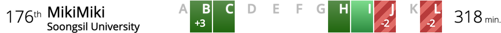

## TL;DR

광.탈.

## Disclaimer

- 팀명은 팀장의 취향을 반영하여 결정되었습니다.
- 자랑할 만한 성적은 아니지만, 기록으로 남기기 위해서.

## 결과

176등 / 교내 11등 / 318min.

## 후기

2019년 들어서 [깃 레포](https://github.com/niceb5y/algorithm-study/blob/niceb5y/README.md)를 파서 동기들과 알고리즘 공부도 하고 있겠다, 1학기 때 문제 해결(Problem Solving) 과목도 들었겠다 한번 해봐도 좋지 않을까 싶어서 참가했습니다.

ICPC에 참가하는 것은 첫 참가이고, 학기 중이라 이래저래 바쁘다 보니 모여서 연습도 못 해봤기 때문에 큰 기대 없이 참가했습니다.

변명 같이 들립니다만, 변명이... 맞네요. 뭐.... 제가 공부가 모자랐던 듯. 내년에도 할 수 있으니, 연습 많이 해서 내년엔 본선 가보고 싶네요.

사실 별 연습 없이 간 것 치곤, 생각했던 대로 점수가 나오긴 했는데 막상 점수가 나오니 아쉬운 건 어쩔 수 없나 보네요. 조금만 더 잘할 걸 하는 후회.

채점 서버가 뻗어버려서 코드를 빨리 체크하고 수정하지 못했는데, 만약 멀쩡했으면 어땠을까 하는 궁금증도 듭니다.
