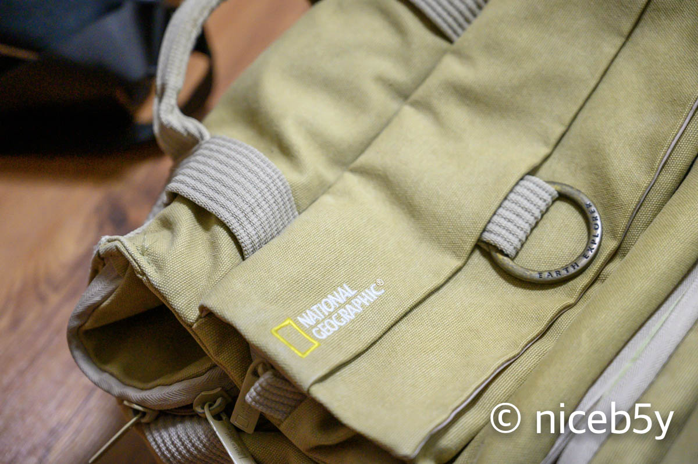
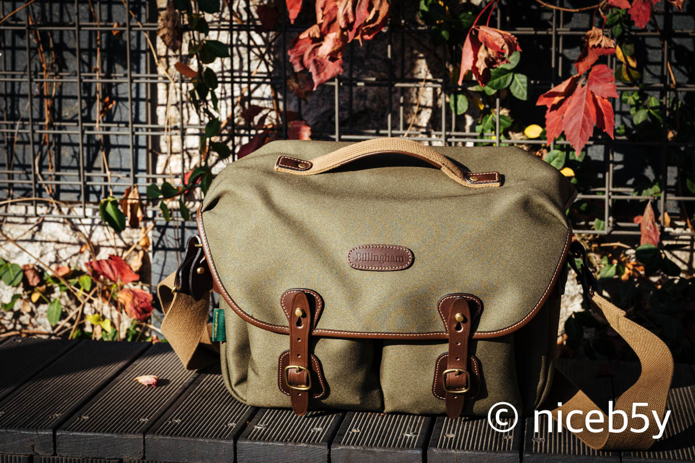

DSLR을 시작하는 초보자의 상징(?) 같은 아이템을 하나 꼽으라면 캐논, 니콘 등 브랜드 로고가 새겨진 크로스백이 아닐까 싶네요.

'그 가방 쓰면 초보자냐!'라면 그건 아니고, 그냥 처음 카메라 사면 그 가방 많이 쓰니까요. 덤으로 받든지, 비싸게 바가지 써서 사든지 처음 그 가방 생기면 되게 뿌듯한 기분이 들죠. 사진 되게 잘 찍게 될 것 같은.

가방이 생기면 조금 있다가 두 가지 사실을 깨닫습니다. 카메라 비싸게 주고 샀다고 사진이 잘 나오는 건 아니라는 사실과, 장비병이 남의 이야기가 아니라는 사실을요.

그러다 보면 카메라 가방도 막 바꾸고 싶어지고 그러잖아요.

그래서 제가 샀던 가방은 이겁니다. 내셔널 지오그래픽 NG 5160.

사진 많이 찍으시는 분들한테 내셔널 지오그래픽이 그렇게 좋지 않은 취급을 받지는 않습니다. 보통 예쁘고 비싼데 별로인 가방 취급을 받는 것 같아 보입니다. 뭐 저도 예뻐서 샀으니깐요.

캐논 카메라 가방 이래로 카메라 가방은 저 가방 하나밖에 안 썼으니 좋은 가방인지 아닌지 평가할 대조군이 없긴 합니다만, 그럭저럭 잘 썼다고 말할 수 있겠습니다.

카메라를 바꾸고 나서 렌즈 개수도 하나 줄어든 상태라, 지금도 무리 없이 모든 장비를 수납할 수 있습니다. 여기저기 신나게 굴리긴 했어도 어디 딱히 고장 나지도 않았네요.

그래도 굳이 가방을 하나 더 지른건, 백팩이 아니라 가볍게 들고다닐 크로스백 계열의 가방을 하나 사고 싶었기 때문입니다.

미러리스로 전환하고 나서 카메라 좀 들고 나가려고 백팩을 다 들고 나가는 건 좀 부담스러웠거든요. 그렇다고 가방을 안 들고 나가기엔, 새 장비로 그러는 건 겁이 났습니다.

그래서 가방을 하나 사고 싶긴 했지만, 학기중이니 돈은 빠듯하고, 그럼에도 인터넷 뒤지면서 가방이나 구경하던 와중에...

[ICPC 예선을 겸했던 교내 프로그래밍 대회](https://blog.niceb5y.net/acm-icpc-2019-preliminary-contest-review/)의 상금이 들어왔습니다.

질러야죠.

빌링햄 하들리 원을 질렀습니다.

아직 들고 많이 돌아다녀본 것도 아니니 어떤 평가를 내리긴 뭐하지만....

장점

1. 예쁩니다. 예쁜게 중요하죠. ~~기능성으로 가방을 따지는 건 프로의 영역입니다.~~
2. 많이 들어갑니다. 크기도 꽤 크고요. 원래 백팩을 완전히 대체하는데 무리가 없습니다. 당초 계획을 생각하면 더 작은 가방을 샀어야 하나 싶지만, 크기 생각 안하고 가방을 바로 결제한 것을 보면 상금 받고 얼마나 눈이 돌아갔었는지를 알 수 있습니다.

단점

1. 비싸요. 파티션도 반만 주고, 어깨 패드도 별매입니다.
2. 좋게 말하면 전통적인 디자인, 나쁘게 말하면 구시대적인 구석이 있습니다. 요즘 가방들보다 열기 불편하다던가 하는. 아직 가죽이 빳빳해서 열고 닫기 힘이 듭니다.

사실 요즘 픽디자인 액세서리에 꽂혀서 이것저것(이라고 해봤자 스트랩 2개지만) 지른 것을 보면 픽디자인 슬링을 살까 하는 고민도 있었지만, 가방끈 잘못 설계해서 분리되는 모습을 보니 실망스러워서 못 사겠더군요.

<blockquote class="twitter-tweet" data-conversation="none">
コミケ新刊　カメラバカにつける薬解説編　進捗（20/24） <a href="https://t.co/f49cqBNHnd">pic.twitter.com/f49cqBNHnd</a>
&mdash; 飯田ともき@11/24 ティアA02a (@teikokulunch) <a href="https://twitter.com/teikokulunch/status/1151116989273796608?ref_src=twsrc%5Etfw">July 16, 2019</a></blockquote>

_"카메라를 모으는 것도 멋지지만, 카메라로는 사진을 찍는 것도 할 수 있어요." "헤에. 그렇구나."_
