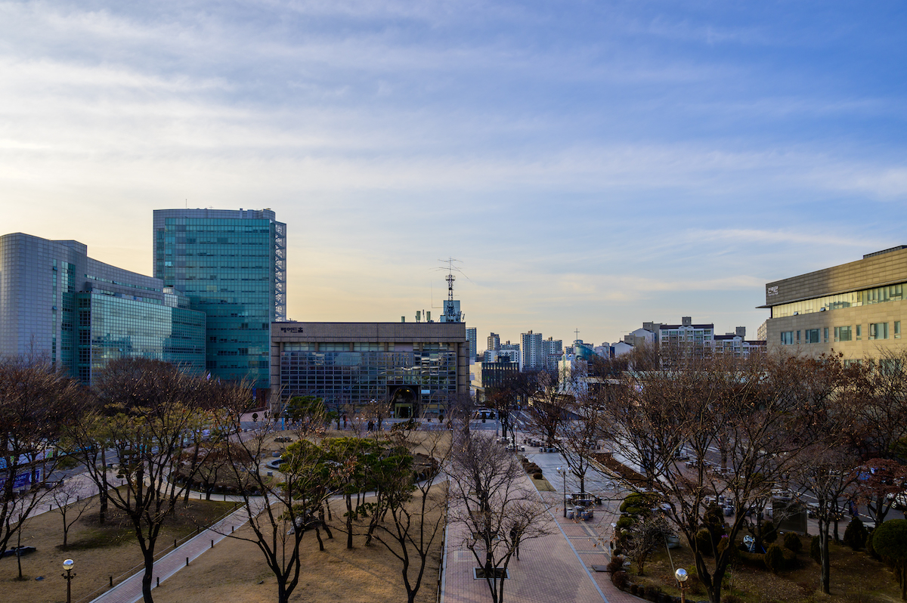

길고 길었던 3학년이 끝났습니다. 아직 기말고사 성적이 나오진 않았지만, 시험은 제 손을 떠났습니다. ~~어떻게든 되겠죠.~~

3년 만에 복학했기에 2월까지만 해도 나름 학교에 가고 싶었는데, 1년 보내니 괜한 생각이었다는 생각이 듭니다.

1학기엔 수강 신청 생각 없이 막 질렀다가 죽는 줄 알았고, 2학기엔 줄인다고 줄였지만, 바닥 치는 체력 때문에 또 죽는 줄 알았습니다.

그래도 올해는 1학기에 성적장학금도 타 봤고, 이런저런 장학금 탄 거 생각하면 꽤 금전적으로는 풍요로운 해였네요. 아직 받지 못한 것도 있고....

어쨌든 행복한 방학 생활을 즐겨... 야 하는데 모 회사의 인턴십에 붙어버려서 겨울 방학에 놀 시간이 없겠네요. 4학년 올라가는 사람에게 겨울방학은 사치일지도 모르지만.

끄악.
