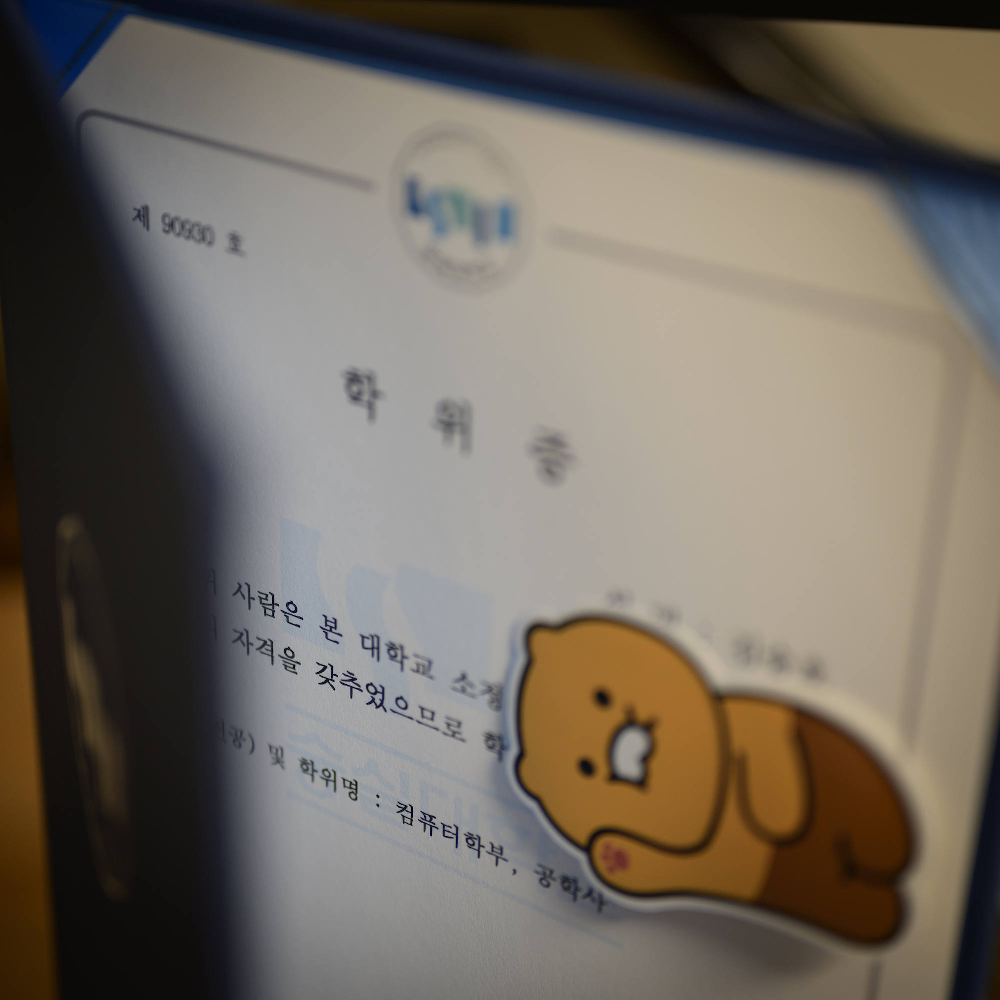

으레 하는 말이지만, 그리고 그중에서도 압도적으로.... 오랜만에 쓰는 글입니다. 마냥 바빴던 건 아니지만, 그래도 나름대로 정신없는 2020년을 보냈던 것 같네요. 물론 그중엔 노느라 바빴던 시간도 많았지만.

그건 그렇고 드디어 대학교 졸업을 했습니다. 사람 앞일은 모른다지만, 대학원을 진학하는 저를 도저히 상상할 수는 없기에 아무래도 이 졸업은 제 인생의 마지막 졸업이 되지 않을까 싶네요.

2014년 대학교를 입학하고, 이래저래 3년을 휴학하고, 4년을 채워서 어느덧 7년이라는 시간이 흘러버렸습니다. 졸업할 때쯤 되면 뭔가 더 어른스러운 사람이 될 줄 알았는데, 추세를 보면 죽을 때까지도 불가능하지 않나 싶군요.

뭐 아쉬운 것도 많았지만, 이래저래 좋았던 4년이었습니다. 많은 좋은 분들을 만날 수 있었고, 많이 배우고 경험할 수 있었다고 생각해요.

어쨌든 같이 졸업한 동기들은 ~~저와 함께하느라~~ 고생 많았고, 축하해주신 모든 분들껜 다시 감사하다는 인사 올립니다.

끗.

&nbsp;

~~짤 하나로 표현하는 졸업 소감~~
