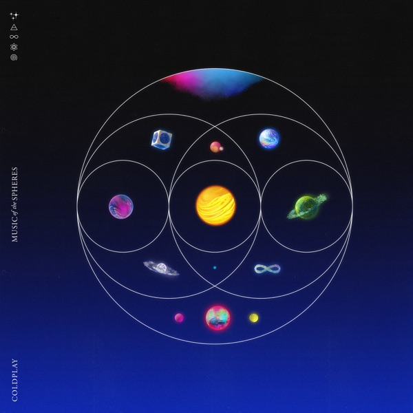

(꼰대 같지만) 옛날에는 콜드플레이가 내한 공연을 한 번이라도 오기나 할까? 생각했던 적이 있었죠. 물론 저보다 더 오래 기다린 분들도 많으시겠지만....

정말 다행히도 2017년에 내한공연이 있었고, ~티켓팅 광탈하고~ 열심히 취소표를 주워 내한공연을 보러 갈 수 있었습니다.

그때의 리뷰는 [여기](https://blog.niceb5y.net/coldplay-ahfod-tour-in-seoul-2017/)

양일 모두 관람을 했기 때문에 더할 나위 없이 좋았지만, 한편으로는 걱정도 됐습니다. 다음에 또 내한을 오기는 할까 싶은 생각이 들었죠. 워낙 비싼 분들이니까요. 게다가 [Everyday Life](https://blog.niceb5y.net/coldplay-everyday-life/)때는 아예 투어가 없었죠.

그러던 어느 날, 신곡이 나왔는데....

<iframe width="560" height="315" src="https://www.youtube.com/embed/3lfnR7OhZY8" title="YouTube video player" frameborder="0" allow="accelerometer; autoplay; clipboard-write; encrypted-media; gyroscope; picture-in-picture" allowfullscreen></iframe>

뮤비에 앰비규어스 댄스컴퍼니가 나왔습니다.

그래서 찾아보다 보니 크리스 마틴이 인천공항에서 목격됐단 이야기도 들리고.... (미리 알았으면 싸인 받으러 가는 건데....)

국내의 모 그룹과 콜라보해서 곡을 낸다는 소문까지 들리다가

<iframe width="560" height="315" src="https://www.youtube.com/embed/3YqPKLZF_WU" title="YouTube video player" frameborder="0" allow="accelerometer; autoplay; clipboard-write; encrypted-media; gyroscope; picture-in-picture" allowfullscreen></iframe>

**엄청난 곡이 나왔습니다.**

과연 콜드플레이가 내한 공연을 바라며 고통받던 과거의 저에게 콜드플레이 곡 중 하나에 한국어 가사가 들어가는 날이 온다고 하면... 무슨 반응을 보였을까요? 🤔🤔🤔🤔🤔

BTS와의 콜라보만으로도 상당히 파격적인 음반이지만, 다른 음악들도 마음에 듭니다. 몇몇 부분에서는 옛날 앨범을 듣는 듯한 기분을 주기도 하고.... 뭐 원래 제가 콜드플레이 앨범은 딱히 가리지 않고 좋아하는 편이기도 하지만요.

가장 좋아하는 트랙을 하나 꼽으라면 Coloratura입니다.

<iframe width="560" height="315" src="https://www.youtube.com/embed/kWUV5-frRU4" title="YouTube video player" frameborder="0" allow="accelerometer; autoplay; clipboard-write; encrypted-media; gyroscope; picture-in-picture" allowfullscreen></iframe>

제 기억으로는 콜드플레이 곡 중 10분을 넘어가는 곡은 이게 처음이 아닌가 싶네요. 정말로 긴 곡이지만, 듣는 시간이 아쉽지 않은 곡인 느낌.

<iframe allow="autoplay *; encrypted-media *; fullscreen *" frameborder="0" height="450" style="width:100%;max-width:660px;overflow:hidden;background:transparent;" sandbox="allow-forms allow-popups allow-same-origin allow-scripts allow-storage-access-by-user-activation allow-top-navigation-by-user-activation" src="https://embed.music.apple.com/kr/album/music-of-the-spheres/1576349937"></iframe>

&nbsp;

덧붙여, Mylo Xyloto가 발매된 지 (벌써) 10년이 되었다고 합니다. 세월이란....

<blockquote class="twitter-tweet">
Mylo Xyloto turns 10 today. To celebrate, Paris - the album’s cover artist - has created this special piece 🌀 <a href="https://t.co/QLHwTNsbSY">pic.twitter.com/QLHwTNsbSY</a>
&mdash; Coldplay (@coldplay) <a href="https://twitter.com/coldplay/status/1452207311607509004?ref_src=twsrc%5Etfw">October 24, 2021</a></blockquote> 
