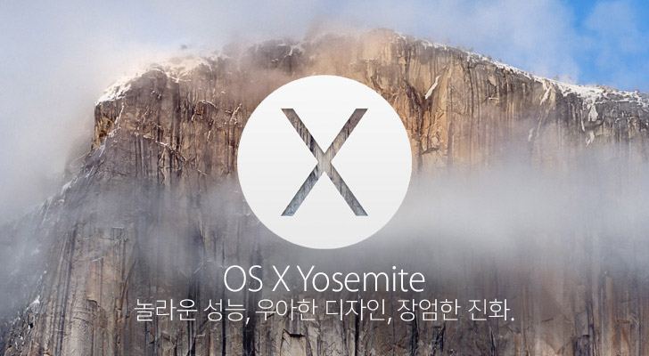
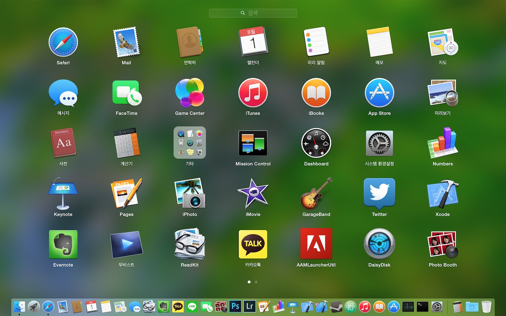
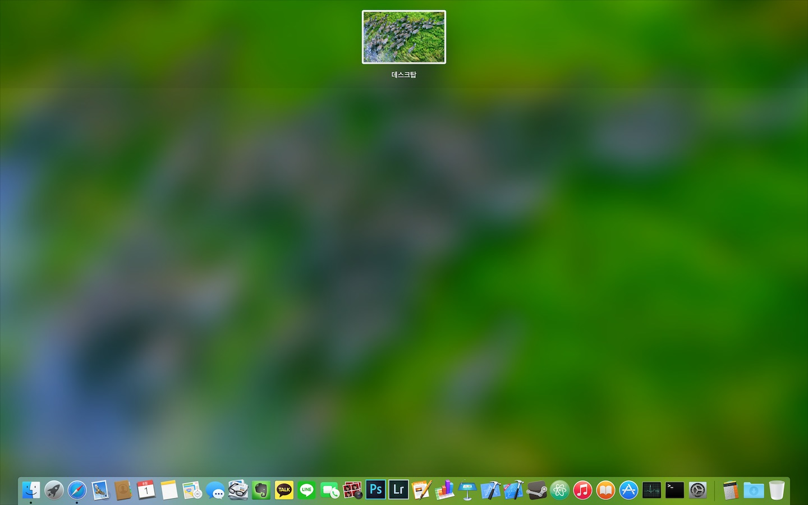
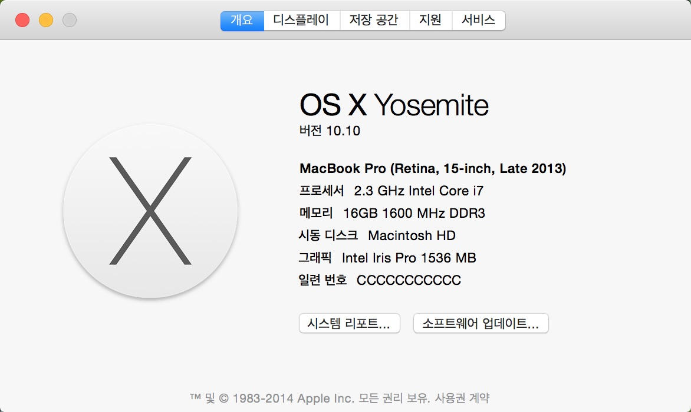
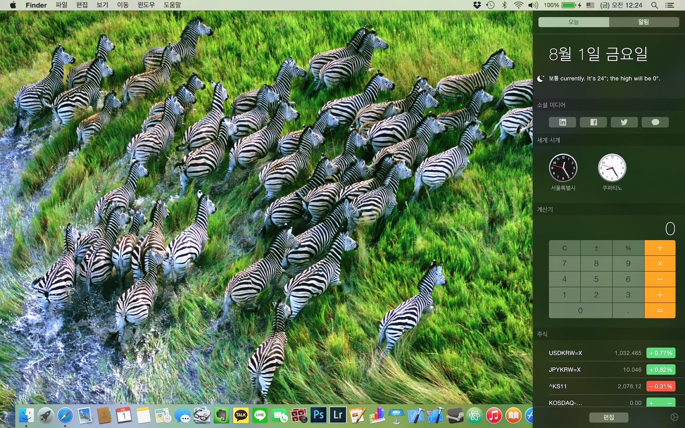
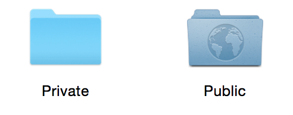

## OSX Yosemite

[OSX Yosemite](http://www.apple.com/kr/osx/preview/)가 발표되던 날에 바로 DP1 버전으로 설치를 해 본 적이 있습니다.

필요한 어플리케이션이 정상동작 하지 않는 관계로 다시 다운그레이드 해야 했습니다만, DP4버전은 많이 안정된 것 같아서 + Handoff기능이 작동하기 때문에 설치를 해보게 되었습니다.

## 디자인

아무래도 OSX Yosemite의 가장 큰 변화는 디자인입니다.

iOS7과 디자인적인 면에서 매우 닮아 있지만, iOS7보다는 더 다듬어졌다고 볼 수 있습니다.

iOS7처럼 반투명 레이어, 블러를 전반적으로 적용한 인터페이스를 지니고 있습니다.

아이콘들이 과도한 텍스쳐의 사용을 줄이고, 더 밝은 느낌으로 변화했다고나 할까요.

[이 포스트](http://martiancraft.com/blog/2014/07/inspecting-yosemite-icons/)에서 볼 수 있듯이, 아이콘의 디자인은 매우 정교하게 잘 만들어져 있다고 할 수 있습니다.

알림 센터도  iOS8과 유사하게 새로 디자인 되었습니다.

이제 여기에 위젯을 추가할 수 있기 때문에 아무래도 Dashboard의 사용도는 많이 떨어질 것이라 생각이 듭니다.

## Handoff

찍어둔 스크린샷이 없다는 것은 매우 큰 안타까움이지만, Handoff는 매우 잘 작동합니다.

꽤 괜찮은 품질로 통화를 할 수 있고, 전화나 문자가 왔을때에는 맥 또는 아이패드에서도 확인할 수 있다는 것은 큰 장점이라 할 수 있습니다.

다만 전화가 오면 3군데에서 전화벨이 울린다는 것은... 음...

아무래도 블루투스를 활용하는 기능이다 보니, 블루투스 신호가 도달하는 거리를 벗어나는 경우에는 작동이 되지 않습니다.

그러므로 폰을 어느 정도 가깝게 거리를 유지해야 한다는 점은 살짝 아쉽긴 하지만, 이 정도만 하더라도 매우 좋습니다. ~~놀고 있는 아이패드를 안 놀게 할 수 있습니다.~~

또, 아직 지원하는 어플리케이션이 많이 늘어나지는 않았지만, A에서 했던 작업을 바로 B에서 할 수 있다는 것은 매우 큰 장점이라 할 수 있습니다.

Safari만 하더라도, 기존의 iCloud 탭보다 간편하게 사용할 수 있다는 점은 참 좋습니다.

## ETC

그 외에도 여러 변화가 있었습니다.

Spotlight가 따로 분리되었고, 드디어 Safari에서 CMD + Shift + N 으로 **분리된** 개인 정보 보호 브라우징 창을 띄울 수 있습니다. -\_-;;

또, iOS와 OSX간 AirDrop을 지원하기 때문에 기기간 파일전송을 훨씬 더 편리하게 할 수 있습니다.

## 총평

전체적으로 뛰어난 운영체제긴 하지만, 정식 버전은 아니다 보니, 아직까지도 몇몇 문제점들이 있습니다.

아직까지 몇몇 버그들이 있고(비정상 종료 오류), 파이널컷 같은 어플리케이션들은 실행이 안되는 문제라던지,

아직까지 프로그램들이 OSX Yosemite를 지원하지 않는 문제들이 있습니다.

하지만 버그가 안정화 된 정식버전이 출시되고, 많은 어플리케이션들이 이를 지원한다면, 썩 괜찮은 운영체제가 될 것이라 생각합니다.
