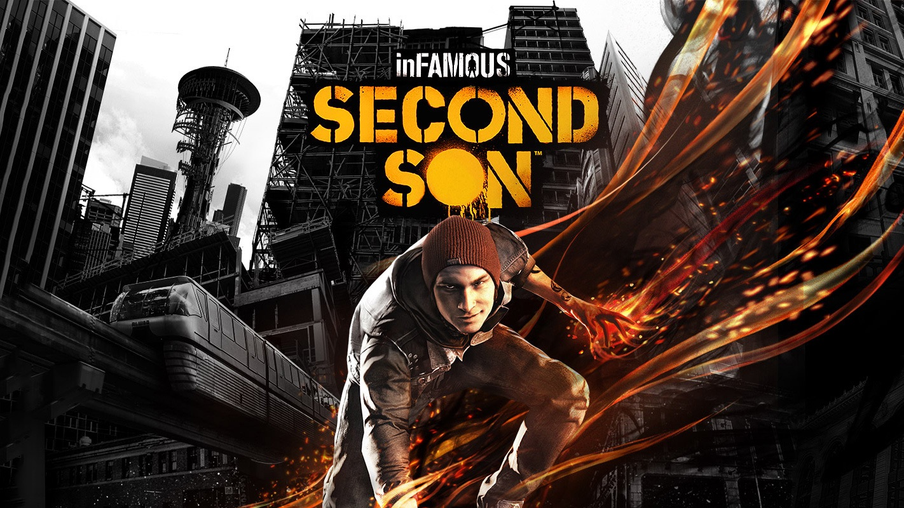
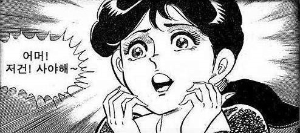
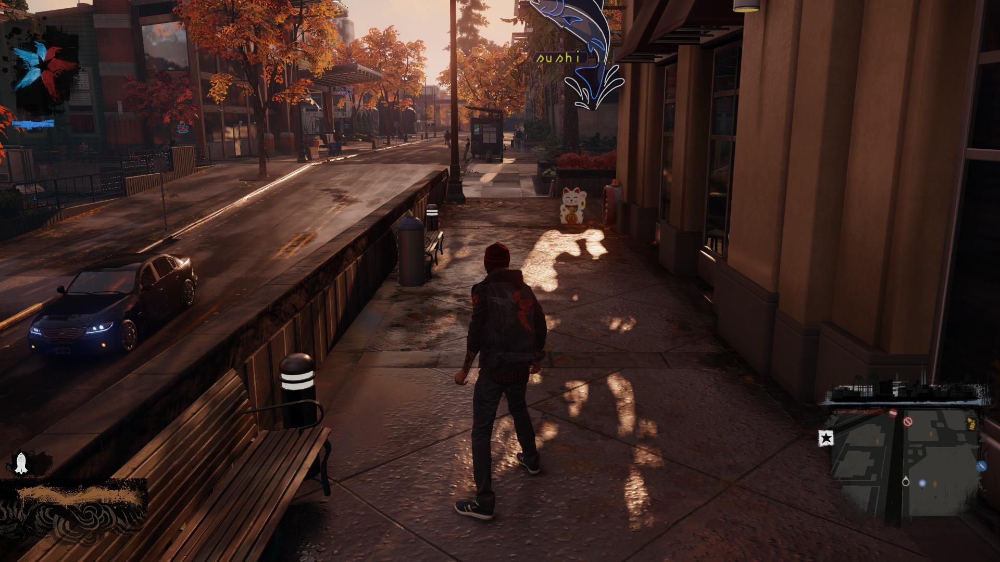
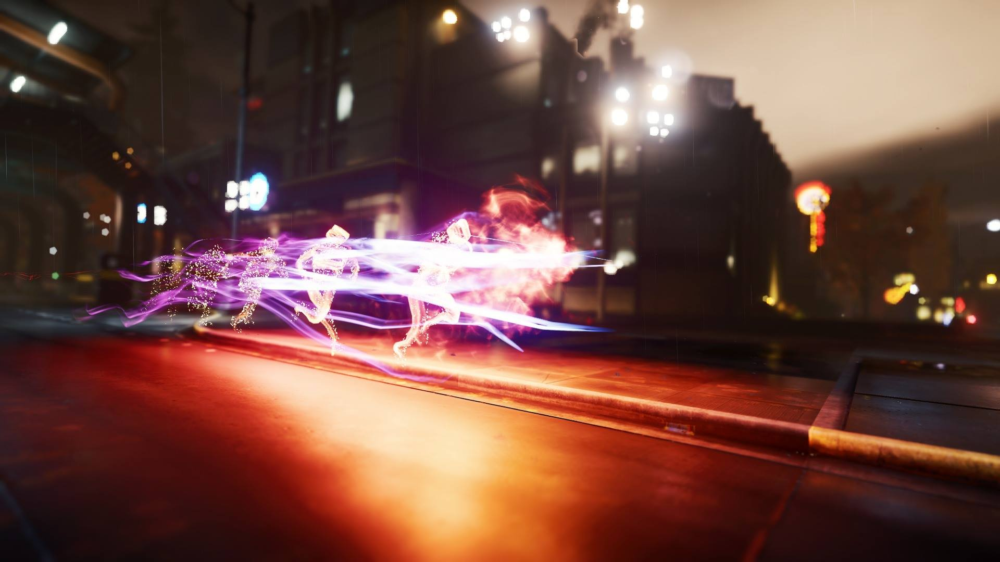
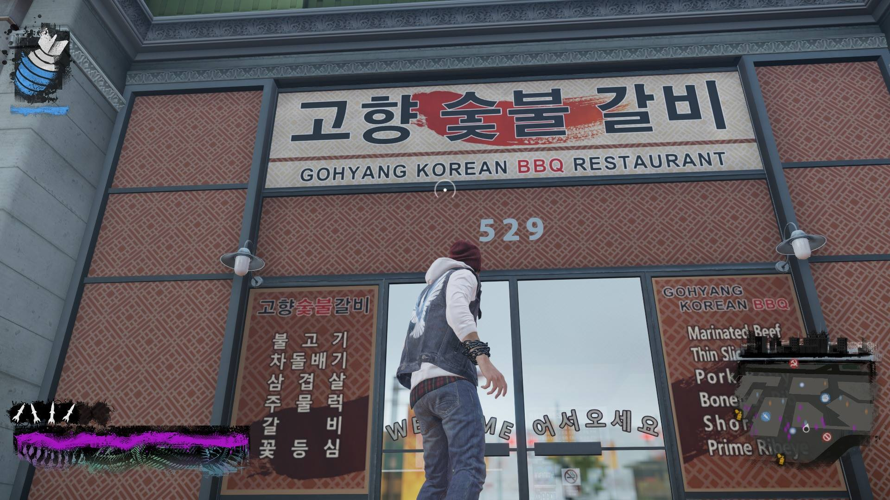
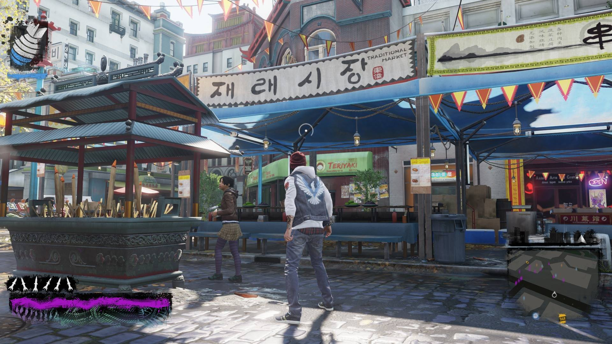

## inFAMOUS: SECOND SON

인퍼머스: 세컨드 선 악명높은: 둘째 아들(...)

사실 어떻게 보면 이 게임이 PS4를 사는 직접적인 계기가 되었다고 볼 수도 있을 것 같습니다.

예전에는 그냥 사야지 사야지 소리만 했었는데...

인퍼머스 플레이 영상 보고

... 그래서 샀습니다.

## 그래픽

사실 스크린샷으로 보면 잘 느낌이 살지 않는데, 아직까지도(...) PS4의 게임 타이틀에서 손에 꼽을 그래픽을 자랑합니다.

보면 텍스쳐는 다른 게임에 비해 그렇게 뛰어난건 아닌것 같은데...광원이나 반사 효과가 참 좋습니다.

특히 네온 능력을 보면 매우 화려한 그래픽을 자랑합니다.

게다가 업데이트로 포토모드가 추가되어 더 다양하게 스크린샷을 찍을 수 있습니다만... 쉽진 않네요.

## 물리엔진

물리엔진은 하복을 이용했는데, 꽤 잘 만들어져 있습니다.

다만 가끔 버그 때문에 벽에 끼인적은 몇번 있습니다만, 배틀필드4 수준은 아닙니다.

배틀필드4는... 방 자체가 없어지던가... 그런 게임이니까요.

## 오픈 월드

인퍼머스: 세컨드 선의 배경은 시애틀입니다.

시애틀의 스페이스 니들까지도 구현되어 있는데, 실제로 가본 적은 없으므로 얼마나 닮았는지는 모르겠지만, 맵은 꽤 잘 만들어져 있습니다.

신기하게도(...) 한글로 된 간판(고향 숯불 갈비 등...)도 찾아볼 수 있습니다. 아무래도 주인공이 날아다니다 보니...

자동차같은 것들을 뺏어탈 수 없도록 해놓았는데, 물론 날아다니는게 더 빠르긴 하지만, G\*\*와 같은 교통사고 시뮬레이션을 못한다는 점이 약간 안타깝습니다.

또, 사이드 미션이 반복적인 점과 건물 내부가 구현되지 않은 점도 안타깝습니다.

## 스토리

스토리도 길이가 짧은 점만 제외하면 꽤 괜찮다고 생각합니다.

초능력을 가진 인물로 선 / 악을 선택하게 됨으로써 게임이 진행되는 과정이 달라지는 부분은 꽤 인상적이었습니다.

선카르마로 먼저 진행한뒤에 악카르마로 진행하니 이게 청소년 이용불가 게임인 이유를 알겠더군요.

## 단점

이 게임의 단점은 짧은 플레이타임과 심심한 근접공격, 반복되는 사이드 미션이라 할 수 있습니다.

DLC인 인퍼머스: 퍼스트 라이트에서는 심심한 근접공격같은 부분은 어느정도 해결한 것 같습니다만, 이건 좀 더 해봐야 알겠네요.

## 평가

후반부로 갈수록 꽤 지겨워지는 감이 있지만, 그래도 PS4 초반에 나온 게임 치고는 괜찮았다고 생각합니다.

그래서 점수는 ... **8 / 10**
