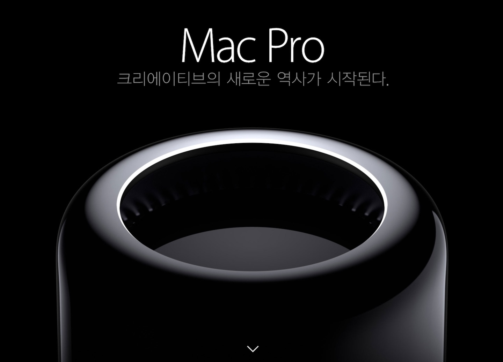
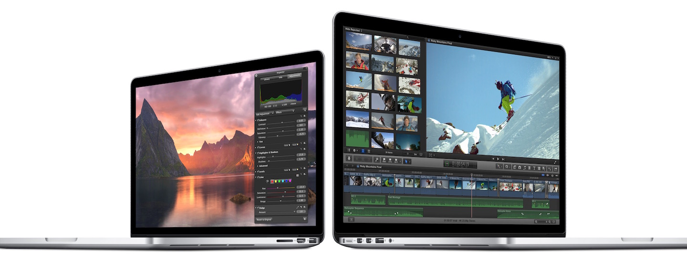

저도 잡스가 뛰어난 CEO라고 생각하고, 그가 한 업적에 대해서도 뛰어나다 생각하며, 월터 아이작슨이 쓴 스티브 잡스 책도 마르고 닳도록 읽어 봤습니다.

다만, 요즘 "잡스라면 이렇지 않았을거야!"하며 팀 쿡이 필요 이상으로 까이는 느낌이 들어 그냥 끄적거려봅니다.

팀 쿡한테 따로 돈 받는 거 없습니다. ~~그러면 좋겠네.~~

&nbsp;

Q. 잡스였으면 아이폰이 커지지 않았을까?

A. 아니오.

<blockquote class="twitter-tweet" lang="ko">
  

    "한손으로 잡기 가장 좋은 사이즈 3.5인치"는 잡스가 그냥 한 소리임. 만약 살아있었다면 "왜 아이폰을 한손으로만 잡는가 이 미개한 유저들아, 나처럼 두 손을 써봐!"라고 키노트에서 호통을 쳤을 것이다. 아이폰4 데스그립 사건을 떠올려봐 여러분.
  

  
  

    — JeongtaeRoh (@JeongtaeRoh) <a href="http://twitter.com/JeongtaeRoh/status/509552163349991424">2014년 9월 10일</a>
  

</blockquote>

이랬을걸요.

&nbsp;

Q. 잡스였다면 키노트가 개판이 아니었을까?

A. 일단 내용상으로는 더 좋았겠지요. ~~그리고 동영상 스트리밍 서버 관리자 잘림.~~

&nbsp;

Q. 잡스였다면 팀쿡을 죽이려 들었을까?

<blockquote class="twitter-tweet" lang="ko">
  

    팀쿡 "앞으로의 애플은 어떻게 할까요…" 잡스 "당신 마음대로 하십시오…" 팀쿡 "정말… 입니까…!" 잡스 "당신을 믿습니다…" 팀쿡 "이것은 아이폰 6입니다" 잡스 "아 잠깐 타임 취소좀" — [루프] ★그리자이아 시리즈 애니화★ (@bokuga_loop) <a href="http://twitter.com/bokuga_loop/status/510039948620087296">2014년 9월 11일</a>
  

</blockquote>

A. 아닐껄요.

<blockquote class="twitter-tweet" lang="ko">
  

    잡스는 팀쿡한테 자기 생각하지 말고 니 꼴리는 대로 하라고 하고 죽었는데 왜 잡스 이야기가 나오는지 모르겠다
  

  
  

    — Dit (@618116_kr) <a href="http://twitter.com/618116_kr/status/509581460026560512">2014년 9월 10일</a>
  

</blockquote>

&nbsp;

제 의견도 위와 같습니다. 잡스가 괜히 팀 쿡한테 맡긴게 아니지요.

<blockquote class="twitter-tweet" lang="ko">
  

    지금 팀쿡이 능력없는 개객기 취급받지만, 정작 우리나라에서 가장 높이 평가받는 iPhone 3GS는 팀쿡의 작품이라는게(…)(잡스는 그 당시 병가)
  

  
  

    — 김승호 (@niceb5y) <a href="http://twitter.com/niceb5y/status/510040984806100993">2014년 9월 11일</a>
  

</blockquote>

&nbsp;

뭐 이렇기도 하고(물론 3GS는 어떻게 보면 지금 6보다도 더 대충 한 업그레이드 같기도 하지만...)

꽤 혁신적이라 부를 수 있는 제품도 만들어 냈고 말이죠.

~~스콧 포스톨을 쫓아내는 등의~~ 직원간의 균형을 유지하는데도 힘쓰고 있고,

이런 면에서는 잡스보다 더 열심히 하기도 하니까요.

이제 팀 쿡이 CEO를 맡은지도 오랜 시간이 지났고, 그동안 잘 운영해 왔으니 "잡스라면 ~했을꺼야..."라는 이야기는 그만할 시점이 오지 않았나 싶네요.
