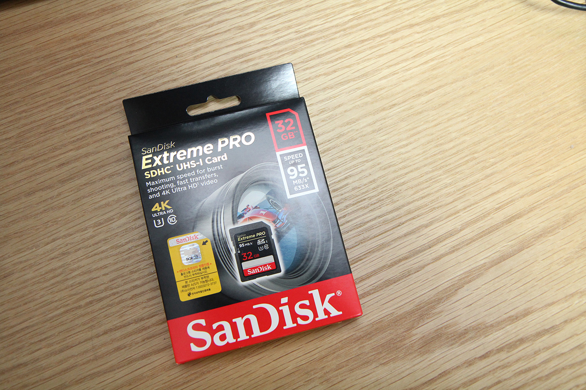
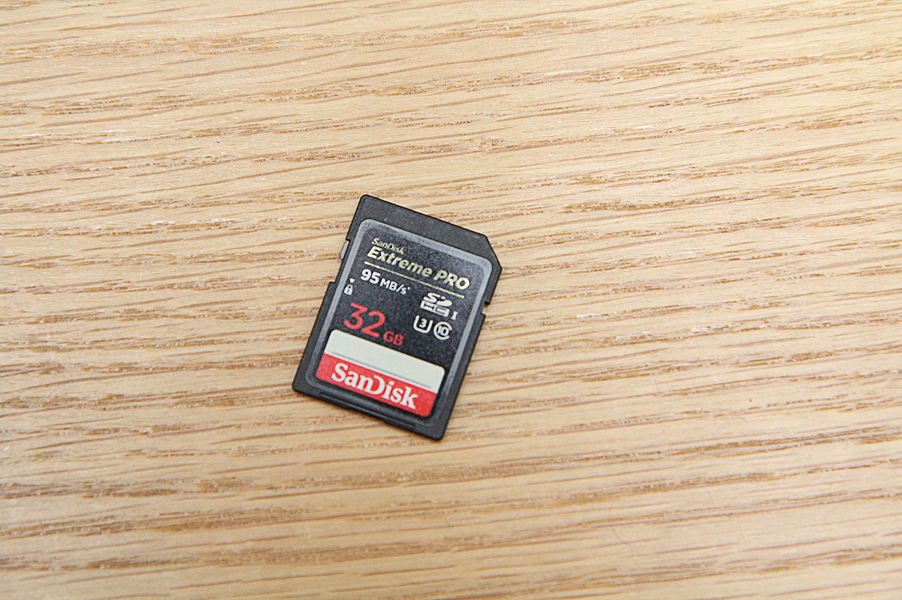

SD카드 중에서는 꽤 비싸고 좋은 축에 드는 Sandisk Extreme Pro SD 카드를 샀습니다. 카메라를 새로 사고 싶었는데, 카메라를 못 사는 바람에 기분이라도 내기위해 산...건 아니고, 기존에 사용하던 SD카드들이 죽었거나, 죽을 기미가 보이길래.

용량은 기존에도 딱히 부족함을 못느꼈기에 32GB모델을 샀습니다만... 생각해보니 아이폰 용량보다도 작은 용량이네요.

UHS-I U3라 4K영상 촬영에도 대응한다고 하지만, 읽기/쓰기 속도는 예전과 달라진 게 없는 걸 보니 그냥 라벨만 바뀐것 싶기도 하고...

샌디스크 고급라인이라 아무래도 속도는 뛰어납니다. 라벨에 95MB/s라 그냥 그러려니 하고 벤치마크는 안했지만 200MB정도 되는 사진이 2~3초 내외로 옮겨지는 걸 보면 그 정도 되는듯.

예전에 쓰던 삼\* SD카드는 클래스 10 모델이었습니다. 그런데도 FHD영상 촬영이 끊기던 적이 많았습니다. 덕분에 버린 영상이 많아서 실망도 많았는데, 이제 그럴 일은 없겠지요.

이제 4K 촬영을 지원하는 메모리카드를 샀으니, 4K촬영이 가능한 카메라만 하나 사면... (한숨)
