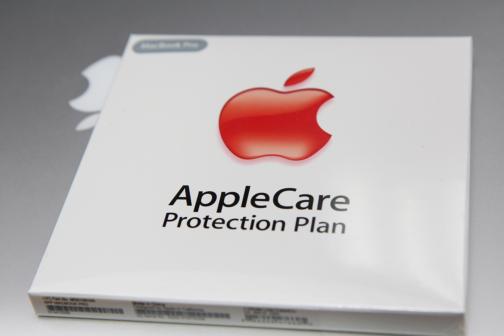
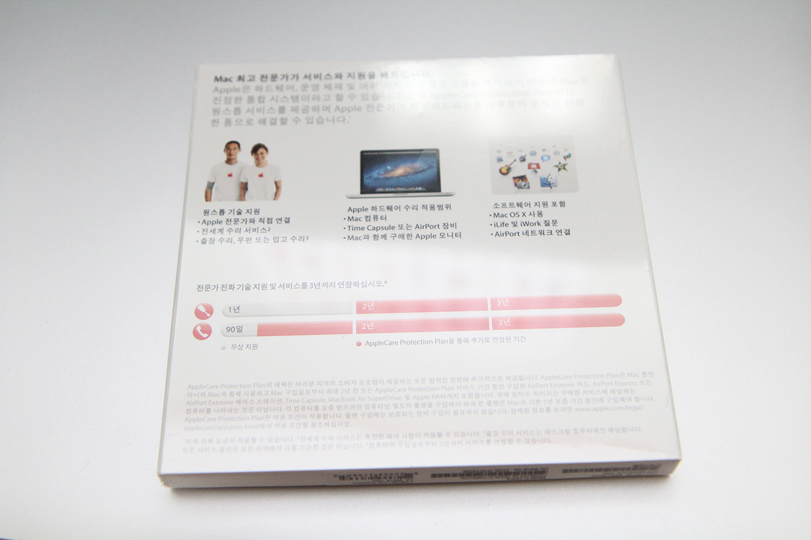
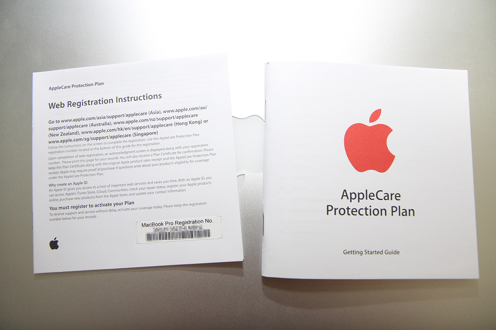
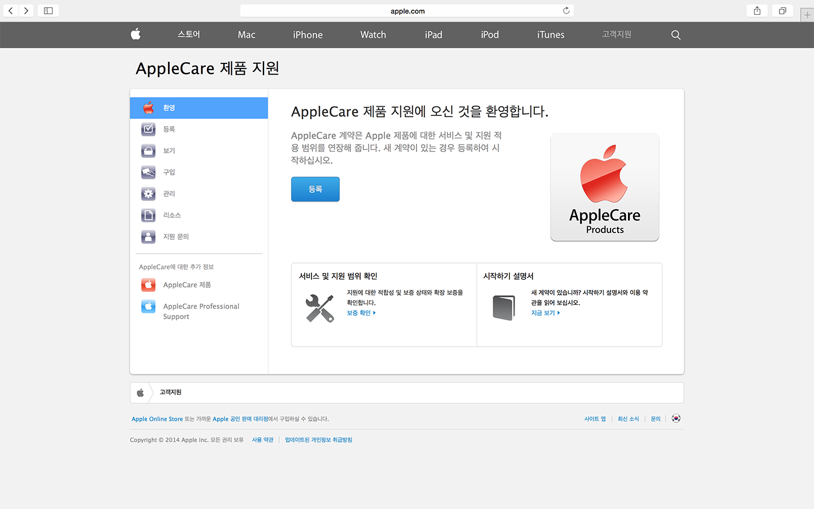
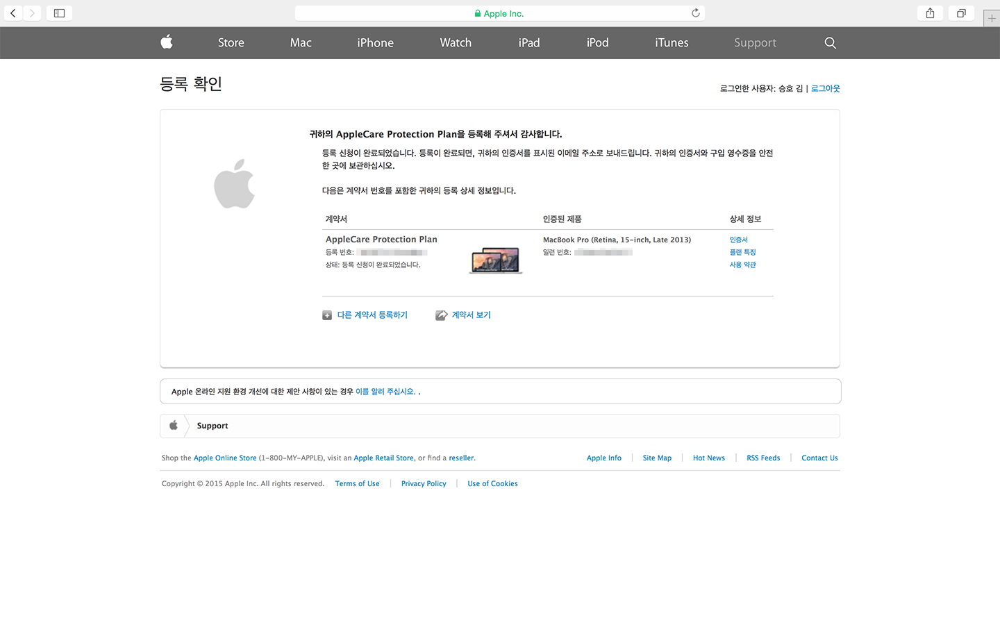
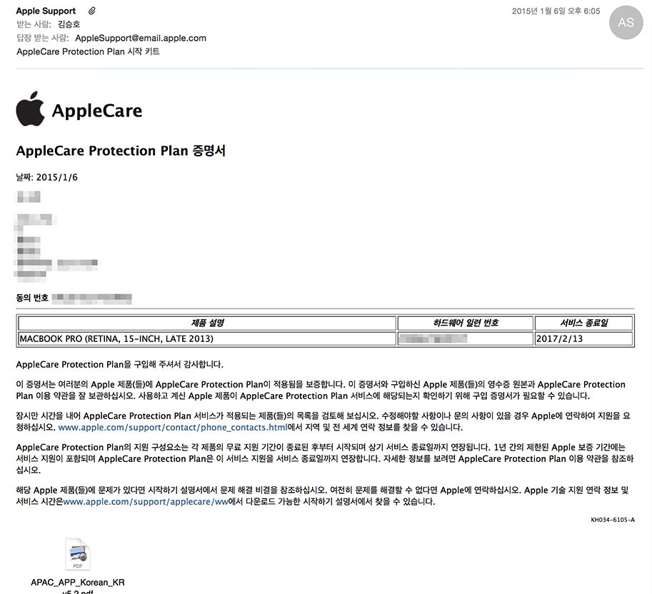
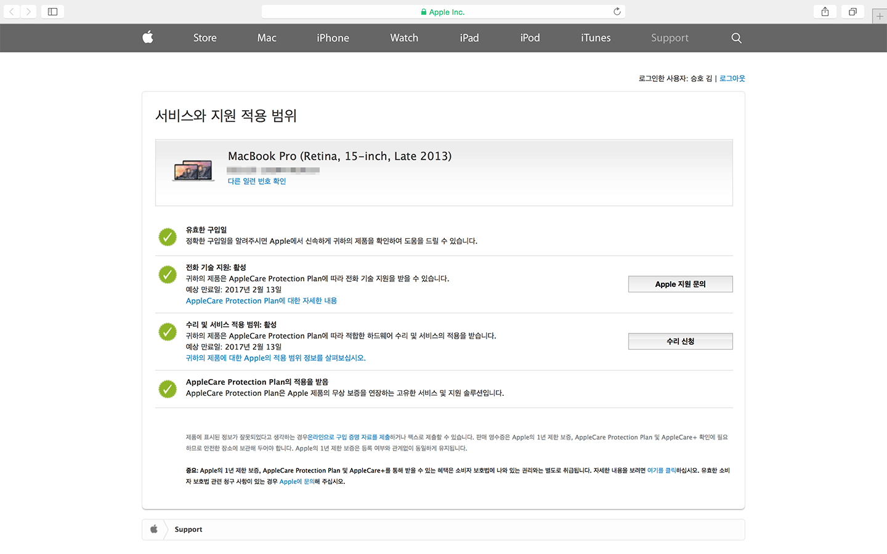

어느덧 지금 쓰고 있는 맥북 프로 모델이 사용한 지 약 11개월이 되었습니다.

지금까지는 별 고장 없이 잘 쓰고 있었는데, 곧 보증기간이 끝나게 되니 혹시 망가지면 어쩌나 부담스럽기도 해서 AppleCare를 등록할지 말지 엄청 고민했었습니다.

아마존, 이베이 등등을 찾아봤지만, 그냥 우리나라에서 사기로 결정했습니다. 15인치 모델을 사다 보니, 어디에서 사던지 20만원은 넘는 데다, 이베이에서 사기는 뭔가 찝찝하고... 아마존에서 구매하자니 배송대행 비용 + 관세 등등을 비교하니 큰 차이는 나지 않는 것 같아서...

우리나라 가격을 보자니, 오픈마켓이나 AOC가 가장 싼 축에 속하고, 애플 온라인 스토어는 39만원이나 받아먹습니다... -\_-

그런데 kmug를 들어가보니 293,000원에 팔길래 구입했습니다. (그래도 비쌉니다. 소비자 과실 커버도 안되는데... 노트북 가격의 10%가량...)

패키지 앞.

아직까지도 여기에는 아쿠아 스타일의 애플 로고가 사용되네요.

패키지 뒷면.

뭔가 말이 많지만, 어차피 보증기간 연장말고는 쓸 일이 없을 듯...

이렇게 종이 뭉치가 2장 들어있습니다. 오른쪽 종이보단 왼쪽 종이가 중요하고요.

[여기](http://apple.com/kr/support/applecare)에서 등록하시면 됩니다.

등록 신청하면 승인을 받아야 한다고 합니다.

한 5분정도 기다리면 메일로 날라 옵니다.

그 다음에 확인하면 기간이 2년 더 늘어나 있습니다.

30만원이나 주고 연장했으니, 이제 2년 더 열심히 써야겠습니다.
