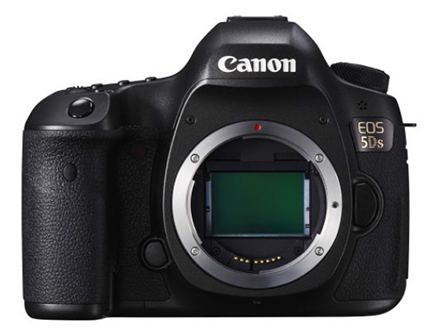
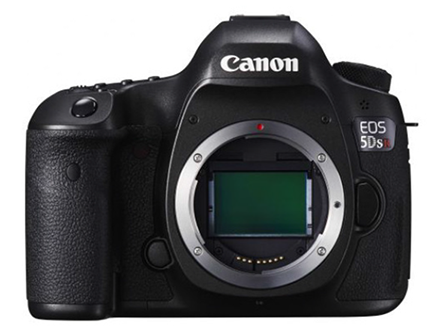

EOS-1 DX가 1800만 화소로 출시 한 뒤, 캐논이 고화소 DSLR이 EOS 3D라는 이름을 가지고 나온다는 루머를 처음 본 지도 꽤 지났는데, 드디어 나왔습니다.

1D, 1Ds 시리즈가 1DX로 합쳐진 이후로 간만의 Ds라인업입니다.

니콘의 D800처럼 로우패스 필터가 있는 버전과 없는 버전이 모두 출시되었으며 (정작 D810은 하나로 나왔지만.) 각각 $3699, $3899로 \$200정도 차이가 납니다.

센서는 캐논에서 설계 / 제조된 것으로 보입니다. 7D Mark2수준의 노이즈, 5D Mark3수준의 DR을 가진다고 하는데, 이 때문에 7D Mark2의 센서를 그대로 키운것이 아닌가 하는 의심을 받는 중입니다. 그래도 암부는 조금 개선이 있는것 같다고도 합니다.

샘플샷을 찾아 한번 크롭 해 보았는데, 이 사진은

바로 아래 사진에서 자른 겁니다.

역시 고화소다 보니, 인물 사진 찍는건 좀 별로인듯. ~~으아 주름~~

화소만 보면 풍경용인데, 정작 DR이 좁아서(...)

(다음 카메라는 마이크로 포서드 중에서 고르려고 하지만) 한번 써보고 싶은 기종입니다.

~~로또를 사야 하나...~~
