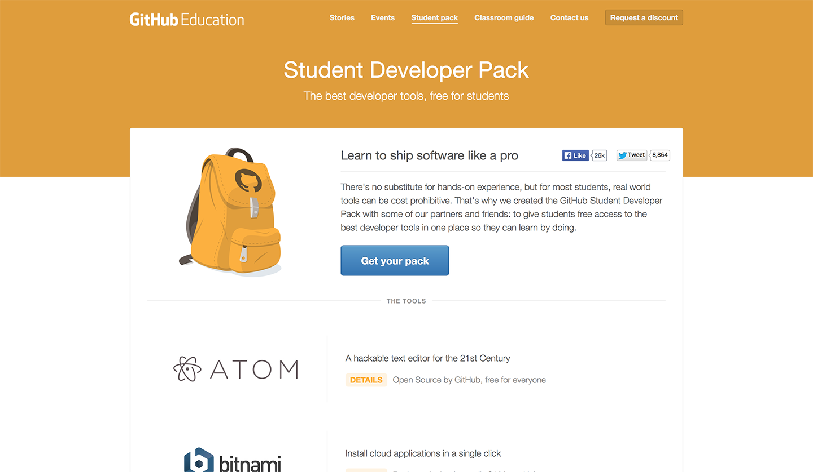

github에서 학생 개발자를 위한 지원 프로그램을 내놨습... 내놓은지는 꽤 됩니다만, 신청을 해도 승인을 안해주다가 1:1 (영어) 문의 하고 나서야 승인을 해줬길래 이제 한번 써 봅니다.

한 3~4개월은 pending상태에서 기다린듯.

신청은 [여기](http://education.github.com/pack) 에서 하시면 되고, 간단한 회원가입, 이메일 인증~~, 그리고 3~4개월 정도의 지옥같은 기다림 또는 1 : 1 (영어) 문의~~를 하시면 되겠습니다.

혜택은, Atom에디터가 무료(...는 원래 무료 + Sublime Text보다 어딘가 부족 (Atom쓰려고 노력하다 그냥 Sublime Text 질러버린...))

그리고 여러 클라우드, 도메인, 결제 시스템 (1년치 또는 크레딧 등등.)등과

언리얼 엔진 4(졸업할 때 까지!) + Github Micro Plan(5개 비공개 레포 + 졸업할 때까지!)라는 어마어마한 혜택을 줍니다.

개인적으로 언리얼 엔진4나, Github플랜만으로 충분히 매력적인듯.

어쨌든 매력적인 혜택이니 신청 할 수 있는 분들은 신청하시는게 좋겠습니다.
