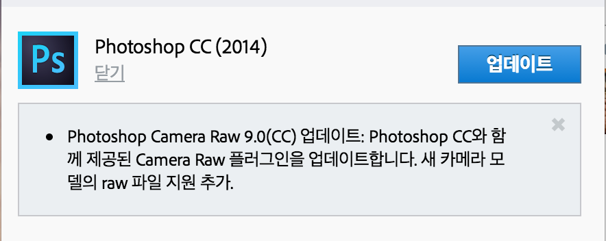

Adobe Lightroom 6이 출시되었습니다.

변경 사항으로는 HDR이미지 생성, 파노라마 생성, 얼굴 인식, 성능 향상 등이 있습니다.

Adobe Lightroom CC에서는 이제 안드로이드 동기화도 지원한다고 합니다.

자세한 내용은 [여기](http://www.adobe.com/kr/products/photoshop-lightroom/features.html)를 참고하세요.

덧붙여, ACR도 9.0으로 업그레이드 되었습니다.

뭐 그건 그렇다 치고.

라이트룸 6 한번 깔아보고 자야겠다는 계획을 세웠는데...

아니 왜 최신버전요...

~~일해라 어도비~~
