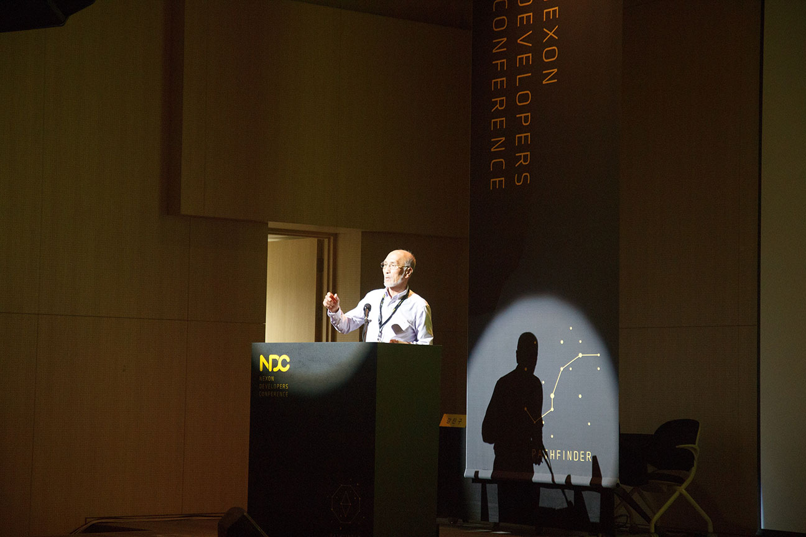

기왕 NDC를 다녀왔으니 뭔가를 남겨야 할 것 같아서 간단한 포스팅이나 해보려 합니다.

사진을 이것저것 찍다 보니 스크롤이 길어질 것 같아서 하루마다 나눠서 포스팅 하겠습니다.

사건의 발단은... 친구가 NDC 참관 신청 링크를 던져준 것으로 시작됐습니다.

한번 가보고 싶은 행사였기에 신청했는데 합격을 하게 되어 오게 되었습니다.

아침에 수업 하나만 빨리 듣고 버스 타고 판교에 왔습니다.

판교 테크노밸리 생기고 나서 처음 오는 듯 하네요. 뭐 예전에도 그닥 올 일은 없었지만...

육교를 건너고 좀 걷다 보니 넥슨 글씨가 보이더군요.

더 가까이 가서 찍어봤습니다.

문을 열고 들어가니 NDC 일정표가 있었습니다.

친구들이 듣고 싶은 강연이 있다고 하길래, '게임 기획자 지망생에게 들려주는 괜찮은 이야기'라는 강연을 같이 들으러 갔습니다.

기획자가 책을 많이 읽어야 하는게 중요하다고 말씀하시면서 보여주시는 예가 참 인상깊었습니다.

~~뭐 강연이랑 상관없는 이야기지만 저기 TV가 참 좋아보이던ㄷ...~~

공부할 수 있는 좋은 방법 + 이직한다고 오해 살 수 있는 좋은 방법이라고 합니다.

이 강연이 끝난 뒤 점심 식사를 하고, (여기는 사진이 없네요)

기어 VR을 체험해 보게 되었습니다. (마찬가지로 사진이 없습니다.)

5분 가량 체험해 볼 수 있었는데,  게임을 체험 해 본 소감으로는...

...왜 그 게임을 넣었는지 모르겠어요. VR만의 매력도 그닥 없고...

기왕 VR이면 1인칭 시점 게임을 만들어 넣어야 하는게 아닐까 싶은데...

~~[서머 레슨](https://store.playstation.com/ko-kr/product/HP0700-CUSA11674_00-ASIAPLACEHOLDER0) 같은거 있잖아요(...). 그거 하면 대박 날텐데... 꼭 다음에 참고하세요.~~

그건 그렇고... 기기 자체로만 보면... 뭐 나쁘지 않은 것 같아요. 갤럭시 있으신 분들은 싼 가격에 쓸 수 있으니...

다만 해상도가 여전히 부족합니다. 4K를 넘어서 6~8K는 돼야 볼만 할 듯.

다음에는 20세기 대한민국 컴퓨터 개발 역사 워크숍에 왔습니다.

애들이 그 긴걸 어떻게 듣냐고 했는데, 의자도 여기가 제일 편했고, 딱히 그렇게 힘들진 않더라구요.

음... 이 강의를 왜 들었냐 물으시면... 그냥 재밌을 것 같아서...?

그리고 이 분을 뵐 수 있다는 생각에...

대한민국 인터넷을 개발하신 전길남 박사님을 뵐 수 있었습니다.

강연은 프로세서, OS, 입출력 등으로 나눌 수 있었는데요, 나름 컴퓨터 학부 재학중이지만 우리나라 컴퓨터 역사를 모르는게 너무 많았습니다. 그 점에 대해 참 안타깝다고 느꼈습니다.

워낙 한분 한분들이 대단하신 분들이셨기 때문에 인상깊게 봤습니다.

나중에 동영상으로 업로드 된다고 하니 보고 싶으신 분들은 찾아서 보시면 될겁니다.

강연이 끝나고 귀가하던 길에 한컷.

2일차에 계속됩니다.
