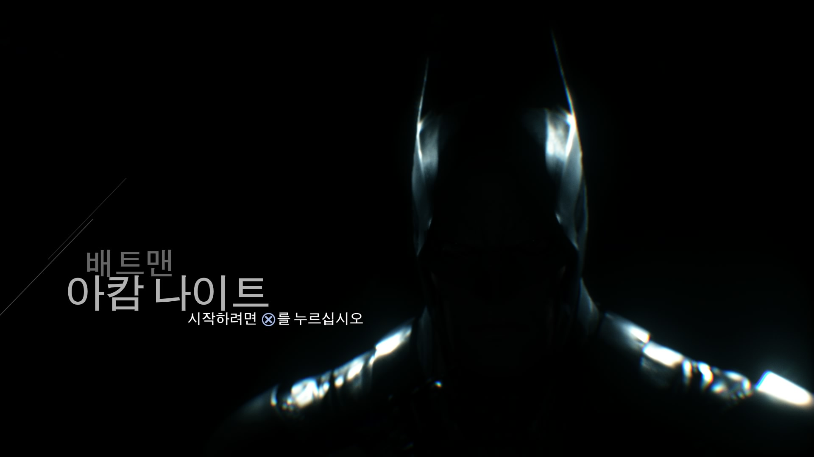
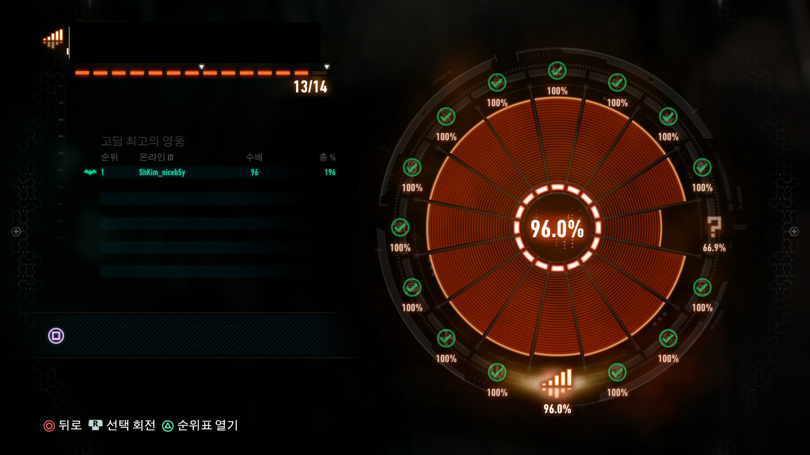
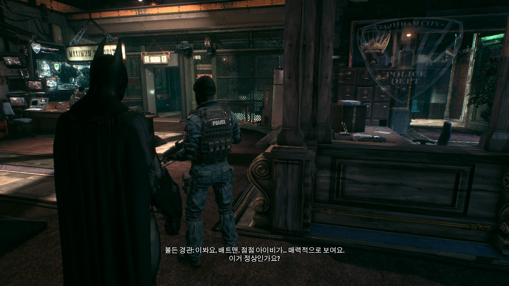
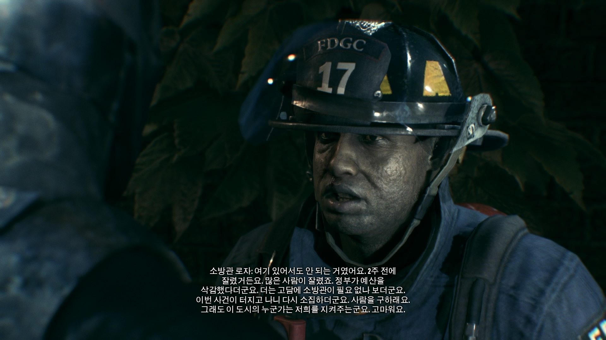
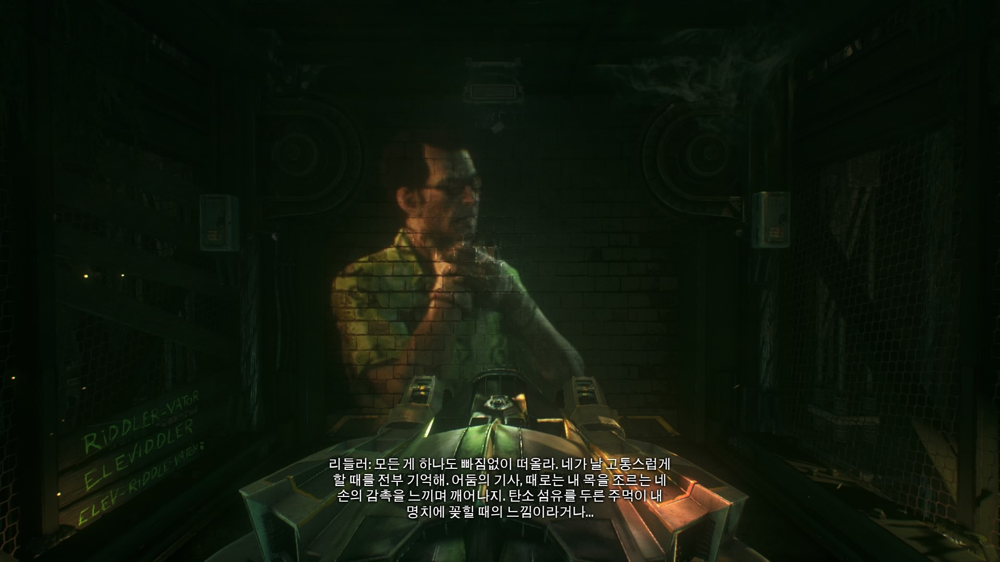

## Batman Arkham Knight

**배트맨 아캄나이트**

아-주 오래전부터 상당히 기다린 작품입니다.

사람을 절대 죽이지 않는(...어?) 불살의 배트맨이 주인공인 작품이며

락스테디에서 만든 아캄 시리즈 3부작의 마지막을 장식하는 작품이니까요.

그렇기에 발매를 연기 할 때마다 엄청난 고통을 안겨주던 작품이죠.

드디어 우리나라에서 심의를 받고, 예약 판매를 한다고 하길래, 구매를 하려 했습니다.

... 그런데 시험기간이라 정신없어서 예약판을 사는걸 까먹어서 못샀습니다. -\_-;;;

그렇게 슬퍼하다, 출시 전날 국전을 어쩌다 가게 됐는데, 앞쪽에 줄을 서서 운 좋게 예약판 취소물량을 얻게 됐더랍니다.

요즘 게임들은 다 다운로드로 구매하고 있었기 때문에, 예약판 아니면 다운로드로 샀었을 것 같은데...

다른 분들 다운로드 시간 보니 디스크로 사기 잘한 느낌.

PC판은 퍼포먼스 문제에, 스팀버전은 우리나라에 한해 출시가 연기되었고... XO판은 자막이 존재하지 않았다고 하니, PS4판을 산 저는 상당히 운이 좋았다 할 수 있겠습니다.

어찌 됐든 열심히 플레이 해서 메인 엔딩도 봤고, 진엔딩 보려고 리들러 트로피 모으러 다니는 일 밖에 남겨두지 않았으니, 이 정도 플레이 했으면 리뷰 쓰는덴 문제가 없을것 같네요.

## 그래픽

그래픽은 매우 만족스럽습니다.

시리즈 특유의 수트 손상도 잘 구현 되었고... 물리 효과들도 매우 뛰어납니다. 그럼에도 거의 항상 30fps를 유지합니다.

팝인 현상이 가끔 보이긴 하지만, 심한 정도는 아닙니다. 그리고 배트모빌로 빠르게 돌아다니면 1초정도 잠시 멈추고 로딩을 하기도 합니다.

'그럴 만한 가치가 있을까?' 싶긴 하지만, PS4에 SSD를 달면 사라질 것 같습니다.

처음 시작 부분 영상입니다. PS4 기본 캡쳐를 이용했기 때문에, 화질 열화가 좀 있습니다. 물리효과 정도만 참고하시면 되겠습니다.

## 스토리

아캄 어사일럼 \- 아캄 시티 \- 아캄 나이트로 이루어진 3부작의 끝을 맺기엔 괜찮은 스토리라고 생각 됩니다.

몇몇 부분에 대해서는 (의도 한 듯 보이는) 뻔한 스토리가 느껴지지만, 몇몇 부분은 매우 놀랄 만한 반전 요소가 있습니다.

한 가지 아쉬운 점은 스토리의 진엔딩을 보려면 리들러 트로피를 다 모아야 한다는 것이지요.

~~정상이 아닙니다.~~

## 게임 플레이

이전 시리즈부터 장점으로 평가되는 전투 시스템을 협동 전투 같은 이벤트를 통해 잘 발전시켰다 할 수 있습니다.

잠입 시스템도, 적들이 한번 당한 수단에 대비하기 때문에 너무 단조로워지지는 않습니다.

고담시를 마음대로 돌아다닐 수 있다는 것도 장점이지요.

단점으로는 도구 사용을 이용한 퍼즐이 많이 줄었습니다.

~~아...~~

## 배트모빌

아무래도 개판으로 만들어 놓은 PC판을 제외하면, 가장 핫 한 존재가 배트모빌일 듯 합니다.

예전 시리즈의 그 찰진(?) 전투는 별로 없고, 배트모빌로 쾅쾅쾅 하는 일이 너무 많기 때문이지요.

저도 이 부분이 아쉽긴 합니다. 스포일러 문제 때문에 많이 말하기는 뭐하지만, 배트모빌의 존재는...

뒤로 갈 수록 더 짜증이 나더랍니다. 리들러가 나올때도 그렇고요.

그런데 이전의 아캄 시리즈가 짜증 날 일이 없는 게임인가 하면 딱히 그건 아닌 것 같은...

~~죽이고싶다....~~

## 결론

어쨌든 아캄시리즈를 마무리하는 작품으로써, 값어치를 충분히 한 작품입니다.

배트모빌이 다소 아쉽긴 하지만, 뛰어난 스토리 및 연출, 그래픽을 자랑하는 작품이죠.

다음 락스테디의 게임이 기대되게 하는 작품이며, '다음에 WB에서 나온 게임을 예약 구매 해도 될까?' 라는 생각도 들게 하는 작품이죠.

어쨌든 작품 내적으로 살짝, 외적으로 많이 아쉬운 작품이지만, 기다린 값어치를 충분히 한 작품입니다.

그래서 제 점수는 **9/10**
