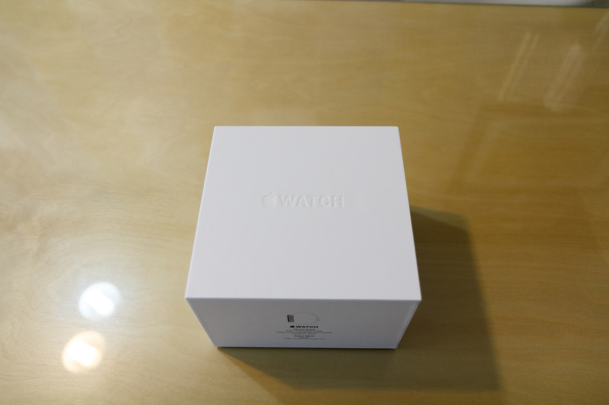
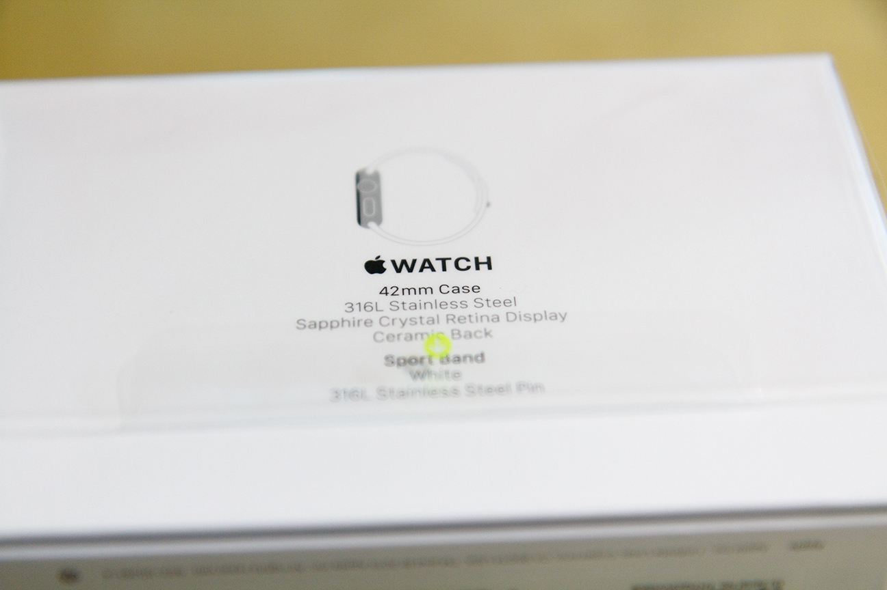
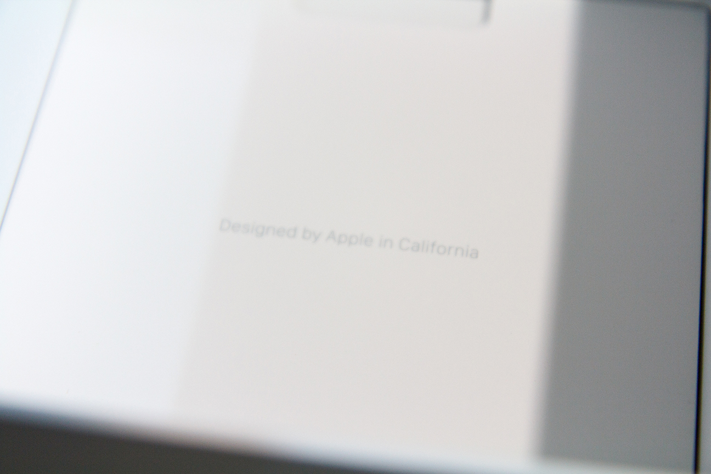
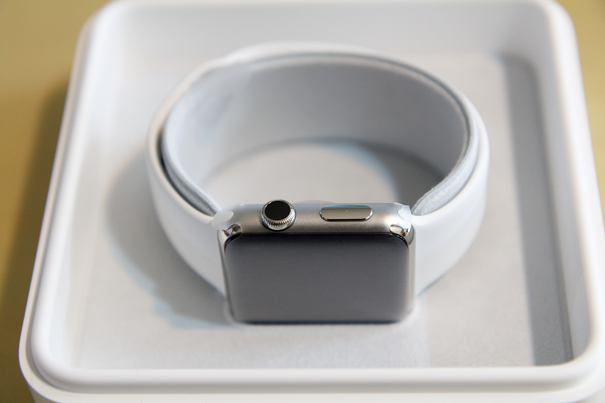
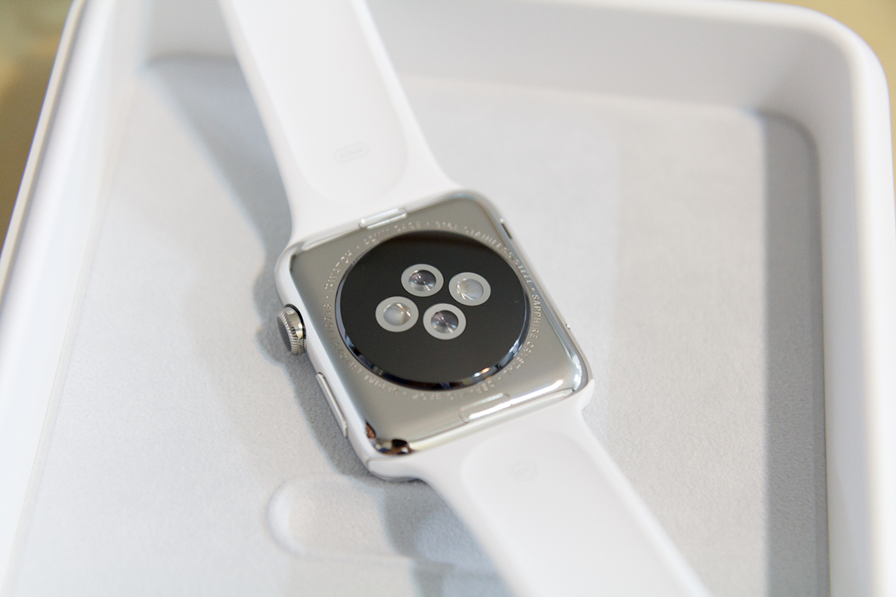
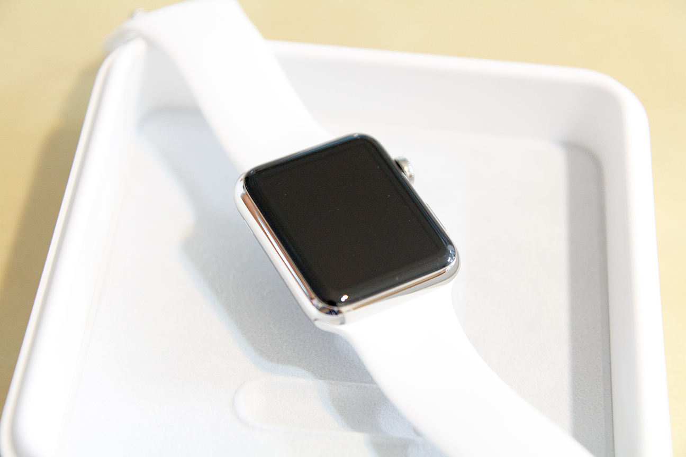
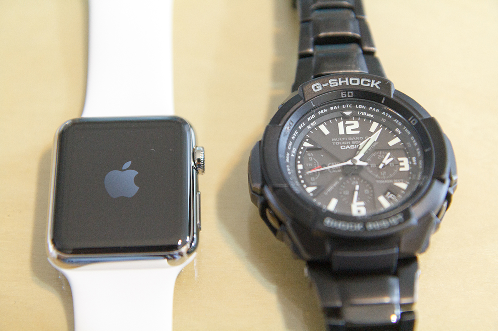
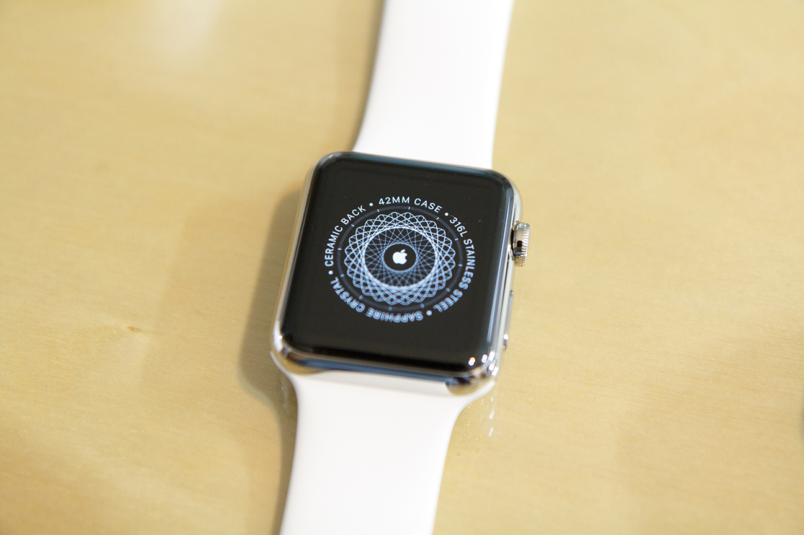
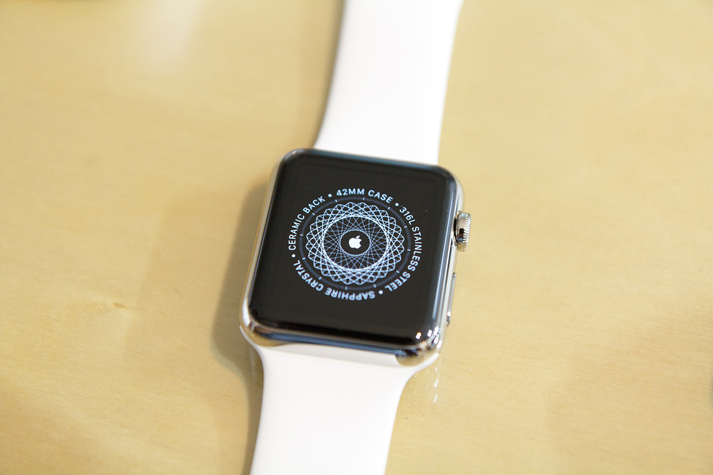
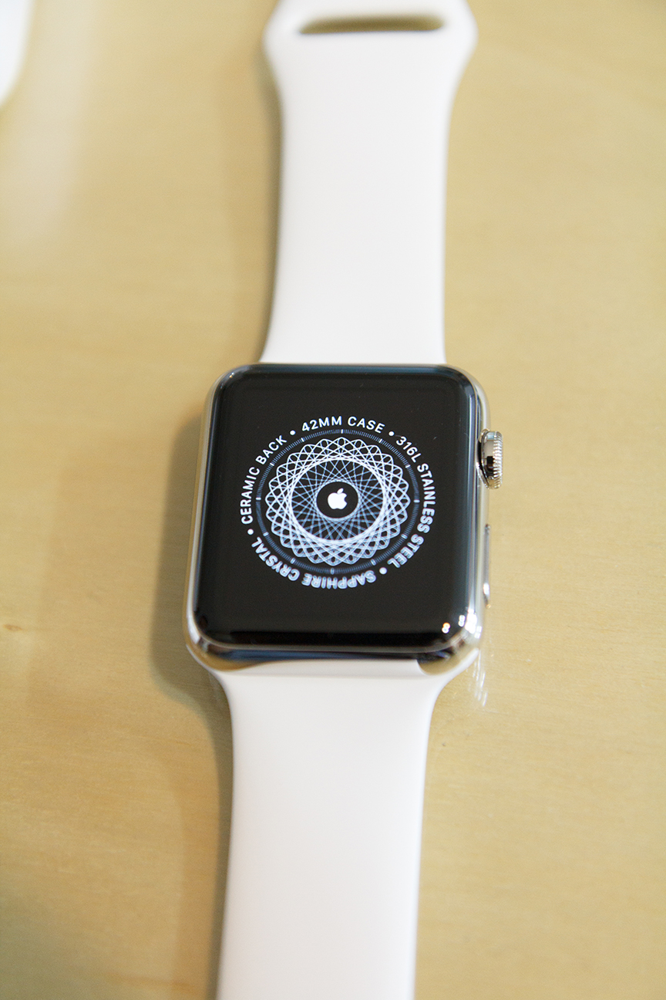

어쩌다 보니, [이 글](https://blog.niceb5y.net/thought-of-iphone6-and-apple-watch/)에서 끄적거린 물건들을 모두 사게 되었습니다.

음...?!

여튼, 샀으니 짤막한 소감.

박스가 꽤 고급스럽습니다. 종이 박스 치곤 적당히 무게감도 있고요.

다소 포장이 심심한 느낌도 있지만, 아이폰6도 그랬으니 컨셉인듯.

42mm 스테인리스 스틸 바디에 스포트 밴드 모델을 구입했습니다.

밴드를 꽤 고민했는데, 밴드가 비싸던가, 딱히 마음에 안든다던가 해서 비싼 밴드를 시는 것은 보류하기로 했습니다.

늘 보던 애플의 자신감 있는 멘트.

애플이 늘 그렇듯이, 포장 디자인도 상당히 신경 쓴 모양입니다.

다만, 알루미늄 제품이 아니라 그런지, 처음 개봉하는 애플 제품 특유의 향기(?)는 나지 않습니다.

스포트 모델은 날지도...?

사진에서 반짝거림을 표현하는게 상당히 어려운데, 예쁩니다. 보석같은 느낌이랄까?

생각했던 것보다 크지도 않고 두껍지도 않은 느낌.

사진과 실물이 다릅니다. 실물이 예뻐요.

기존에 차던 GW-3000모델과의 비교.

동기화할때 잠깐 스쳐 지나가는 화면인데, 이 화면이 참 예쁘더랍니다.

아직 실사용은 몇분 안되기 때문에 뭐라 말하기 뭐하지만, 확실히 예쁘긴 예쁩니다.

자세한 리뷰는 나중에 생각나면 쓰는 것으로.
