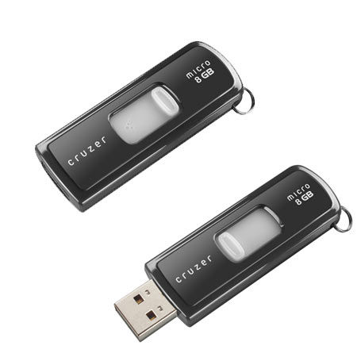
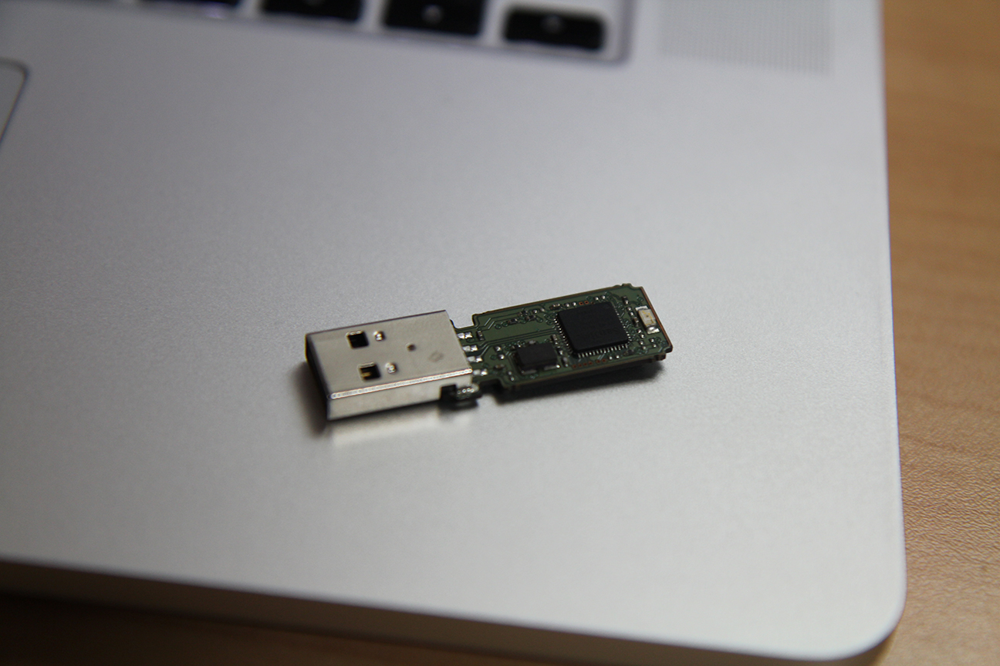
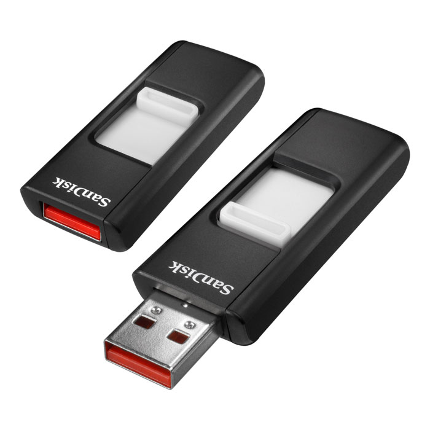
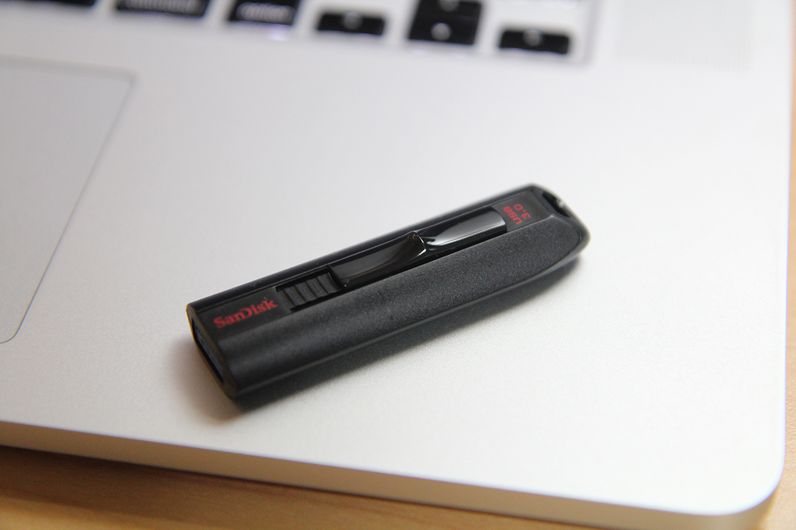
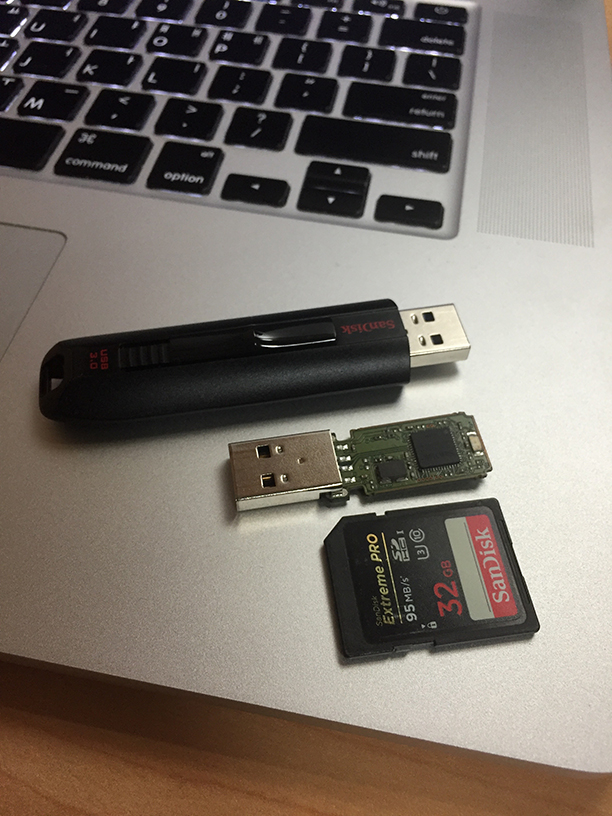

사실 요즘 USB 메모리를 쓸 일이 별로 없습니다.

그런데 막상 없으면 엄청 불편한 것 또한 사실이죠.

중학생때였던가? 부터 사용하던 USB 메모리가 있었습니다.

원래 이렇게 생겼었는데...

이런 저런 일이 있다 보니 현재 저런 모습이 됐습니다.

그래서 아마 고등학교때

이런 녀석을 샀던 기억도 있습니다만... 그렇게 심하게 굴리지도 않았는데 망가진 것 까지는 기억나는데... 버렸는지 어쨌는지 기억이 안나네요. 하여튼 지금은 가지고 있지 않습니다.

여튼 저 헐벗은 USB 메모리가 USB2.0 규격이라 느리기도 하고, 수 많은 사람들이 들고다니면 불쌍한 눈빛으로 쳐다보길래(...) 새로 하나 질렀습니다.

읽기 100MB/s, 쓰기 240MB/s인데 벤치마크는 귀찮은 관계로 생략했습니다.

대충 파일 복사했는데 속도는 만족스럽습니다.

한가지 단점은 좀 두꺼워서 PS4에 안들어가는데 이건 좀 안타깝네요. 아무래도 Cruzer fit같은걸 하나 사야할듯(...)

~~결론은~~

~~메모리는 샌디스크를 씁시다.~~
