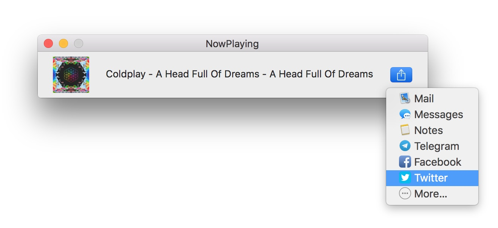
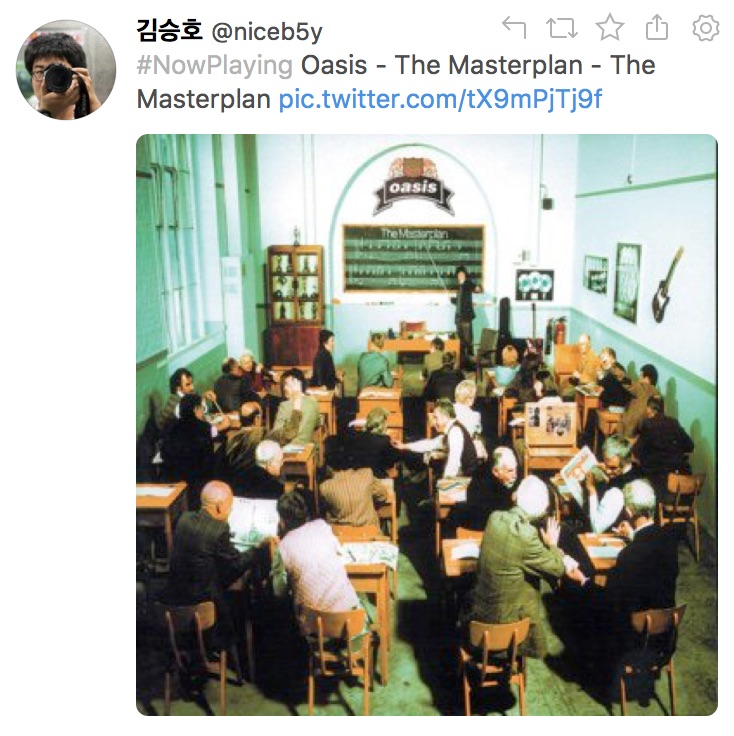

늘 그렇듯이 그냥 갑자기 만들어보고 싶길래 구글 뒤적거리면서 만들어보았습니다.

ScriptingBridge로 iTunes 정보 받아온 다음 NSSharingServicePicker로 공유합니다.

트위터에 쓰려고 만들었는데, 뭐... 트위터는 잘 나오니 OK.
텔레그램쪽은 사진이 안 나오는 증상 && 공유가 완료되지 않는 증상이 있던데....
그건 제 책임이 아니니 패스(...)

쓰실 분이 얼마나 될지는 모르지만, 다운로드는 [여기](https://dl.dropboxusercontent.com/u/36107953/nowplaying/NowPlaying.zip)서 하시면 되며, 소스코드는 [이곳](https://github.com/niceb5y/NowPlaying-for-OS-X)에 있습니다.

처음 만들때만 해 도 위젯까지 추가해야겠다고 생각했습니다만, 메인 기능 다 만들고 보니 놀랍도록 귀찮아져서... 다음 기회에(...).
