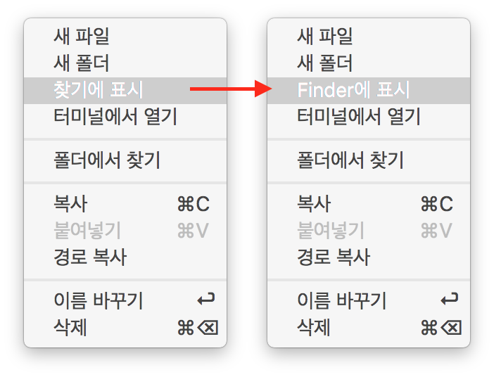

## 본격 생색용 포스팅

Visual Studio Code V1.2가 출시되었습니다.

변경사항은 [여기](https://code.visualstudio.com/updates/May_2016)에서 확인하실 수 있습니다.

별거 아니긴 한데, 제가 번역 [몇개](https://github.com/Microsoft/vscode/pull/6381) 고쳤습니다. (생색)

VSCode가 편집기능만 Sublime Text 정도로 좋아졌으면 싶긴 하지만, Node 개발하기에 좋은 녀석인것 같긴 합니다.

개발 속도도 빠르고요. 요즘 Sublime Text 업데이트를 보면 뭔가 아쉽습니다. 물론 이미 뛰어난 에디터긴 하지만...
