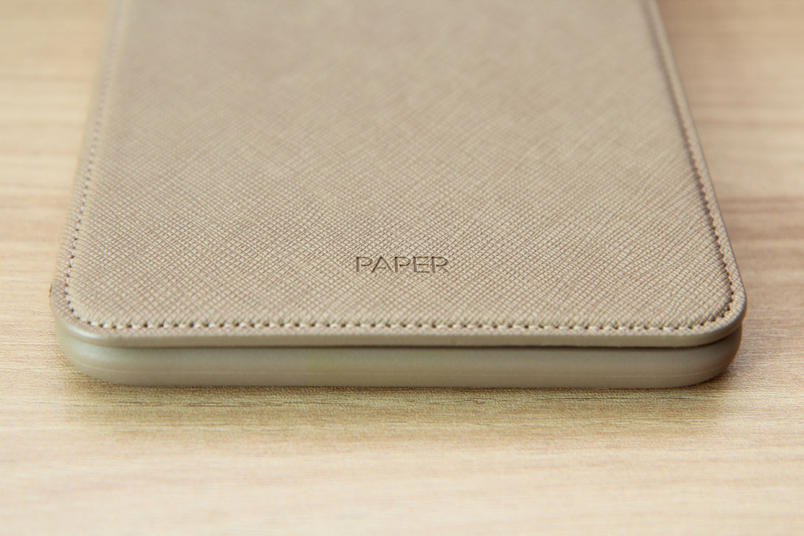
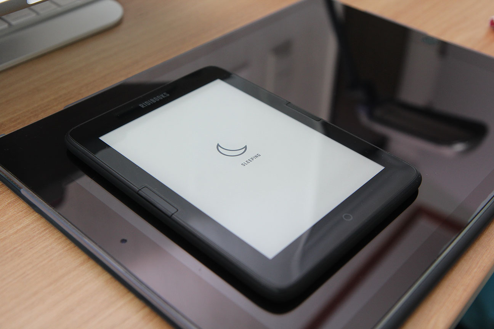
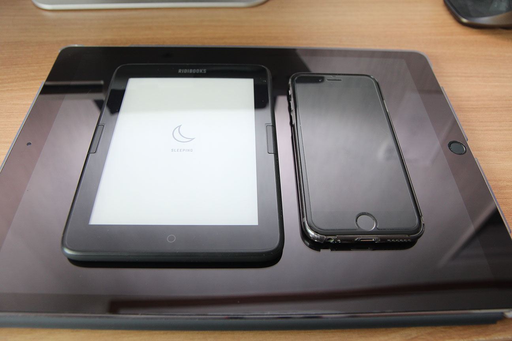
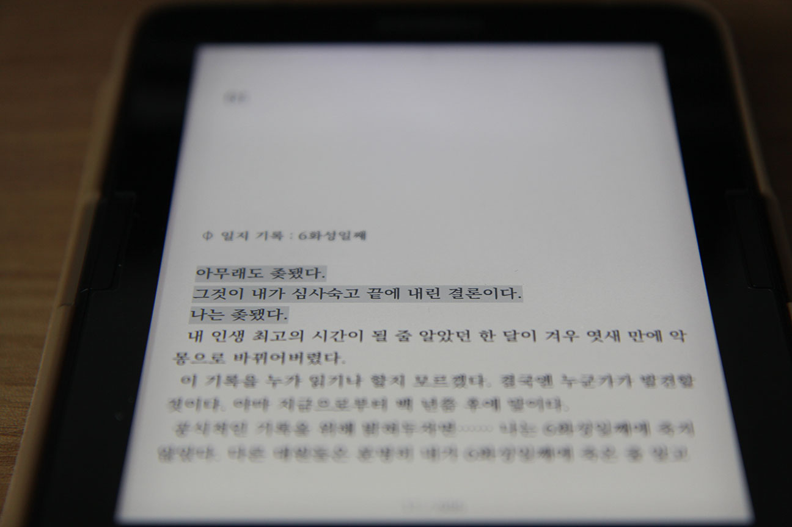
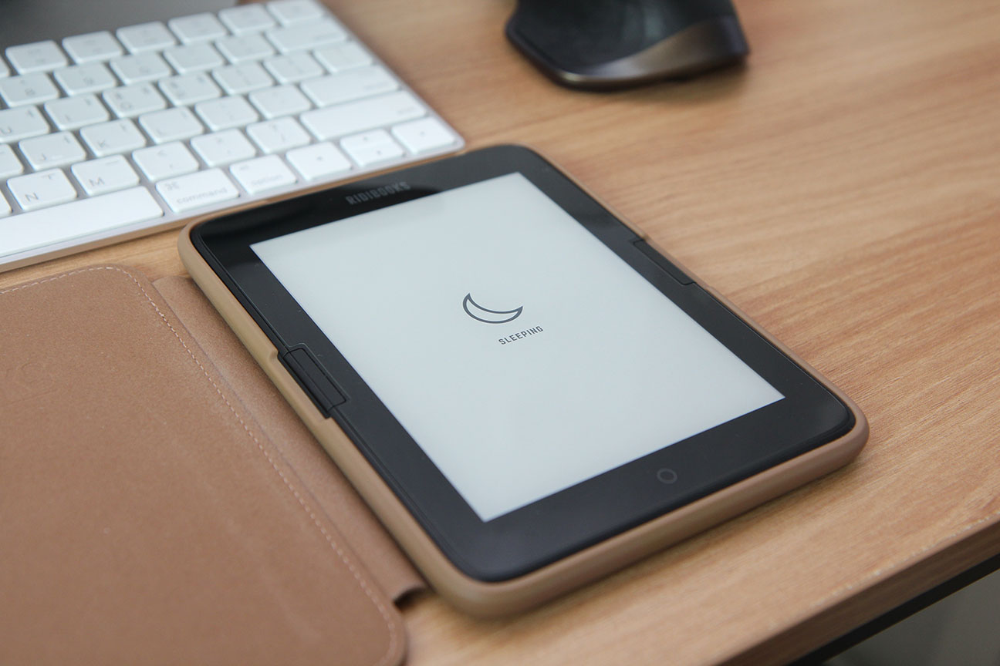
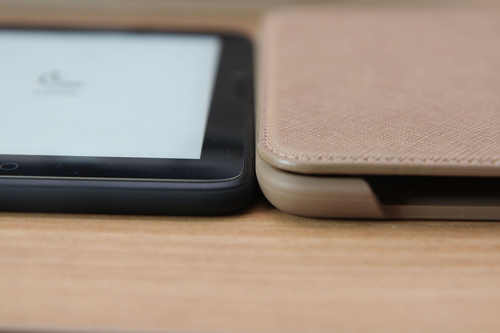

**드디어 샀습니다.**

상당히 오래전부터(고등학생때 쯤?)... 전자책 단말기를 갖고 싶다는 생각을 했었습니다.

그런데 막상 사자니 마음에 드는 단말기가 없더랬죠.

i모 사의 스토리라던지... 평이 그렇게 좋지 않더군요.

그 당시엔 컨텐츠가 별로 없기도 했고요.

게다가 디스플레이가 잘 깨진다는 소리까지 들었기 때문에 '아직은 아닌가...' 하던 와중에 아이패드 4세대까지 사게 되었기 때문에 전자책 단말기를 사지 않게 되었습니다.

나중에 킨들 페이퍼화이트가 나오고, 카르타 패널이 탑재된 모델들이 나오고 나니 한번 사볼까 싶다가도 한국어로 된 컨텐츠가 별로 없기 때문에 꺼려지게 되더군요...

그러다 크레마 카르타나, 이 리디북스 페이퍼가 나오게 된다는 소식을 듣고 뭘 살까 고민하다... 정작 출시할 당시에는 여유가 없어서 못사고(...) 이제 와서 마련하게 되었습니다.

리디북스에 책을 사놓고 안 읽는 일이 벌어져서, 스팀처럼 되기 전에 전자책 단말기를 사면 해결이 되지 않을까 싶어서 샀다는 사실(...)

크레마는 열린 서재나 TTS를 지원한다는 장점이 있지만, 페이지 넘김 스위치가 더 끌리기에 리디북스 페이퍼로 왔습니다.

아무래도 물리키가 좋긴 좋거든요. 페이퍼에 달린 스위치 품질이 그렇게 좋냐 하면 그건 아니지만...

일단 사이즈가 휴대하기 편리합니다. 그냥 제가 이상한거겠지만, 4.7인치 폰과 12.9인치 태블릿을 쓰기 때문에 둘 다 너무 극단적이거든요. 아이패드를 잠자리에서 책을 보는데 쓰기에는 너무 무겁고 큽니다. 실수로 얼굴에 떨어뜨리면 죽을 수 있는 무게이기도 하죠.

아이폰6이랑 비교하면 크기는 대충 이정도 됩니다.

장점은 전자잉크라 배터리가 오래가고 눈이 편하다는 겁니다. 물론 안드로이드라 배터리가 오래간다는 점을 약간 상쇄시킨다는 생각이 들긴 하지만요(...).

킨들처럼 전용 OS가 있었으면 좋겠다는 생각은 들지만... 현실적으로 무리니까요.

킨들 페이퍼 화이트나 크레마 샤인 이후의 기종들처럼 프론트라이트를 지원하기 때문에, 어두운 곳에서도 책을 읽을 수 있습니다. 백라이트처럼 눈이 아프지도 않고요. 다만 최저밝기가 너무 밝은게 아닌가 싶은 생각은 듭니다.

아무래도 디스플레이 잘 깨진다는 점은 여전하기 때문에 케이스를 끼워 사용하고 있습니다. 재질이나, 생김새는 꽤 마음에 듭니다만....

너무 두껍고, 너무 무겁습니다. 가볍고 얇은 기기라는 장점이 상쇄되는 느낌. 다음 기기는 케이스가 더 가볍고 얇아졌으면 좋겠습니다.

리디북스 페이퍼의 첫 물량은 말도 많고 탈도 많았던 것으로 기억합니다만, 한-참- 지난 지금 받아본 경험으로는 딱히 큰 문제는 없는 것 같습니다. 빛새는 곳 하나, 그다음 불량화소 하나 있는 것 같은데 딱히 눈에 띄진 않습니다.

물리키...는 품질이 약간 마음에 안들긴 하는데, 그래도 그렇게 거슬리진 않습니다. 다만 '쉽게 고장나지 않을까?' 하는 생각이 살짝 드는 정도.

요약하자면 HW는 약간 아쉬운 기기입니다만, 리디북스의 SW가 어느정도 커버해 주는 기기입니다. 업데이트가 잘되는 편이기도 하고요. 다음 기종이 나온다면, TTS, 플립 커버로 슬립/해제 정도만 넣어주면 좋겠네요. 뭐 USB type-C 단자를 달아줬으면 좋겠지만 너무 큰 욕심이려나...

덧. macOS에서 파일전송이 **끔찍**하긴 한데... 사실 그건 안드로이드 문제니까요. 쩝...
