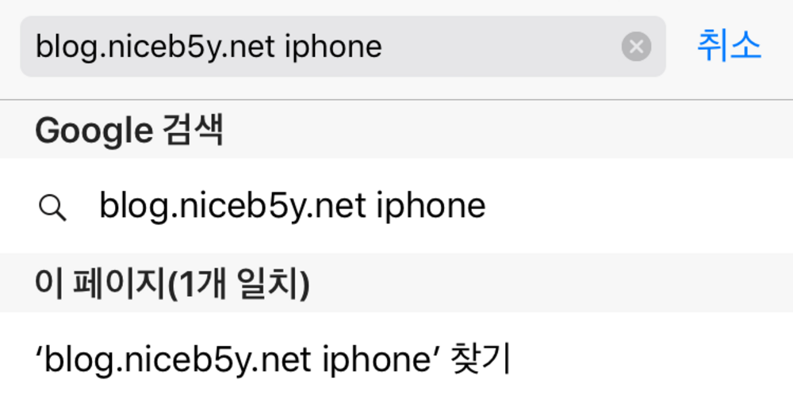
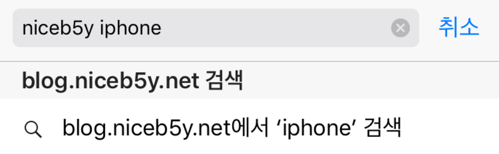

애플은 사파리8에 **빠른 웹 사이트 검색** 이란 기능을 [추가](https://developer.apple.com/library/content/releasenotes/General/WhatsNewInSafari/Articles/Safari_8_0.html)했습니다.

이 기능을 활성화하면, 사파리에 미리 등록된 검색 사이트 (Google 등…)이 아니더라도, 주소창에서(애플의 공식 명칭은 ‘스마트 공식 필드’지만…) 검색을 할 수 있습니다.

사진으로 살펴보자면…



해당 기능이 활성화 되기 전에는 이렇게 보입니다만,


해당 기능이 활성화 된 후에는 이렇게 보입니다.



주소를 다 입력하지 않고, 웹사이트 제목의 일부만 입력해도 검색할 수 있습니다.

웹사이트에서 해당 기능을 활성화시키려면, [Opensearch 명세](http://www.opensearch.org/Specifications/OpenSearch/1.1#OpenSearch_description_document)에 맞게 웹사이트를 수정해주면 됩니다.

먼저 xml 파일을 하나 작성합니다.

제 블로그에 적용된 xml 파일은 다음과 같습니다.

```xml
<!-- https://blog.niceb5y.net/search.xml -->
<OpenSearchDescription xmlns="http://a9.com/-/spec/opensearch/1.1/">
	<ShortName>niceb5y blog</ShortName><!--사이트 이름-->
	<Description>몇번째 갈아엎는지 모를 블로그</Description><!--사이트 설명-->
	<InputEncoding>UTF-8</InputEncoding><!--인코딩-->
	<Image width="16" height="16" type="image/x-icon">https://blog.niceb5y.net/favicon.ico</Image><!--파비콘-->
	<Url type="text/html" method="get" template="https://blog.niceb5y.net/search?q={searchTerms}"/><!--검색 주소-->
</OpenSearchDescription>
```

알맞게 위 파일을 변경시켜 서버에 업로드 해 주시고, 웹사이트 head에 다음 줄을 추가합니다.

```html
<link
  rel="search"
  type="application/opensearchdescription+xml"
  title="niceb5y blog"
  href="https://blog.niceb5y.net/search.xml"
/>
```

물론 title과 href는 알맞게 바꾸어 주셔야 합니다.

위 단계를 따라 등록하신 뒤, 사파리로 해당 웹사이트를 들어가서 (아마도) 검색 기능을 한번 이용해 주시면, 그 다음부터는 ‘빠른 웹 사이트 검색’을 이용하실 수 있습니다.

검색 기능을 꼭 한번 이용해야 하는지는 확실하지 않습니다만… 이용한 다음엔 확실히 등록이 됩니다.

사실 접속자수도 적은 블로그인데, 이거 추가해봤자 별 의미 없을 것 같은 생각도 듭니다만… 자기만족이라 생각하고 있습니다. -\_-;;

정말로 오래간만의 포스트는 여기서 마칩니다. 끝.
