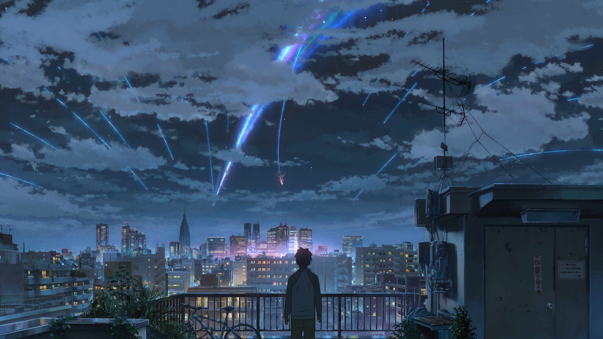

지난 7일 코엑스 메가박스 M2관에서 관람했습니다.

예전에 관람한 적 있는 신카이 마코토 감독의 작품은 「초속 5cm」, 「언어의 정원」이 있습니다만, 둘 다 VOD를 통해 관람했기 때문에 극장에서 처음 보는 신카이 마코토 감독의 작품이 되겠습니다.

한마디로 말하면.... 뛰어난 작품이네요.

## 스토리

한 편으로는 신카이 마코토 감독의 작품스럽지만, 다른 한 편으로는 아닙니다. 분명히 신카이 마코토 감독 특유의 요소들이 포함되어 있으나, 훨씬 더 대중적이라는 느낌이 듭니다. 그래서 어느 쪽(...)에서는 "신카이 마코토 감독이 변했다."라는 말도 나오는 모양입니다만, 딱히 그런 것 같진 않습니다. 사실 변하면 어떤가 싶고....

제가 본 이전의 작품들과 굳이 다른 점을 하나 꼽자면.... 「초속 5cm」나 「언어의 정원」은 '사랑'자체를 이야기 전개 수단으로 썼지만, 이쪽은 다른 사건이 이야기를 전개하고 사랑은 이야기가 전개된 결과에 가깝다는 느낌을 받습니다. 그래서 연애소설 같은 분위기를 그렇게 좋아하지 않는 제게는 거부감이 덜 든달까요.

하여튼, 영화 줄거리는 한두가지 부분을 제외하면 자연스럽게 이어지는 좋은 스토리라고 생각합니다. 이 몇가지 부분을 가리기 위해 영화는 상당히 노력하지만, 영화가 끝난 뒤 약간 의문이 남는 건 어쩔 수 없는 부분이라 생각합니다. 저는 '몸이 서로 바뀌는 영화에서 개연성이 그렇게 중요할까....'하면서 넘어가긴 했지만 분명히 민감하게 느끼실 분들이 있으실 거라 생각합니다. 여기서 평이 갈리지 않나 생각이 드네요.

## 비주얼

제가 뭐라 적는 것보단 직접 보시는 게 좋습니다. 끝내줍니다. 이야기 끝.

**이 영화를 정말 극장에서 봐야 할 이유를 부여합니다.**

HDR이 적용된 UHDBD를 내줬으면 좋겠지만 가능할지는 모르겠고요.

특히 구름씬을 보면.... 갈려나간 애니메이터들에게 애도를....

## 음악

**이 영화를 정말 극장에서 봐야 할 이유를 부여합니다(2).**

이전 작품들과는 다르게 이 영화는 상당히 음악에 의존을 많이 하고 있습니다. 디즈니의 「Frozen」에서 음악이 차지하는 비중과 비슷한 느낌이랄까요. 신카이 마코토 감독이 이번 작품은 음악에 맞춰 제작했다고 하는데, 실제로 한편의 긴 RADWIMPS 뮤직비디오 같은 느낌을 줍니다. 물론 ('트론: 새로운 시작'이 다프트펑크 뮤직비디오 같다는 생각이 드는 것보다는) 긍정적인 방향으로요.

## 여담

제작비가 40억원 쯤이라는데.... 어떻게 그 돈으로 만든 걸까요....

OST CD 사서 듣는 데 좋습니다. 요즘 이것만 계속 듣는 듯.

재밌게 보시려면 [예고편](https://youtu.be/0GtEGZv1_Os)도 안보고 가시는 게 좋을 듯. 개인적으로 예고편이 너무 많은 걸 보여주지 않나 싶어요.

블루레이 디스크 언제 나올까요. 사고 싶다....
