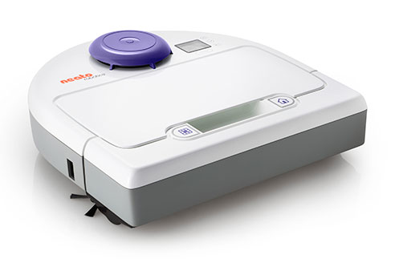

## Neato Botvac 80

<small class="text-muted">귀찮아서 사진은 이게 마지막입니다.</small>

드디어 집에 로봇 청소기가 생겼습니다. **만세!**

아마존 프라임데이 때문에 Woot에 [Neato 로봇청소기 핫딜](https://home.woot.com/offers/neato-your-choice)이 올라오는걸 가격 정보 게시판들 구경하다 발견했고, 긁었습니다. 정작 아마존 프라임딜은 [Echo Dot](https://www.amazon.com/dp/B01DFKC2SO)을 살까말까 고민하다 안 질렀지만요. 사실 Woot이 아마존 자회사인걸 생각하면 뭐....

매번 아마존 재팬 직배로만 뭘 사다 간만에 미국에서 시키는 물건이었는데, 역시 미국 배송은 오래 걸리더군요. 기다리다 죽는 줄 알았습니다.

&nbsp;

## 배송정보

<small>~~배송업체에 대한 뒤끝~~</small>

다음에 미국에서 뭐 시킬때 참고용으로 기록해 둡니다.

참고로 배대지는 왠만한 분들은 다 아실 X꼬리... DE 이용했습니다.

**무게:** 17lbs

**배송비:** \$40.77

**2017-07-11** 주문 + 배송 출발

**2017-07-13** DE 배대지 도착

**2017-07-18** 입고 + 배송비 결제

**2017-07-19** 출고

**2017-07-20** 한국 도착 + 국내 배송 시작

**2017-07-22** 국내 배송 도착

배송기간은 뭐.... 좀 그랬네요. 인터넷 보니 하루 먼저 받는 분들도 있고.... 배대지 바꿀까 생각도 들고....

아마존 재팬의 DHL 배송 수준까진 바라진 않지만요.... 뭐 받았으니 그러려니 하지만....

&nbsp;

## 외관

아무래도 새제품이 아니라(리퍼) 걱정을 좀 하긴 했지만.... **거의 새 제품이 왔습니다.** 사용감이 없더군요.

상품마다 차이는 있겠지만, 다른 글들 찾아봐도 이번엔 상태 좋은 모델들을 보낸 것 같습니다.

물론 이 포스팅 보고 시켰는데 이상한거 와도 책임은 지지 않습니다.

리퍼라 박스 포장은 Botvac 85 모델 박스로 왔지만, 뚜껑 컬러는 보라색인 제 모델로 왔습니다.

&nbsp;

## 청소 능력

**제가 청소기 돌리는것보단 훨씬 낫습니다.**

뭐 구조상 너무 좁은 부분은 밀 수 없다던지 하는 1%정도 모자른 부분들이 있지만, _제가 청소기를 돌린다고 그곳들을 다 청소할까 하면...._

가족들이 모두 바쁘다보니 청소가 주간 작업 비스무리한 무언가가 되었는데, 예약 설정해두면 매일 청소기가 알아서 청소하니 이렇게 좋을 수 없습니다.

원래 뭔가를 체감하는데 상당히 둔한 축에 속하는 사람인데, 바닥에 먼지가 없다는게 확 느껴질 정도로 좋습니다.

&nbsp;

## 결론

돈으로 행복을 살 수 있다면, 그 방법 중 하나가 이 물건이 아닐까요. (아무말)

~~좋습니다. 지르세요.~~
