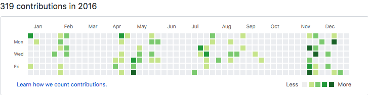
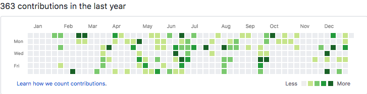

<iframe width="560" height="315" src="https://www.youtube.com/embed/r8OipmKFDeM" frameborder="0" allow="accelerometer; autoplay; encrypted-media; gyroscope; picture-in-picture" allowfullscreen></iframe>

오늘로 2017년이 끝나는군요.

언제나 그랬듯이, 뒤돌아보니 매우 다사다난했던 한 해였습니다. 개인적으로는 몇몇 좋은 순간도 있었지만, 대체로 피곤한 순간이 더 많았던 것 같습니다만.... 블로그에 서술할 만한 내용은 아닌 것 같기에 자세히 서술하지는 않겠습니다.

매년 블로그 포스트로 연말 결산 또는 마음대로 주는 어워드 같은 포스팅을 해볼까 하는 생각을 했었지만, 이런저런 이유로 오늘에서야 처음으로 연말 포스팅을 작성하게 되는 것 같습니다.
그렇다고 해서 마냥 거창한 포스팅은 아니고, 몇 가지 주제를 선정하여 소소한 회고를 작성해보자 합니다.

&nbsp;

## **글쓰기**

올해는 블로그에 글을 잘 쓰지 못했습니다. 미처 모두 작성하지 못한 글도 있었고, 고민 끝에 쓰다가 지워버린 글도 있었고, 쓸까 말까 고민만 하다 쓰지 못한 주제도 있었습니다.

올해는 무언가를 질러놓고 쓰는 글을 최대한 자제해보려는 생각을 가졌었는데, 그에 따른 영향이 꽤 있는 것 같다는 생각이 듭니다. 1~2월만 하더라도 꽤 의욕이 넘쳐서 글을 쓰곤 했었는데, 그 의욕을 유지하지 못한 것이 안타깝습니다. 내년에는 조금씩이라도 자주 작성하도록 해야겠습니다. 짤막하게 TIL나 테크 뉴스만 모아두는 사이트를 만들어볼까 생각을 가졌습니다만, 실천으로 옮기지 못했었는데 내년에는 시도해봐야겠습니다.

&nbsp;

## **프로그래밍**

2017년은 프로그래밍을 하기에 그렇게 좋은 연도는 아니었습니다(변명). 하루가 끝나가는 시간엔 이미 정신적으로 많은 피로감을 느꼈기 때문에, 의자에 앉아서 멍하니 쓰러져 있는 시간이 많았다고나 할까요.

2016

2017

그래서 작년보다 프로그래밍을 많이 못한 게 아닌지 하고 걱정했었는데, 커밋 기록을 보니 오히려 늘긴 늘어났습니다. 이 기록만 봐서는 제대로 판단할 수 없겠지만 작년보다 크게 쳐지지 않는 것 같으니 다행입니다.

&nbsp;

### node.js

올해도 작년에 이어 node.js를 가장 열심히 사용한 것 같습니다. 다만 작년엔 홈 서버 위에서 작동하는 express 기반의 서버를 많이 사용했지만, 올해는 대부분을 AWS + [netlify](https://blog.niceb5y.net/host-blog-on-netlify/)위에서 작동하는 SPA로 이전했습니다.

파일 서버는 S3로 이전되었고 CloudFront를 통해 CDN으로 배포됩니다. 사이트들은 대부분 [create-react-app](https://blog.niceb5y.net/set-up-react-development-environment-easily/)을 이용하여 SPA로 작성되었으며, (대단한 기능은 없지만,) API 서버는 [Serverless Framework](https://serverless.com)를 사용하여 AWS Lambda와 API Gateway위에서 작동하도록 Typescript로 재작성되었습니다. SPA들은 netlify위에서 서비스되므로 파일서버와 마찬가지로 CDN을 통해 배포되고요.

이제 대부분의 웹서비스가 홈서버보다 안정된 기반에서 작동하기 때문에 안정성이 향상되었습니다만....

**저 혼자 쓰려고 만든 서비스들입니다. 공개된 건 없네요.**

자기 계발, 자기만족으로 개발하는 서비스들이긴 하지만, 아쉬움이 남긴 하네요.

&nbsp;

### 머신 러닝

요즘 핫 트렌드입니다.

저도 써볼까 싶어 눈팅은 했지만, 깊게 가진 못했습니다. 애플이 올해 WWDC에서 공개한 [coreML](https://developer.apple.com/documentation/coreml)을 한번 써볼까 싶어 문서를 훑어보긴 했습니다만 원하는 물건은 아니었고, 요즘 [TensorFlow](http://tensorflow.org) 문서를 보고 있긴 한데, 몇 번 써보지 않은 파이썬을 쓰려니 코드가 눈에 잘 안 들어오네요. 아무래도 책을 사서 읽어야 할 듯.

&nbsp;

### 여담

어쩌다 보니 작년만 해도 많이 사용했던 Swift라든지, 과제 할 때(?) 많이 사용하던 C++을 올해는 잘 사용하지 않은 것 같습니다. 사실 저는 JS보다는 이쪽을 더 좋아하는 편인데 말이죠. 특히 Swift는 방치된 프로젝트들이 있는데 여유가 되는대로 유지보수를 열심히 하도록 해야겠습니다.

&nbsp;

## **문화생활**

### 음악

애플뮤직을 듣다 보니깐 대부분 스트리밍으로 듣게 되는 것 같네요. 뭐 올해도 CD 음반은 10개 넘게 사긴 했지만, 애플뮤직에서 제공하지 않는 음원들이고, 기존에 모으던 아티스트들의 음반이 아니라면 스트리밍으로 듣게 될 것 같습니다. 아티스트 수익 분배라든지 하는 단점이 있지만, 결국은 스트리밍만이 남지 않을까 싶네요.

&nbsp;

### 공연

흔히 애플스토어 국내 매장 개장이나, 남북통일과 동일시 되며 이뤄지지 않을 것으로 예상되던 COLDPLAY가 내한을 했습니다!(곧 애플스토어도 개장합니다. ~~이젠 정말 남북통일뿐인가~~) [COLDPLAY는 최고](https://blog.niceb5y.net/coldplay-ahfod-tour-in-seoul-2017/)였습니다. 끝.

&nbsp;

### 영화

가장 돈을 많이 쓴(?) 영화는 [「너의이름은.」](https://blog.niceb5y.net/kimi-no-na-wa-review/)이네요. BD도 한정판으로 구매했고, 악보집도 샀고(동생만 열심히 치는 중입니다.), [비주얼 가이드북](https://blog.niceb5y.net/kimi-no-na-wa-official-visual-guide-review/) 및 기타 등등도 구매했습니다.

「덩케르크」를 그 무렵에 리뉴얼 오픈한 CGV 용산에서 IMAX로 관람했습니다. 최신 영사기라지만, 필름의 품질 차이(IMAX 촬영분과 아닌 것 사이의)가 너무 심해서 실망. 영화는 나쁘지 않았지만요.

「스타워즈: 라스트 제다이」는.... 노 코멘트.

&nbsp;

### 게임

올해 출시 된 게임 중에 하나를 뽑으라면 「니어: 오토마타」를 뽑지 않을까 싶습니다. 스토리나 비주얼, 음악 모두 좋았습니다. 기술적으로는 아쉬운 측면이 있었지만요.

뭐 젤다나 호라이즌등 좋은 게임들이 많이 나온 한 해였지만, 그것들을 플레이해보진 않았기 때문에 제가 플레이해 본 게임 중엔 「니어: 오토마타」가 제일인듯.

&nbsp;

## **지름**

### Neato Botvac 80

아나킨 스카이워커가 온 우주에 포스의 균형을 가져다준다면, [로봇청소기](https://blog.niceb5y.net/neato-botvac-80-review/)는 집안에 평화를 가져다줍니다. 얜 아나킨과는 다르게 다른 사람을 배신한다던가 하지도 않죠.

&nbsp;

### ASUS RT-AC88U

공유기를 ASUS RT-AC88U으로 변경했습니다. 집에 더이상 음영지역이 존재하지 않습니다.
만세.

&nbsp;

### Zhiyun Tech Smooth Q

아마도 중국 직구는 이 기기가 처음인 것 같습니다. 몇년전만 하더라도 짐벌이 참 비쌌기 때문에, 대학 처음 들어와서 수강한 창의적 공학설계에서 직접 짐벌을 만들어보기도 했었습니다만.... 당연히 그것보다 더 잘 작동하고 가격도 나쁘지 않습니다. 단지 아이폰7+가 좀 무거운게 흠.

이것 저것 지른 물건은 많지만 이하 생략.

&nbsp;

## **마치며**

글을 작성하다보니 어느덧 11시 40분을 넘어섰네요. 20분도 안되는 시간이 지나고 나면 새해가 밝을테니 미리 인사 드립니다.

새해 복 많이 받으세요.
