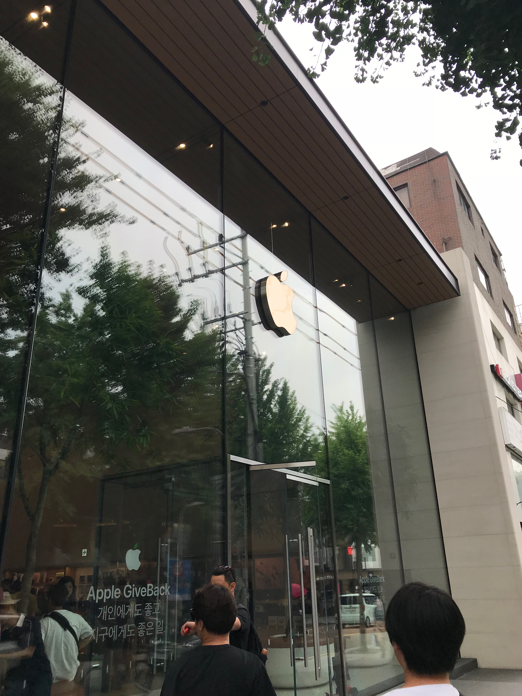
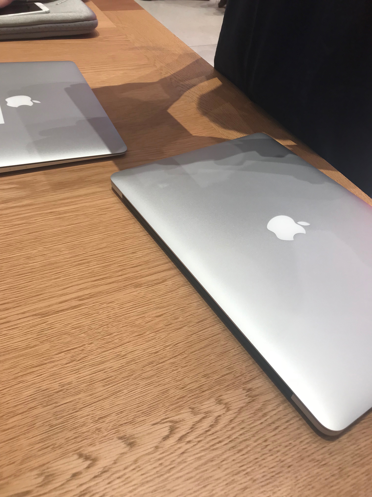
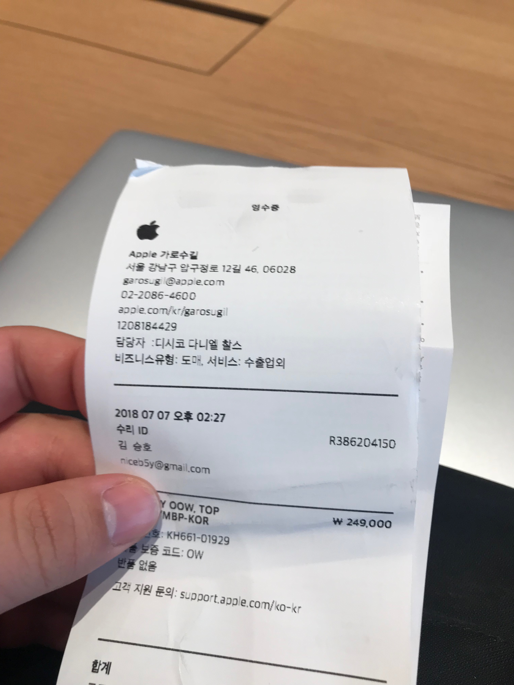
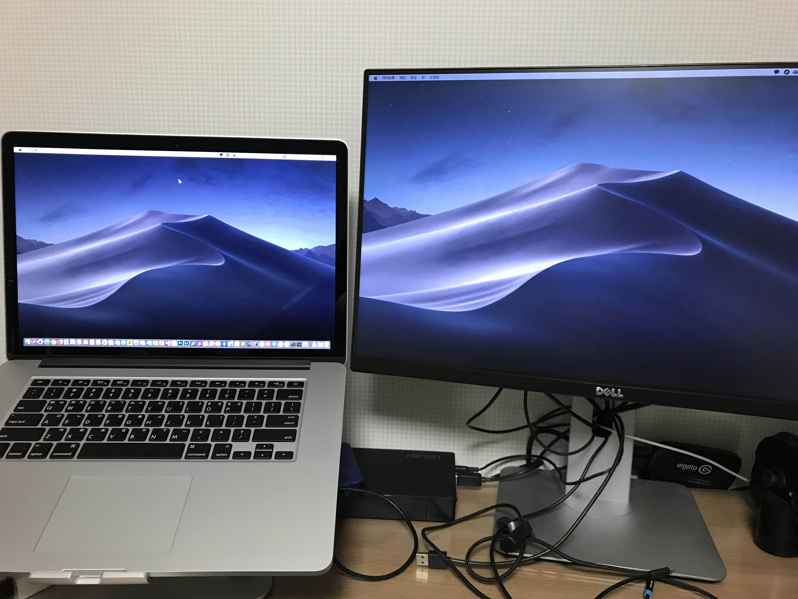

아실 분들은 다 아시겠지만, 집에 사과 농장을 기르고 있는 저답게 제 메인 컴퓨터는 15인치 맥북 프로(Late 2013)을 사용하고 있습니다.

분수에 맞지 않게 좋고 비싼 노트북을 선물받아 사용하고 있는지라, 애지중지하면서 사용하고 있었죠.

애플케어도 먹였었고(3년이 지나버렸지만), 고질적인 문제였던 디스플레이 코팅 깨짐 때문에 디스플레이 교체한것만 빼면 깨끗하게 사용했습니다.

2014년 1월부터 사용하여 어느덧 4년 반의 사용기간을 채웠고, 새 모델이 발표하면 교체할 계획을 세웠습니다.

사실 인텔이 열심히 일하지 않은 탓에 속도면에선 신형과 비교해도 크게 모자람이 없었지만, 애플케어가 끝난 노트북의 수리비, 그리고 중고 가격의 감가상각을 따져서 내린 결정이었습니다.

~~적금까지 들어가며(...) 준비를 해왔지만, 인텔은 굼떴고, 아직도 14nm에서 머물고 있습니다. LPDDR4(와 32GB RAM)는 언제 지원할지도 모르겠고....~~

돈도 모이고 계획대로 되나 했더니만, 일이 터졌습니다.

평상시 노트북을 스탠드에 올려놓고 무선 키보드/마우스를 사용하느라 눈치채지 못했지만, 어느 날 터치패드를 눌러보니 제가 아는 클릭감과 동떨어진 것을 발견했습니다.

그리고 책상에 놓고 수평을 맞춰 보니 수평이 맞지 않는 것을 발견했습니다.

그렇습니다. **배터리가 부풀어버렸습니다.**

빅뱅이 일어난 137억년 전 이래로 우주의 모든 것이 서로 멀어지고 있다지만, 이제 와서 급팽창해버린 노트북의 배터리를 보고 죽음의 5단계(부인-분노-협상-우울-수용)을 머리속에서 한번씩 겪고 나서 든 생각은 당연히....

_"그래서 얼마 들지?"_ 입니다.

애플 홈페이지를 찾아보니 친절히 **13형/15형 MacBook Pro Retina 디스플레이 ￦ 249,000**이라는 친절하지 않은 가격을 설명해주고 있습니다.

[ifixit](https://www.ifixit.com/Guide/MacBook+Pro+15-Inch+Retina+Display+Late+2013+Battery+Replacement/89280)을 찾아봅니다. 난이도는 어려움이며, 뭐 하나 끊어먹기 딱 좋게 생겼군요. 포기합니다.

가장 중요한 전원 부분이기에 '사설수리 받느니 수리 받고 말아야겠다.'는 생각을 굳히고....

가로수길에 왔습니다.

첫 방문은 (그 추웠던!) 첫 개장날이었고, 이번이 두번째 방문입니다. 어째 극단적인 날짜 선택이군요.

미리 [웹사이트](http://getsupport.apple.com)를 통해 예약했으니 체크인하고 ~~오래 기다리고~~ 자리를 배정받아 앉습니다.

~~아아 그는 갔습니다.~~

수리기간은 7일 걸린답니다. 정확히 249,000원 나온다고 다시 알려주고요.

마음대로 수리한 흔적이 있거나, 물이 들어간 흔적이 있다면 수리 거부될 수 있다던지, 백업은 했는지 묻고 맡기게 됩니다.

<iframe width="560" height="315" src="https://www.youtube.com/embed/oye8H8HkUks" frameborder="0" allow="accelerometer; autoplay; encrypted-media; gyroscope; picture-in-picture" allowfullscreen></iframe>

노트북이 없는 1주일을 기다립니다.

수리는 5일만에 되더군요. 토요일에 맡겼는데, 목요일 저녁 늦게 전화가 왔습니다. 하지만 찾으러 갈 시간이 안되는 관계로 1주일을 보냈습니다.

다시 가로수길을 찾아가서....

24만 9천원을 긁습니다. 눈물이 나옵니다.

어쨌든 다시 돌아온 노트북입니다. 배터리사이클이 무려 2로 줄었지만, 너무나 크나큰 희생을 치뤘습니다. 이제 다음 노트북을 맞이하게 될 때까지 잘 버텼으면 좋겠습니다.
