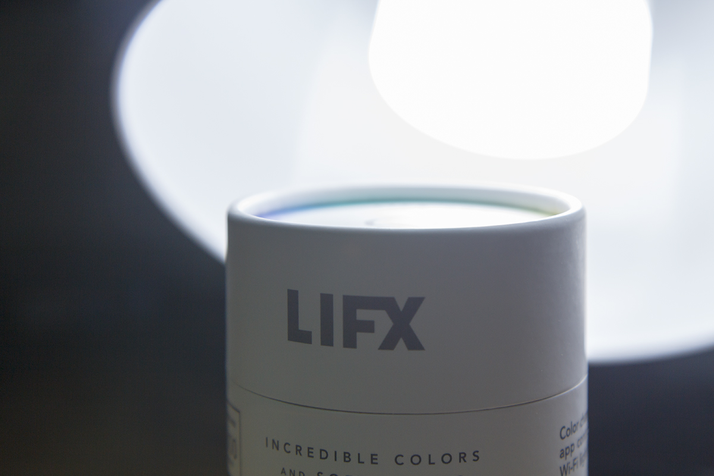
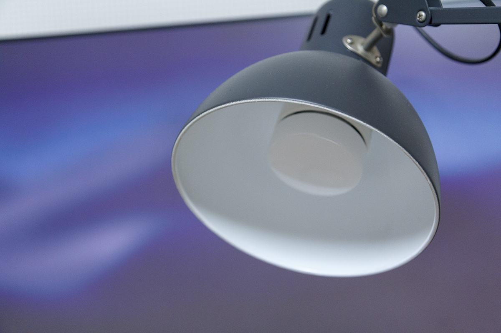
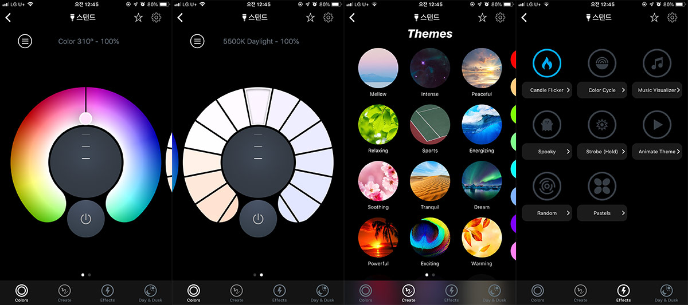
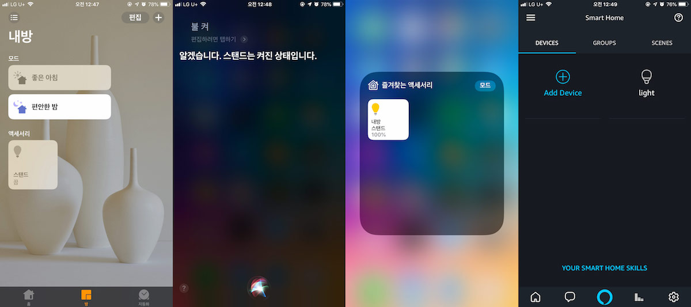

며칠 전에 [LIFX 스마트 LED 전구](https://www.lifx.com/products/lifx-e26)를 선물받았습니다.

[Philips Hue](http://meethue.com)를 처음 알게 된 후부터, 저는 스마트 전구를 갖는 것에 대한 로망이 있었습니다.

그런데 가장 큰 문제는 **도저히 전구를 꽂을 곳이 없다**는 것이었죠(...)

전구가 아닌 Hue 모델이 나오긴 했지만, 딱히 마음에 드는 모양새는 아니었습니다.

게다가 허브의 연결을 필요로 했기에 가격부담이 좀 되는 편이었죠.

그런데 어느날 [IKEA Tertial](https://www.ikea.com/kr/ko/catalog/products/10355439/)을 보고 꽂혀서 질러버렸습니다.

마음에 드는 생김새와 2만원도 안하는 가격은 지름신을 불러오기에 충분했습니다.

그리고 무엇보다 **전구 소켓이 있었습니다.**

처음 샀을때는 일반 필립스 LED 전구를 사용했습니다. 스마트 전구가 사고 싶긴 했지만....

그리고 오랜 시간이 흐른 뒤 마침내 LIFX 전구가 생겼습니다.

아무래도 이 분야에서 가장 유명한 브랜드는 Philips Hue가 있겠습니다만, LIFX는 Hue에 비해 큰 장점을 하나 갖고 있습니다.

**허브가 없어도 작동한다는 것**이죠.

그냥 소켓에 전구를 꽂고, [LIFX 앱](https://www.lifx.com/pages/go)이랑 연동하면 됩니다.

Hue를 써보지는 않았기에, 직접적인 비교는 어렵습니다만, 기대했던 기능들은 다 들어 있습니다.

불을 켜고 끄거나, 색을 원하는대로 바꾸거나, 음악에 맞춰 색을 변경하도록 해서 불금을 즐길 수 있습니다.

HomeKit이나 Amazon Echo의 스마트 홈 기능과도 연동할 수 있습니다. Siri나 Alexa한테 불 끄라고 하면 끕니다.

앱에서는 많은 기능을 제공하고, 연동성도 뛰어나니 기능면에서는 부족함 하나 없는 제품이라고 할 수 있겠습니다.

HomeKit 사용할 때 약간 오락가락 하는 모습을 보이긴 하지만, 이건 HomeKit 문제가 아닌가 싶고요.

다만(허브도 사야하는 Hue보다는 덜하지만) 가격대는 좀 있습니다. \$59.99라는 가격을 갖고 있기 때문이죠.

그럼에도 여분의 돈과 전구 소켓만 가지고 있다면 더 달아놓고 싶을만큼 매력적인 전구입니다.
