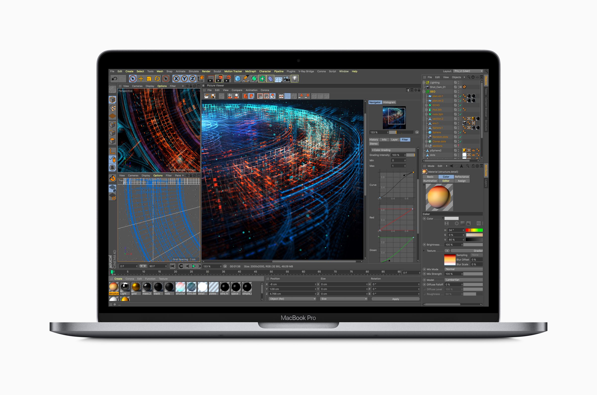

블로그 포스팅을 부지런하게 하지 못한 탓에 벌써 몇달 전 이야기입니다만....

새로운 맥북 프로가 출시됐고, 전 그걸 샀습니다.

이렇게 말하면 충동적으로 구매한 것 같은 생각이 들지만 그렇게 충동적으로 살 물건도 아니고, 그럴 가격도 아닙니다.

나름대로 체계적으로 준비한 예산 집행을 통해 약 2년에 걸쳐서 적금을 넣고 ~~깨면서~~ 손에 넣었습니다. (자기합리화)

이 모델이 2017년형 모델보다 얼마나 향상되었는지는 충분히 다른 곳에서 다뤄졌다고 생각합니다. 수 많은 벤치마크와 리뷰가 쏟아져 나왔고, 출시한지 꽤 오랜 시간이 흘렀으니까요.

전 제가 여태까지 사용하던 2013 Late 15인치 맥북 프로(ME294KH/A, 이하 기존 모델)와 비교한 서술을 해보겠습니다.

## 더 빠른 성능

지금까지 쓰던 모델이 딱히 벌써 4년이라는 세월을 맞아가고 있었음에도, 성능적으로 크게 모자란 것을 느끼진 못했습니다. 그만큼 좋고 비싼(...) 모델이었지만, 2018년 맥북 프로는 인텔 8세대 코어 프로세서가 들어가게 됨으로써, 13인치와 15인치 모델 모두 코어가 2개씩 늘었습니다. 덕분에 더 빠른 CPU 성능을 자랑합니다. 처음에는 얼마나 체감이 될지에 대한 의문을 가지고 있었습니다만, 파이널 컷 프로나, 라이트룸, 빌드등을 돌려 본 결과 확실히 빠르긴 빠릅니다.

다만 인텔이 예전만 못하다는 점이 큰 문제점으로 작용하고 있습니다. 새 아이폰의 프로세서가 7나노 공정으로 접어드는 와중에도, 인텔은 14나노에 머물고 있고 당분간 더 그럴 예정이기 때문에 공정 미세화를 거치지 못하고 코어만 2개씩 늘어난 8세대 코어 프로세서들은 이전 세대의 프로세서보다 조금 더 **따뜻**합니다. 안타깝게도 CPU가 인간성마냥 따뜻하다고 좋은 것이 아니기 때문에, 코어의 증가는 발열과 전력소모의 상승이라는 크나큰 문제를 발생시켰습니다. 덕분에 기존 모델보다 더 팬이 돌기 쉽고, 시끄럽죠. 들고 돌아다녀본적이 딱히 없기 때문에 배터리타임에 대해서는 제대로 논하기 어렵지만, 높은 전력소모량을 상쇄하기 위해 2017년형 모델보다 배터리 용량이 상승했다고 알려져 있습니다.

SSD도 PCIe와 NVMe가 적용되어 큰 성능 향상이 있었습니다. 512GB 용량에 FileVault를 켜놨기 때문에 성능을 까먹음에도 불구하고 읽기 2000MB/s, 쓰기 1600MB/S 정도의 속도를 보여줍니다. FileVault를 끈, 더 큰 용량의 SSD였다면 더 빨랐겠죠. 덕분에 부팅 속도도 꽤 빨라진것으로 느껴지지만, T2 칩의 채용으로 인해 부팅 과정이 좀 달라진 것 같다고 생각되기 때문에 기존 모델과 부팅 속도를 단순히 비교하는 것은 무리가 있겠습니다.

GPU는 GT750M에서 Radeon Pro 560X로 업그레이드가 되었습니다. VRAM도 4GB로 늘어나긴 했습니다만.... 그래픽 부하를 주는 작업을 딱히 하지 않다 보니 그렇게 체감이 되진 않습니다. 엔비디아보다 성능에서 밀리기 때문에 살짝 아까운 면도 없잖아 있지만, 맥북으로 게임을 많이 하거나 하질 않기 때문에 잘 모르겠네요. 출시한지 몇달 뒤 갑자기 베가 그래픽으로 업그레이드 하는 옵션을 넣어줬는데, 왜 지금와서 그런 옵션을 넣었는지 모르겠습니다. 진작 넣어줬으면 고민이라도 한번 해봤을텐데 말이죠. 그나마 다행이라고 할 것은 썬더볼트3를 통한 EGPU 연결이 가능하다는 것입니다. 나중에 필요하면 추가로 연결해서 사용할 수 있겠죠.

램은 드디어 32기가 옵션이 추가되었고, 그나마도 LPDDR4가 아닌 DDR4를 사용해서 추가되었습니다. 이 문제의 원흉은 또한 인텔이 가져가게 되었고, 애플의 입장에서는 ARM 기반의 맥을 출시해야만 할 또 하나의 이유가 되겠죠. 비싼 비용을 지불하고 32기가 램으로 업그레이드 하긴 했습니다만, 그 많은 비용을 지불하고 업그레이드 할 정도로 좋은지 또는 굳이 업그레이드 할 필요가 있었는지는 모르겠습니다. ~~가끔씩 메모리 사용량 그래프 띄워 놓고 있으면 기분은 좋습니다~~

## 디스플레이

디스플레이는 DCI-P3 색영역과 트루톤 기능을 지원하게 되었습니다. 색이 더 풍부해진 덕분에, sRGB색역만 지원하는 24인치 울트라샤프 모니터를 연결해서 옆에 붙여놓으면 마음이 아픕니다. 모니터 업그레이드 욕구를 불러일으킬 정도로 말이죠. 맥북 프로가 너무 비쌌기 때문에 모니터 살 돈 따윈 없기때문에 그냥 사용하긴 합니다만....

트루톤 디스플레이는 이번 모델을 통해 처음으로 사용해보게 되었는데, '엄청나게 좋다.'까진 아니지만, 그럭저럭 쓸만한 기능이라고 생각됩니다. 확실히 눈이 편해지긴 합니다.

## 썬더볼트3

이번 노트북 업그레이드에 있어서 가장 기대했던 부분은 썬더볼트3였습니다.

2016년 모델부터 적용된 이 포트를 통해 노트북과 주변기기를 단 한 개의 포트로 모두 연결하는 성과를 이용할 수 있었습니다. 다만 공짜는 아니었죠. 비싼 썬더볼트 독을 사서 기존에 3개의 케이블을 필요로 하던(MagSafe2/miniDP/USB) 연결을 단 하나의 케이블로 합쳤습니다. 덕분에 케이블 하나만 뽑으면 외출이 가능하고, 돌아와선 다시 하나만 꽂으면 모두 연결됩니다. 물론 장착된 USB단자가 모두 타입-C 단자이기 때문에 생기는 불편함이 있습니다. 이 불편함은 시간의 흐름이나 당장의 현질이 해결해주겠죠. 애플이 좋아하는것은 당장의 현질이 아닐까 싶습니다만.

## SD카드 슬롯

사용할 때마다 불안불안한 기분이 드는 슬롯이긴 했지만 빼버리는건 좀 아니지 않습니까? 쿡 아저씨...?

## 트랙패드

2016년형 모델 이래로 아이폰 플러스(또는 맥스) 모델이 넉넉히 들어가는 사이즈의 트랙패드가 탑재되었습니다. 언제나 그랬듯이, 트랙패드는 좋습니다.

## 키보드

2016년형-2017년형이 장렬한 고장 사태를 일으키면서 구조가 변경되었습니다. 먼지를 막는 실리콘 패킹이 들어갔다고 하는데, 혹시 몰라 키보드에 먼지가 안들어가도록 조심하고 있습니다. 키보드 키감은 개인 취향의 영역이니 만큼 개인차가 크겠지만, 개인적으로는 마음에 드는 키감입니다.

## 터치바

펑션키의 자리를 터치바가 꿰찼습니다. 그렇게 악명만큼 나쁘지는 않은 느낌이지만, 'ESC는 살려뒀으면 더 좋았을걸.' 하는 생각이 듭니다. 그나저나 왜 새 맥북에어엔 적용되지 않은걸까요? 애플은 터치바의 보급을 원하지 않는것일지요.

## TouchID

폰에서 사라지고 있는 TouchID를 맥북에서 만났습니다. FaceID를 넣어줬으면 살짝 더 좋았겠지만, 이만해도 더 편리하게 로그인 할 수 있어서 좋습니다.

## 딩 소리

부팅의 그 소리(...)가 없어졌습니다. 저는 그렇게 좋아하지 않는 소리지만, 역사와 전통을 자랑하는 소리라 아쉬워하는 분들이 많다고 합니다.

## MagSafe

사라져서 아쉬운 그 이름입니다. USB-PD규격의 적용과 함께 강을 건너고 말았죠. 장점으론 저렴한 서드파티 충전기로도 맥북을 충전할 수 있다는 것일 테고, 단점은 저렴한 충전기에 비싼 맥북의 목숨을 믿고 맏길 수 있을 것인가 하는 문제와, MagSafe 채용 이전처럼 선 밟아다니면 날아다니는 노트북을 다시 볼 수 있다는 것이 되겠죠. ~~There's something in the air?~~

## Bottom Line

완벽한 노트북은 아니지만 좋은 노트북입니다. 미래지향적인 단자를 가지고 있지만, 그 미래는 비쌌습니다.
