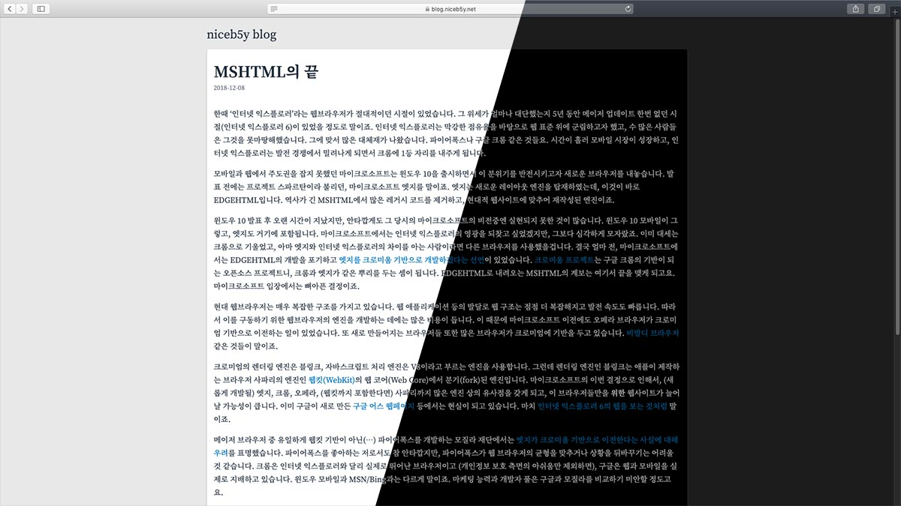

이젠 놀랍지도 않으시겠지만 글 콘텐츠보다 외형이나 내부 작동 방식에 더 노력을 가하는 본 블로그답게, 오늘은 테마를 바꾸어 보았습니다.

2018년의 테마가 n18이라는 성의 없는 이름이었으므로(아무도 신경 쓰지 않으니까!) 2019년을 바라보며 만들어진 이 테마는 n19입니다. 일관적으로 성의가 없는 작명이죠.

레이아웃의 측면에서 보면 큰 변화는 없습니다. 얼마 전 n18 테마에서 웹 폰트를 적용한다든지 하는 소소한 변화를 적용한 덕분에 더 그렇습니다. n18테마는 미니멀리즘에 심취해서(?) 글 말고 다른 걸 넣지 말자는 마인드로 만들었던 테마였습니다. 그래서 웹 폰트 적용 전에는 Google Analytics 정도를 제외하면 CSS 하나 정도 달랑 링크되어 있는 정도였죠. 좋게 말하면 미니멀리즘이고, 나쁘게 말하면 성의 없는 디자인이었습니다.

흰색 배경은 너무 심심해서 이번 테마에서는 조금 변화를 줘봤습니다. 너무 남발되는 감이 있지만, 그래도 트렌드라면 트렌드라 할 수 있는 카드 UI를 적용했습니다. 그 외에는 약간의 마이너한 수정 정도가 있겠네요. 내부적으로는 빌드 시스템의 변경이 있었습니다. gulp와 Sass 조합에서 PostCSS와 플러그인을 사용하는 조합으로요. Sass 변수는 CSS 변수로 바꾸고, 이런저런 플러그인을 적용하니 금방 옮길 수 있었습니다. Sass의 고급 기능이 필요했던 것도 아니라서 말이죠.

그리고 겸사겸사.... macOS 다크모드를 지원하게 되었습니다. 미디어쿼리 `@media (prefers-color-scheme: dark) {}`와 CSS 변수를 사용해서 말이죠. 다만 아직 사파리 TP에서만 작동한다는 점은 좀 아쉽습니다. 아마 정식 버전은 다음 macOS의 마이너 업데이트에서 지원하지 않을까 싶네요.
