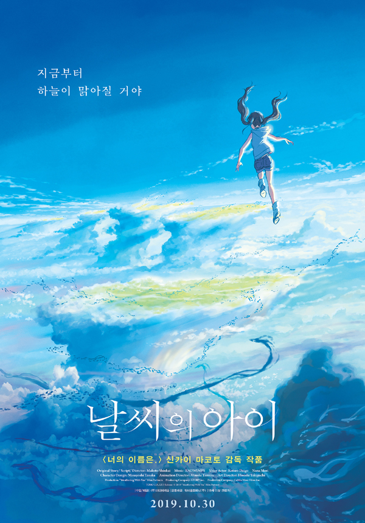

각 잡고 M2관에서 관람했던 「너의 이름은.」과는 다르게 학교와 가까운 이수 메가박스에서 관람했습니다. 시험이 끝나서 빌빌거리는 몸을 이끌고 먼 극장을 가긴 좀 그랬기 때문이죠.

이전 작품의 대단한 열풍으로 '이번엔 투자는 문제없이 받겠구나....' 하는 생각과 동시에, 이래저래 휘둘리는 작품이 나오지 않을까 생각했었습니다만....

신카이 마코토 감독이 만들고 싶었던 작품을 그대로 만든 것 같네요. 전 작품보단 대중적인 면모는 적겠지만, 저는 마음에 듭니다.

작화나 음악은 이전 작품보다 충분한 돈이 들어간 티가 확실히 날 정도로 더 좋아졌습니다만, 스토리 쪽은 좀 더 다듬어질 여지가 있었습니다.

영화가 주는 메시지 측면에선, 고레에다 히로카즈 감독의 「어떤 가족」과 궤를 같이한다고 말할 수 있겠습니다. 칸 영화제 황금종려상까지 받았던 이 작품이 일본에서 무슨 취급을 받았는지를 생각하면, 「날씨의 아이」도 일본에서 대중적 성공을 바라고 만든 영화는 아니라고 말할 수 있겠습니다. 그만큼 현재 일본 사회의 어두운 면을 조망하는 면모가 강합니다.

조금 더 매끄럽게 다듬어졌다면 더 좋은 작품이 될 수 있었겠지만, 제게는 꽤 만족스러운 작품이었고, 대부분의 다른 사람들은 아닐지도 모릅니다. 신카이 마코토 감독이 어떤 생각으로 만들었는지는 모르겠지만, 영화에 구름이 많이 들어가서 어느 정도 소원 성취는 하지 않았을까 하는 생각도 듭니다.

끝.
