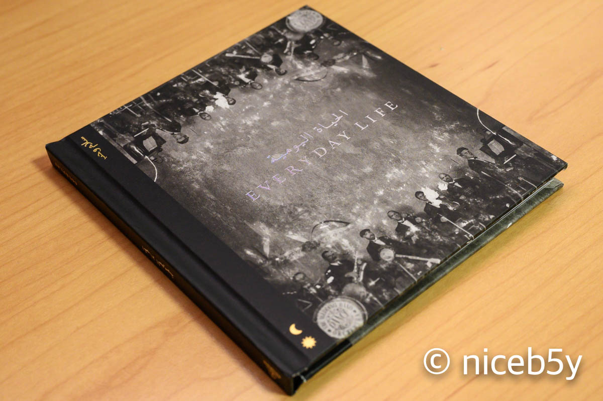
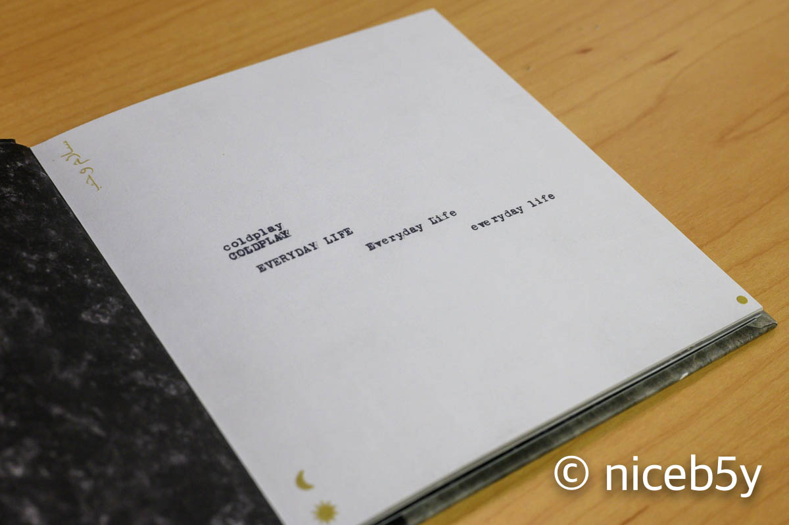
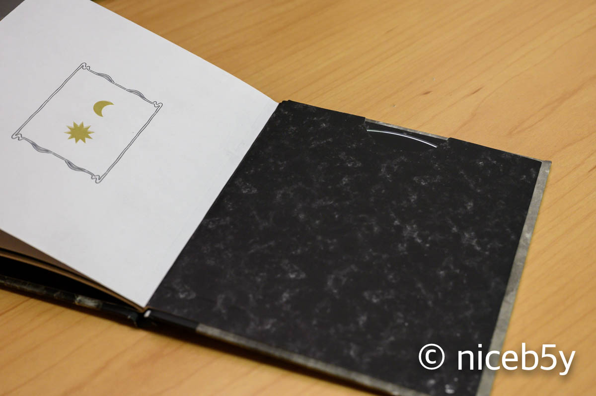

Coldplay 신보가 나왔습니다.

애플 뮤직으로 진작부터 듣고 있었던 기분이 듭니다만, 샀습니다.

첫 더블 앨범이지만, CD는 한 장입니다. 어... 음...?

플라스틱 CD 케이스가 아니라 사실상 책 만들어서 CD를 끼워놓은 모양이 되었습니다.

플라스틱을 사용하지 않았다는 점, 가사를 보기 편하다는 점 등의 장점이 있겠습니다. 하지만 케이스 재질이 종이로 이루어진 탓에 관리에는 좀 어려움이 따를 것 같습니다. 앞의 음반들과의 일관성을 생각하면 좀 아쉽기도 합니다. (사실 케이스 재질의 일관성은 [버터플라이 패키지](/the-most-terrible-act-of-my-most-favorite-band/)에서 진작 끝났지만)

<iframe width="560" height="315" src="https://www.youtube.com/embed/AAXHlLy4PdA" frameborder="0" allow="accelerometer; autoplay; encrypted-media; gyroscope; picture-in-picture" allowfullscreen></iframe>

Ghost Stories를 살 때는 발매일에 사러 갔더니 2시간 뒤에나 나온대서 하루에 2번씩이나 앨범 사러 간 적이 있었는데, 확실히 스트리밍이 앨범 사는 걸 귀찮게 만드는 것 같습니다. 이번 앨범은 그냥 대충 기다렸다 산 걸 보면 말이죠. ~~(방금 하플버 3집 아직도 안 샀다는 사실을 떠올림)~~

<iframe allow="autoplay *; encrypted-media *;" frameborder="0" height="450" style="width:100%;max-width:660px;overflow:hidden;background:transparent;" sandbox="allow-forms allow-popups allow-same-origin allow-scripts allow-storage-access-by-user-activation allow-top-navigation-by-user-activation" src="https://embed.music.apple.com/kr/album/everyday-life/1484143521"></iframe>

어쨌든 Everyday Life 앨범 좋아요. 들으세요.
