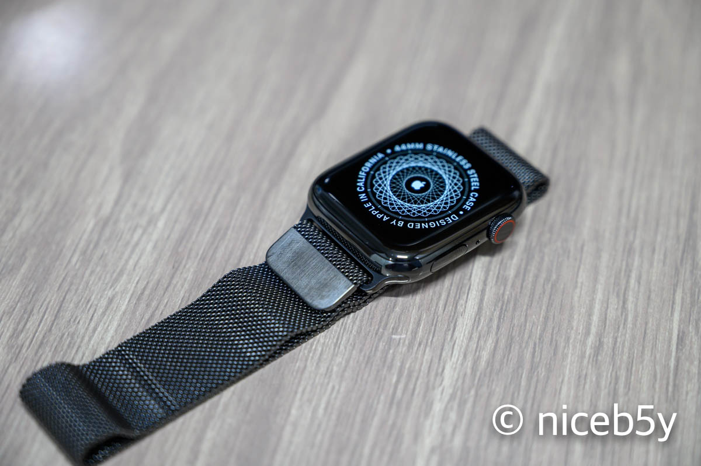

일단 새로 산 시계 자랑입니다. (짝짝짝)

애플 워치 1세대 이래 첫 업그레이드니까 그러려니 하세요.

## 어쨌든

2019년의 마지막 날입니다.

1년 회고라기엔 [저번 포스팅](/the-end-of-third-grade/)에서 거의 다 했기에 이번 포스팅은 _아무 말_ 위주로.

## 학교

복학을 했습니다. 1학기에 무리해서 성적 장학금을 받았었고, 2학기엔 그때 깎아 먹은 체력이 후폭풍이 되어 죽는 줄 알았습니다.

덕분에 2학기 성적이 망한 줄 알았는데 아주 그렇진 않더랍니다. 그래도 실망스럽긴 하지만.

## 코딩 테스트

올해 초에 운 좋게 코딩 테스트 공부를 시작했습니다. 백준에서 문제 풀이를 시작했고, 학기 중의 대부분은 문제를 못 풀었는데, 300개가량을 풀었으니 꽤 풀었다고 말할 수 있습니다.

왜 운이 좋다고 말하냐면.... 덕분에 속된 말로 뽕을 뽑았기 때문입니다.

학교에서 치른 코딩 테스트로 500만 원 장학금을 두 번 받았고, [ICPC](/acm-icpc-2019-preliminary-contest-review/)도 본선 진출엔 실패했지만, 상금 받([아서 카메라 가방을 사](/new-camera-bag/))기도 했으며, [코딩 테스트](/2019-kakao-developer-winter-internship-solution/) 덕분에 인턴도 붙을 수 있었습니다.

코딩 테스트 최고.

## TOPCIT

TOPCIT이라는 이상한 이름의 시험이 있습니다. 학교에서 보래서 봤고, 잘 봤는지 학교에서 상장도 주더랍니다.

어쨌든 이 시험을 본 소감은 다음 만화로 대체.

<blockquote>
  <em>
    
상황: 14개의 규격이 경쟁하고 있다.

    
"14개?! 말도 안 돼! 우리는 다른 모든 걸 아우르는 단 하나의 규격을 만들어야해." "맞아!"

    
상황: <strong>15</strong>개의 규격이 경쟁하고 있다.

    <a href="https://xkcd.com/927/">
      xkcd - standards (CC BY-NC 2.5)
    </a>
  </em>
</blockquote>

## 인턴

26일부터 인턴으로 회사에 다니는 중입니다. 아직 뭐가 뭔지도 모르겠고, 잘못 뽑힌 거 아닌가 하는 의심이 들기도 합니다. 그래서 아직 쓸 말은 별로 없고, 잘 되었으면 좋겠네요.

## 2020

어쨌든 곧 있으면 2020년의 해가 떠오르겠네요. 전 늦게 자고 늦게 일어나느라 해가 뜨는 모습을 보지 못하겠지만요.

재미없는 글 읽어주셔서 감사합니다. 새해 복 많이 받으세요.

<iframe width="560" height="315" src="https://www.youtube.com/embed/yDCfuQLPhyY" frameborder="0" allow="accelerometer; autoplay; encrypted-media; gyroscope; picture-in-picture" allowfullscreen></iframe>
