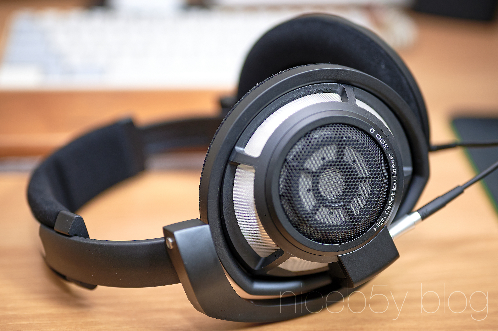

젠하이저 HD800S를 샀습니다.

갑자기 자금이 좀 생겨서, 어디에 사용할지 몇 날 며칠을 고민하다 이 녀석을 샀습니다. 코로나 시국에 집안에서 사용하기 좋기도 하고, 예전부터 사보고 싶었던 녀석이었거든요. 살 엄두가 안 나는 가격이었으니 그렇지....

쨌든 제가 기억하기론 젠하이저 라인업에선 이 헤드폰 위로는 300만원가량하는 HD820이나 금액의 자릿수 자체가 다른 HE1밖에 없으니 나름 하이엔드 모델이라고 할 수 있겠습니다.

300옴에 달하는 임피던스를 자랑하는 헤드폰이기도 하고, 3.5mm 케이블 따위는 제공하지 않다 보니 헤드폰 앰프 등을 준비하는데 이런저런 돈이 추가로 깨지긴 했지만, HD800S의 소리는 감동입니다.

이제 당분간 대부분의 오디오 기기를 사고 싶은 생각이 들지 않을 것 같습니다...만 HD800S에 물리고 싶은 _**(헤드폰 보다 비싼)**_ 젠하이저 HDV820 앰프가 눈앞에 아른거리는 걸 보면 역시 오디오는 해로운 취미인 듯.
