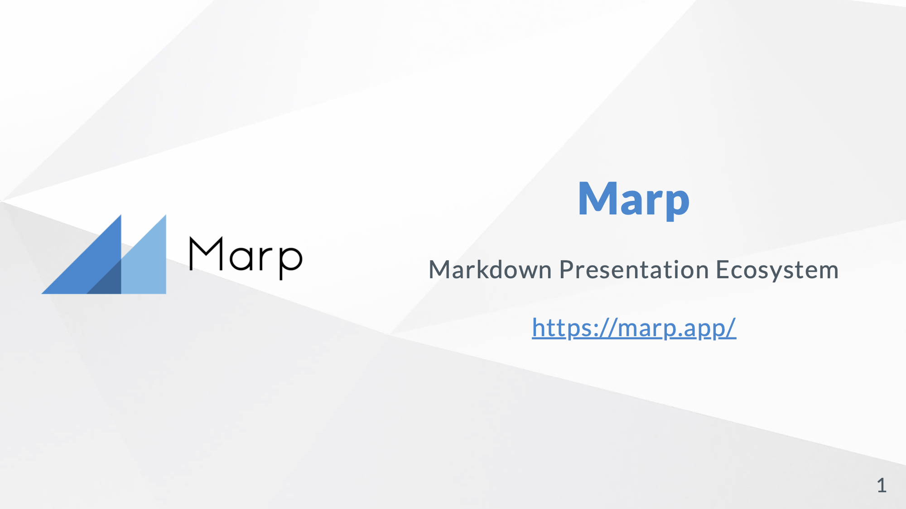
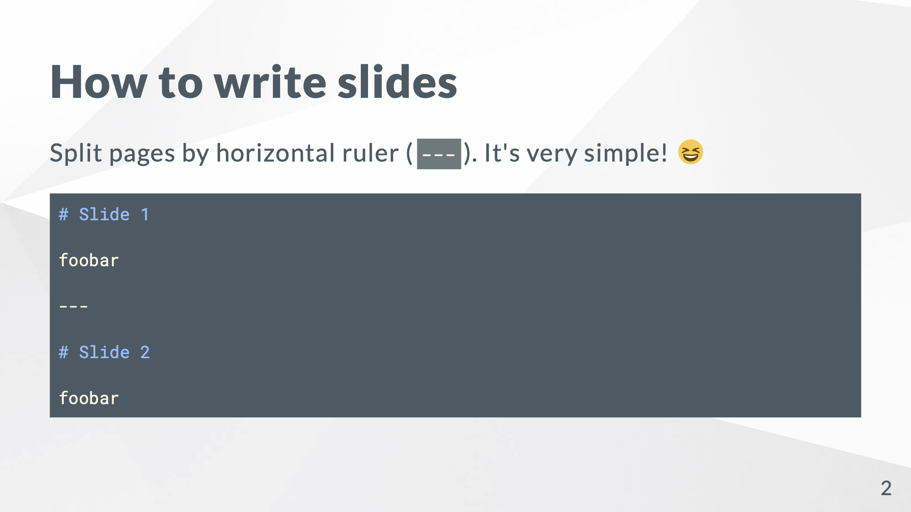
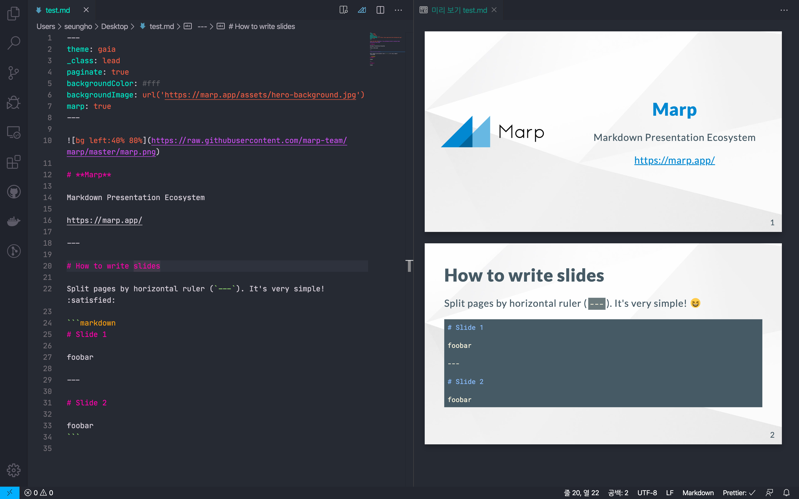

발표 자료를 만드는 것은 손이 많이 가는 작업입니다. 특히 코드가 들어간 발표 자료를 만드는 것은 더 끔찍한 일이죠.
코드를 이미지로 캡쳐하면 글씨가 선명하지 않고, 코드를 붙여넣으면 글꼴이나 레이아웃 문제를 감당하기 피곤합니다.

저도 예전에 학교에서 사용할 [발표 자료](https://github.com/niceb5y/CSE-at-SSU/blob/master/Problem%20Solving/slide/사과와%20바나나.pdf)를 만들 때, 코드를 슬라이드 문서에 집어넣느라 고생 좀 했던 적이 있습니다.

그런데 지난겨울에 인턴을 하면서 마크다운 문서를 쉽게(?) 프레젠테이션 슬라이드로 만들 수 있는 애플리케이션을 알게 되었습니다.
바로 [Marp](http://marp.app/)입니다.

## Marp



위 이미지는 Marp의 공식 예제 슬라이드로, 아래 마크다운 문서가 변환된 결과물의 첫 슬라이드입니다.

````markdown
---
theme: gaia
_class: lead
paginate: true
backgroundColor: #fff
backgroundImage: url('https://marp.app/assets/hero-background.jpg')
marp: true
---


# **Marp**

Markdown Presentation Ecosystem

https://marp.app/

---

# How to write slides

Split pages by horizontal ruler (`---`). It's very simple! :satisfied:

```markdown
# Slide 1

foobar

---

# Slide 2

foobar
```
````

위 문법을 보시면 `---`를 이용해서 슬라이드를 나눌 수 있다는 것을 알 수 있습니다.
그렇게 나눠진 번째 슬라이드는 아래와 같습니다.



마크다운의 코드 하이라이팅까지 쉽게 표시할 수 있다는 것을 볼 수 있습니다.

## 사용 방법

Node.js 환경에서 동작하는 [CLI](https://www.npmjs.com/package/@marp-team/marp-cli)와 [VS Code 익스텐션](https://marketplace.visualstudio.com/items?itemName=marp-team.marp-vscode)를 제공합니다.

VS Code 익스텐션을 설치하면 실시간 미리보기를 통해 문서를 보면서 쉽게 편집할 수 있습니다.



이렇게 말이죠.

## 문법

[CommonMark](https://commonmark.org) 기반의 문법을 사용합니다.
물론 페이지를 나누기 위해 `---`가 추가되었다던지 하는 차이는 있습니다.

자세한 내용은 [공식 문서](https://marpit.marp.app/markdown)를 참고하시면 좋을 것 같습니다.

## 내보내기

PDF, HTML, PPTX 파일로 내보낼 수 있습니다. 프로토타입을 Marp로 만들고 파워포인트로 마무리하기 같은 방법도 사용해 볼 수 있겠습니다.

## 한계

개인적으로 느끼는 단점은 역시 레이아웃을 직접 조절할 수 없다는 것입니다.
애니메이션 효과라던지, 다단 편집이라던지, 이미지 배치등에 있어서 한계가 있기 때문입니다.
레이아웃에 손대다 보면 결국 파워포인트를 사용하는 것이 더 빠르지 않을까 하는 생각이 드는 시점이 올때도 있고 말이죠.

## 그럼에도

그럼에도 Marp는 참 매력적인 도구인 것 같습니다. 비록 복잡한 슬라이드에는 잘 맞지 않는 도구이지만, 빠르고 편리하게 슬라이드를 작성할 수 있으니까요.
